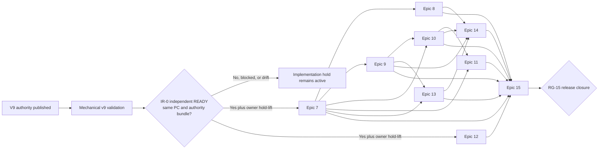

# Architecture Decision Document

_This document builds collaboratively through step-by-step discovery. Sections are appended as we work through each architectural decision together._

## 2026-07-15 Authority Rebaseline

This section is the current initiative architecture authority. It applies the finalized boilerplate-reduction PRD and addendum plus the approved July 15 correction proposals. Where the May 14 historical analysis below describes a different starter, target ownership, project tree, workflow, performance rule, or readiness conclusion, this rebaseline and the amended sections control. The historical analysis remains useful for all unaffected domain and runtime decisions.

### 2026-07-27 Test-Harness Ownership Amendment

Architecture version `conversations-architecture-2026-07-27-v3` supersedes v2
only for the ownership and treatment of `Hexalith.Conversations.AppHost`.
Conversations retains that project solely as a non-packable, non-publishable,
module-scoped user and end-to-end test harness. It is not a production or
deployment composition root. Platform libraries continue to own reusable
runtime capability, and platform deployment continues to own production
composition. All other July 15 authority, preservation, projection-population,
promotion, performance, and readiness decisions remain binding.

### 2026-07-28 Mechanical Final-Record Amendment

Architecture version `conversations-architecture-2026-07-28-v4` supersedes v3
only by adding the mechanical final-record obligation and amending the binding
story order to include Story 6.8. Every ownership, runtime, projection,
topology, promotion, performance, evidence, and readiness decision in v3 remains
in force unchanged.

A story completion record states final test counts, the file list, affected
submodule state, and root gitlink state. From this amendment forward those facts
are derived outputs of a generator, not prose composed by the agent that
performed the work. Derivation sources are exactly four: parsed machine-readable
test-result artifacts; the git-derived path set between the work baseline and
the committed candidate unioned with the tracked working-tree delta;
mode-`160000` root gitlink entries resolved from the committed candidate; and
the promotion-checker document embedded verbatim. A record whose counts, paths,
or gitlink binding are hand-typed, carried forward from an earlier pass, or
restated in a second hand-maintained list is a conformance failure, and a
binding that no longer describes the final candidate goes red rather than stale.

This amendment changes planning authority, generated context, completion
workflows, and conformance validation only. It authorizes no change to
production source, public contracts, package versions, generated output,
accepted baselines, signed evidence, or submodule content.

### 2026-07-28 Conformance Oracle Tiering Amendment

Architecture version `conversations-architecture-2026-07-28-v5` supersedes v4
only by declaring the conformance oracle's tier structure and adding Story 6.9.
Every ownership, runtime, projection, topology, promotion, performance,
evidence, and readiness decision in v4 remains in force unchanged.

The conformance oracle asserts two contracts that this architecture had not
distinguished. The first is the contract a consumer of the shipped Conversations
packages can exercise. The second is Conversations-owned decision code — tenant
access guards, the idempotent command executor, the governance audit sink, the
projection materializer, and the diagnostics classifiers — which is deliberately
not public and must not become public in order to be tested.

Both are legitimate. Conflating them is what produced a standing structural
promise the module could not keep: the recorded target end-state "public-surface
suites no longer transitively depend on the Server plumbing assembly" was
written when that assembly held the plumbing Epics 2-3 were about to move. That
plumbing has since moved to `Hexalith.EventStore.DomainService`,
`Hexalith.Commons.*`, and platform deployment. What remains is domain-owned
behavior that the target ownership section above assigns to Conversations.

The oracle is therefore **two declared tiers**:

- **Portable tier** — binds `Hexalith.Conversations.Contracts`,
  `Hexalith.Conversations.Client`, and `Hexalith.Conversations.Testing` only. It
  references no non-packable module assembly. This is a structural property
  asserted from the resolved compile surface by a test in that tier, not a prose
  claim.
- **Module-internal tier** — explicitly binds `Hexalith.Conversations.Server`.
  Its coupling is declared and correct, not a defect scheduled for removal.

Binding consequences:

- Widening the Conversations public contract so an assertion can move to the
  portable tier is **prohibited**. Test reachability is not a reason to expose a
  domain implementation type.
- Weakening or deleting an assertion so it can move to the portable tier is a
  **conformance failure**. A check that cannot be re-expressed at full strength
  belongs in the module-internal tier, and that is the correct outcome.
- `Hexalith.Conversations.Server` is `IsPackable=false`. Any oracle asset that
  binds it is non-portable by construction; the adopter-verifiability intent
  stated later in this document applies to the portable tier alone.
- Both tiers are release-gate. Tier membership changes what an assertion may
  bind, never whether it runs. The frozen FR-20 denominator is unchanged.

This amendment changes planning authority, test-project structure, and evidence
artifacts only. It authorizes no change to production source, public contracts,
package versions, accepted baselines, signed evidence, or submodule content.

### 2026-07-31 SM-C2 Threshold And Record-Contract Amendment

Architecture version `conversations-architecture-2026-07-31-v6` supersedes v5
only by amending Story 6.2's SM-C2 pass rule, republishing four record-contract
improvements, and adding Story 6.11. Every ownership, runtime, projection,
topology, promotion, evidence, and readiness decision in v5 remains in force
unchanged.

**Performance gate.** The SM-C2 frozen inventory, identical envelope, paired
measurement, and raw-sample retention are unchanged. What changes is when the
`post P95 <= 1.05 x baseline P95` rule applies. A hot-path row is gated at that
threshold only when its cost change is not attributable to an approved
correctness change and the row carries usable signal at that threshold. Story
6.2's HP-LIST and HP-OPEN fail the first test — their cost is the mandatory
fail-closed cross-key validation, which turned a one-read detail path into a
detail read plus a tenant-index read plus a dispatch-ledger read, with a bounded
per-row detail and ledger read added to page verification — so they are gated
instead by an approved-cost ceiling recorded numerically in the release
artifact, and a further regression still goes red. HP-CREATE and HP-APPEND fail
the second test on measured within-run dispersion two orders of magnitude wider
than the threshold, so they are recorded and disclosed rather than gated. The
disclosure is mandatory in the artifact, not only in a test comment. Story 6.6
re-measures under this rule; Story 6.11 owns retiring the ceiling.

This does not relax the projection correctness requirement and authorizes no
repair-on-read.

**Record contract.** The v4 amendment above was rewritten in place on 2026-07-29
after v5 declared it immutable. Its bytes are restored; the four substantive
improvements are republished here and take effect from v6 forward. The second
derivation source is the git-derived path set between the work baseline and the
committed candidate **with source-tree dirt blocked outside record outputs and
declared TRX inputs**, replacing the union with the tracked working-tree delta —
a record must describe a committed tree, not a tree plus whatever else was open
at the time. The root `.slnx` defines the required root-owned test projects,
failures block, and skips require exact versioned identity-and-reason policy.
After the bound candidate only record-output paths may change and no gitlink may
move. The four completion surfaces generate one document-and-Markdown bundle
rather than author it, verify the inserted Markdown digest, and let generator
blockers block `review` and `done` exactly as the promotion gate does.

This amendment changes planning authority, evidence artifacts, and conformance
validation only. It authorizes no change to public contracts, package versions,
accepted baselines, signed evidence, or submodule content.

### 2026-08-01 Projection-Proof Evidence-Lifecycle Amendment

Architecture version `conversations-architecture-2026-08-01-v7` supersedes v6
only by separating immutable candidate-bound projection proof from current
release assurance, adding Story 6.12, and amending the completion obligations
of Stories 6.3 and 6.6. Every ownership, runtime, projection-correctness,
topology, promotion, performance, record-contract, preservation, and readiness
decision in v6 remains in force unchanged.

`projection-read-store-population-proof-v2` remains immutable point-in-time
evidence for umbrella candidate
`856ee997cd35eb1d432fcb288a75a7b5bf3c5b58` and its recorded EventStore
gitlink `e645901928eed9759e28e1086f23dc96875c3ac3`. Historical verification
resolves root-owned blobs from that candidate and platform-owned blobs from the
gitlinks recorded in that candidate. It does not substitute the current `HEAD`
or current submodule worktrees and does not prohibit later approved work from
moving unrelated root gitlinks.

Current release assurance is a separate, versioned concern. Story 6.12 authors
ADR 0004 for an immutable predecessor-linked projection-proof lifecycle and
produces `projection-read-store-population-proof-v3` against the then-current
candidate. The chain has exactly one approved current head. Every successor
binds its predecessor artifacts by full SHA-256, identifies the exact changed
dependency identities with named owner and rationale, and carries fresh
machine-readable deterministic, gateway/DAPR, state-store, query, deletion,
and replay evidence. In-scope projection dependency drift without a successor
fails with `PROJECTION_PROOF_SUPERSESSION_REQUIRED`; unrelated root gitlink
movement does not mutate or invalidate historical proof.

Story 6.3 records v2 as historical evidence and the latest approved successor
as current release evidence. Story 6.6 validates the immutable predecessor
chain and reruns the latest head; it cannot cite v2 alone for a later release
candidate. Story 6.2 remains `done`, and its story record, v2 JSON/Markdown,
three bound xUnit results, final record, and signed-v1 dependencies are not
rewritten.

This amendment changes planning authority, generated context, backlog state,
and planning-authority conformance validation only. It authorizes no change to
production source, public contracts, package versions, accepted baselines,
Story 6.2 evidence, signed evidence, or submodule content. Successor artifacts
and validator changes remain Story 6.12 implementation work.

### 2026-08-01 Implementation Readiness Authority Correction

Architecture version `conversations-architecture-2026-08-01-v8` supersedes v7
only by publishing the complete effective Story 6.1-6.12 execution contract,
restoring the finalized PRD SM-C2 rule as the sole current metric authority,
repairing preservation-only UX planning authority, and imposing a global
implementation hold. The approved correction is
`sprint-change-proposal-2026-08-01-implementation-readiness-authority-correction.md`.
The narrower 6.10/6.11 proposal remains supporting analysis, but its unapplied
publication plan is superseded so there is exactly one v8.

**Overall Status: AUTHORITY CORRECTION ONLY — NOT READY.** No remaining Epic 6
implementation work may start or resume until comprehensive v8 is published,
mechanical authority validation passes, and a new independent
implementation-readiness assessment returns `READY`. File-lifecycle states such
as `in-progress` and `ready-for-dev` do not override this hold.

**One current execution contract.** The append-only v8 block republishes each
Story 6.1-6.12 definition once with status context, complete effective
acceptance criteria, prohibitions, checkpoints, direct dependencies, and
completion gates. The deterministic
`epic-6-current-execution-view-v1.md` is a non-amending projection of that block,
not a second authority. Source marker, authority versions, hashes, generator
version/command, and sprint-status source are part of the projection contract;
semantic or hash drift fails validation.

**Completed history.** Stories 6.1, 6.2, and 6.7 remain `done`. Their records,
evidence, accepted baselines, signed dependencies, and earlier v1-v7 authority
bytes remain immutable. Story 6.2's v6 ceiling/disclosure disposition is
historical completion context only; it is neither reopened nor accepted as the
current release rule. The current view exposes 6.2-H1 baseline/authority,
6.2-H2 runtime/projection migration, and 6.2-H3 candidate evidence/closure only
as read-only navigation checkpoints.

**SM-C2 authority.** PRD SM-C2/OQ-5 controls every current release decision:
HP-CREATE, HP-APPEND, HP-LIST, and HP-OPEN each require usable comparable
evidence under the identical frozen envelope and
`post P95 <= 1.05 x baseline P95`. An approved-cost ceiling, disclosure,
correctness cost, owner acceptance, or unusable signal cannot substitute for
that gate. Story 6.11 owns correctness-preserving signal and performance work
for all four rows and is mandatory before Story 6.6. Changing the target
requires a separate approved PRD-level proposal.

**Execution topology.** Historical completion is `6.1 -> 6.7 -> 6.2`. After a
future readiness result of `READY`, Wave 1 may resume 6.8 and start 6.4, 6.5-A/B,
6.9, and 6.11. Stories 6.8 and 6.9 unlock 6.10; 6.8 unlocks 6.12. Stories 6.10
and 6.12 may then run in parallel, and 6.5-C may finish only after its 6.8/6.10
gates. Stories 6.9, 6.10, and 6.12 gate completion of 6.3; 6.8 and 6.10 gate
completion of 6.5. Story 6.6 remains last and depends on completion of 6.3,
6.4, 6.5, 6.8, 6.9, 6.10, 6.11, and 6.12. The graph is mechanically
cycle-checked.

**Checkpoint boundaries.** Story 6.5 retains one identifier and divides review
into 6.5-A authoring contract, 6.5-B minimal fixture, and 6.5-C measurement and
conclusion. Story 6.12 retains all eight v7 criteria and divides review into
6.12-A historical validity/lifecycle, 6.12-B successor/current guard, and
6.12-C fault injection/handoff/closure. Checkpoint success never advances the
story to `done`. Completed Story 6.2's three projected checkpoints are
retrospective navigation only.

**UX preservation.** The UX specification cites the canonical PRD/addendum,
opens with a preservation-only non-activation banner, and labels its Phase 0-3
roadmap as historical/future activation sequence. The UX map records current
`preserved-not-activated` disposition separately from labeled historical
provenance, and inventories UX-DR1-52 plus every explicit UX acceptance-criterion
identifier. Story 6.4 owns the versioned disposition schema/JSON/Markdown and
zero-gap validator; this architecture publication does not implement those
story deliverables or activate UI scope.

**Executable failure contracts.** V8 binds BDD scenarios for cross-tenant
derived-key poison, post-binding evidence mutation, historical-proof/current
dependency drift, skipped or zero-assertion evidence lanes, unusable or failing
SM-C2 rows, and an independent `NOT READY` assessment. These scenarios are
acceptance contracts; planning publication does not implement their production
or story-owned test work.

**Outcome-neutral readiness.** Story 6.6 preserves the complete actual result
of a fresh independent assessment against the exact committed candidate. The
assessor is never instructed or modified to return `READY`. Release closure is
a separate consumer decision and stays blocked on `NOT READY` or an incomplete
assessment.

This amendment changes planning authority, deterministic planning projections,
UX planning provenance/mapping, sprint hold prose, and planning-authority
validation only. It preserves the ownership spine, public contracts,
production topology, EventStore write authority, fail-closed tenant rules,
preservation denominators, no-product-UI boundary, completed history, signed
evidence, and submodule content.

### Scope And Preservation Denominators

The initiative has exactly **20 initiative requirements (`FR-1` through `FR-20`)**. These are distinct from the preserved product contract: **104 `Feature-FR`s**, **77 `Feature-NFR`s**, **52 UX decisions**, and every UX acceptance criterion. The refactor activates FR-1 through FR-15 and FR-17 through FR-20; **FR-16 alone is deferred and non-activated**. Preserved feature requirements constrain behavior but do not become new feature-delivery scope.

The accepted SM-1 baseline is the immutable **13,289 LOC** classified-plumbing denominator. This denominator is not renegotiable inside this initiative; only a versioned, separately approved target change may restate it. Completed Epics 1-5, their 24 stories and `done` states, retrospectives, and signed v1 evidence remain historical records. A delivered item can become inactive, or a public contract can receive a compatible change, only with a named owner approval, rationale, and compatibility evidence. Legal or policy obligations may require approved compensating events, tombstones, or source-event treatment; those named exceptions do not authorize silent mutation of immutable history.

These denominators are the single authoritative statement of initiative scope. Prose elsewhere in this document, including the preserved May 14 analysis, cannot restate, widen, or reduce them.

### Target Ownership And Current Migration Input

The target Conversations domain module owns contracts, deterministic aggregate behavior, validators, handlers, projections/read-model semantics, domain adapters, domain telemetry definitions, client/testing assets, optional domain UI, and one module-scoped AppHost used only for local user and end-to-end testing. That AppHost is non-packable and non-publishable and is not a production/deployment composition root. Platform deployment owns production topology and composition. `Hexalith.EventStore.DomainService`, `Hexalith.EventStore.ServiceDefaults`, and `Hexalith.EventStore.Aspire` own generic hosting, endpoints, defaults, DAPR resources, health, telemetry wiring, projection/query runtime, and subscription plumbing. Missing generic capability is added to its public platform surface and is never hidden behind a Conversations facade.

`src/Hexalith.Conversations.AppHost/`, its tests, and its solution entries are target test infrastructure and remain in the repository. Story 6.2 makes the test-only boundary mechanical (`IsPackable=false`, `IsPublishable=false`) and keeps the harness limited to Conversations surfaces plus required platform dependencies. `src/Hexalith.Conversations.ServiceDefaults/` remains pre-Story-6.2 drift and is removed when it has no independently justified domain-specific responsibility.

The canonical domain host integration is the pair:

```csharp
builder.AddEventStoreDomainService(/* domain assemblies/options */);
app.UseEventStoreDomainService();
```

`UseEventStoreDomainService()` includes default health endpoints and canonical domain endpoints. Domain-module authoring guidance must never teach direct `MapEventStoreDomainService()` use.

### Initiative Landing-Zone Register

| Requirement | Decision state | Public owner and surface | Conversations responsibility |
| --- | --- | --- | --- |
| FR-10 | resolved-consume-extend | `Hexalith.EventStore.ServiceDefaults` (`AddServiceDefaults`, `MapDefaultEndpoints`) and `Hexalith.EventStore.DomainService` (`AddEventStoreDomainService`, `UseEventStoreDomainService`, `AddEventStoreDomainTelemetry`) | Supply domain assemblies and domain telemetry definitions only. |
| FR-11 | resolved-promote-adopt | `Hexalith.Commons.TenantAccess` public generic tenant-access projection and registration surface | Supply Conversations-specific events, policy, and adapter. |
| FR-12 | resolved-promote-adopt | `Hexalith.Commons.Http` public `AddTypedHttpClient<TClient,TImplementation,TOptions>` surface | Supply Conversations client/options and domain-safe errors. |
| FR-13 | resolved-consume-extend | `Hexalith.EventStore.Aspire` and applicable Commons Aspire helpers provide public EventStore/domain-module topology surfaces; platform deployment owns production composition | Retain one non-packable, non-publishable module test AppHost that supplies project metadata and test-only resource selection; own no reusable Aspire, DAPR, or publication facade. |
| FR-14 | resolved-promote-adopt | `Hexalith.Commons.Serialization` public JSON-context/type-mapping surface | Supply Conversations serialization context and domain-specific converters only. |
| FR-15 | resolved-consume-extend | `Hexalith.Commons.Diagnostics` public diagnostics primitives plus EventStore domain telemetry registration | Define bounded domain instruments; own no generic telemetry scaffold. |
| FR-16 | deferred-non-activated | Optional additive platform command/event metadata remains outside pilot acceptance | Do not adopt or reshape Conversations contracts in this initiative. |

Every named landing zone must exist as a public, consumer-callable platform surface before the corresponding implementation is accepted. Source-signature conformance tests enforce these landing zones; a source token alone is not evidence.

### Open-Question Disposition Register

| ID | State | Binding decision | Reopen condition |
| --- | --- | --- | --- |
| OQ-1 | resolved-2026-07-15 | FR-10 through FR-15 land on the public platform surfaces in the register above; no new shared module or Conversations facade is authorized. | A named platform owner documents that a required public surface cannot host the capability. |
| OQ-2 | resolved-2026-07-14 | SM-1 uses the inclusive >=40% LOC threshold; SM-2 uses the inclusive >=50% file threshold, remains estimate-qualified, and requires reproducible v2 evidence. | Product/release owner approves a versioned target change. |
| OQ-3 | resolved-2026-07-14 | Governance orchestration, temporal reconstruction, and upstream hydration stay domain-owned; only demonstrated generic seams are consumed. | Separately approved follow-on extraction. |
| OQ-4 | resolved-2026-07-14 | FR-16 is deferred and non-activated for the pilot. | Separately approved initiative activates it. |
| OQ-5 | resolved-2026-07-14 | SM-C2 permits no more than 5% P95 regression under an identical reproducible envelope; preserved absolute targets activate only through a current release decision. | Release owner names an additional active absolute gate. |

There is exactly one authoritative row for each OQ-1 through OQ-5; prose elsewhere cannot reopen or contradict a row.

### SM-C2 Versioned Hot-Path Inventory And Gate

Inventory version `sm-c2-hot-path-inventory-v1` is frozen by Story 6.1 before baseline capture and before Story 6.2 changes topology:

| Hot-path ID | Classification | Operation | Required envelope evidence | Post disposition |
| --- | --- | --- | --- | --- |
| HP-CREATE | command-warm | Create a tenant-authorized conversation through the canonical command path. | workload/data shape, concurrency, environment/runtime, tooling, warm classification, repetitions, raw samples, commit | Same operation through platform-owned runtime surfaces exercised by the module test harness; compare P95. |
| HP-APPEND | command-warm-idempotent | Append a message, including duplicate replay and payload-mismatch rejection. | workload/data shape, duplicate mix, concurrency, environment/runtime, tooling, warm classification, repetitions, raw samples, commit | Same success/replay/mismatch mix; compare P95 and retain unknown-outcome semantics. |
| HP-LIST | read-warm | List authorized conversations with filters, stable ordering, and cursor continuation. | seeded tenant/read-model shape, concurrency, environment/runtime, tooling, warm classification, repetitions, raw samples, commit | Same filters/order/page shape through canonical query path; compare P95. |
| HP-OPEN | read-warm | Open conversation detail with freshness, redaction filtering, evidence metadata, and batched Party hydration. | message/participant shape, concurrency, environment/runtime, tooling, warm classification, repetitions, raw samples, commit | Same response/trust envelope through platform-owned runtime surfaces exercised by the module test harness; compare P95. |

The baseline artifact records this exact nonempty inventory version and one baseline result for every row. The post artifact records exactly one disposition and result for every baseline row; rows cannot be selected after measurement. For each row:

`post P95 <= 1.05 x baseline P95`

Baseline and post runs use identical workload and data, concurrency, environment and runtime, benchmark tool/version, warm/cold classification, repetition policy, and raw-result processing. Both bind raw evidence and the measured commit. Cold results are reported separately and cannot be substituted for warm rows. If a pre-change run cannot be captured before Story 6.2, it must be reconstructed from the preserved source commit with the same versioned fixture; an invented or incomparable baseline blocks completion.

### Still-Binding Domain And Runtime Decisions

- Events are immutable, explicitly versioned Conversations contracts. Mixed-version streams must replay deterministically through compatible readers/upcasters; unsupported versions fail with a typed, documented error rather than being skipped.
- EventStore history has precedence over every derived store. Projection/cache/export disagreement marks derived state stale, quarantined, invalid, or rebuilding; rebuild starts from EventStore and does not re-emit external side effects.
- Tenants access fails closed before any read, write, rebuild, export, tool, UI, or background operation. Parties validation fails closed for participant writes. Authorized reads may degrade only to a policy-defined non-personal hydration placeholder while preserving explicit degraded state.
- Idempotency preserves a stable outcome for equivalent retries, rejects the same key with a different payload, and represents an unknown client/provider outcome explicitly so blind retry cannot duplicate effects.
- Governance changes require paired auditable domain evidence. History remains append-only except for named, approved legal-policy mechanisms whose owner, rationale, scope, and evidence are recorded.

### Projection Read-Store Population Decision

[ADR 0003](../../docs/adrs/0003-projection-read-store-population-proof.md) is accepted
architecture authority for Stories 6.2 and 6.6. Production population of the Conversations
query read store is mandatory proof; the signed July 14 v1 residual-risk acceptance remains
valid only for its immutable bound scope and cannot satisfy Epic 6 or v2 readiness.

EventStore owns ordered delivery, stable dispatch identity, and canonical named-projection
routing. Conversations owns event materialization, tenant-scoped read-model keys, use of
the shared write policy/store, freshness, and query semantics. A scoped named
`IAsyncDomainProjectionHandler` is the production population owner for the persisted query
store. The legacy synchronous `IDomainProjectionHandler` remains version-1 compatibility
only and its opaque gateway response is not query-store population evidence.

Queries never replay, materialize, or silently backfill projection state. A durable
completed projection outcome requires both the per-conversation summary/detail record and
the tenant index write to complete. Partial-write uncertainty is non-completion and must
converge through idempotent retry.

Story 6.2 proves the production named-dispatch path, configured integration state-store
end state, production query read, duplicate and partial-write retry convergence, tenant
isolation, bounded failure outcomes, projection deletion, and full replay equivalence.
Direct writer invocation, DI resolution, mock call counts, HTTP acceptance, or the legacy
projection response are supporting evidence only. Story 6.6 hash-validates and reruns the
accepted proof before issuing the v2 attestation.

### Promotion Completion Invariant

Story 6.7 implements this declarative invariant before Story 6.2 can complete: promotion-bearing work declares exact root `references/...` paths; every affected root-declared submodule is initialized, clean including untracked files, at a commit satisfying its declared availability policy, and represented by the exact mode-`160000` gitlink in the committed umbrella revision. The gate also includes gitlinks changed since the work baseline. It reads only root `.gitmodules`, never initializes or traverses nested submodules, blocks only declared promotions and changed gitlinks, and reports unrelated state as warnings.

### Corrective Readiness

**Overall Status: AUTHORITY CORRECTION ONLY — NOT READY.** The completed spine
is `6.1 -> 6.7 -> 6.2`. Every remaining story is held regardless of its
file-lifecycle status. The current topological plan and complete effective
criteria live in the v8 authority block and its deterministic current execution
view. No implementation may start or resume until mechanical v8 authority
validation passes and a new independent implementation-readiness assessment
returns `READY`; that later assessment's result is preserved rather than
prescribed.

## Project Context Analysis

### Requirements Overview

> **Namespace note (2026-07-15 rebaseline).** This section describes the **preserved feature product contract**, not the initiative. Requirement labels here belong to the `Feature-FR` / `Feature-NFR` namespace (`Feature-FR1` through `Feature-FR104`) and are distinct from the 20 initiative requirements `FR-1` through `FR-20` defined in the rebaseline above. Where this section names counts, targets, or components, they constrain preserved behavior and do not restate initiative scope or target ownership.

**Functional Requirements:**

Hexalith.Conversations is a high-governance backend/API module for tenant-scoped, event-sourced AI conversation records. The preserved feature PRD defines 104 `Feature-FR`s across conversation lifecycle, participant attribution, business references, tenant isolation, event sourcing and publication, governance and audit, operator workflows, developer contracts, release evidence, observability, and scope tracking.

Architecturally, the core system must expose adopter-friendly Conversations contracts while hiding EventStore internals. The first implementation pressure is the chatbot create -> append -> attach -> govern -> resume loop, but the contract must remain broader than the chatbot.

**Non-Functional Requirements:**

The preserved feature PRD defines 77 `Feature-NFR`s. The strongest architectural drivers are fail-closed tenant isolation, audit integrity, redaction non-leakage, deterministic projection rebuilds, schema/version handling, content-safe observability, WCAG 2.1 AA admin UX, and signed conformance evidence.

Performance has a notable preserved warm-cache target: P95 <= 500ms for opening conversations up to 500 messages under the defined load envelope. Per OQ-5 this preserved absolute target is **not an active gate for this initiative**; it activates only through a current release decision. The active initiative performance gate is SM-C2 (`post P95 <= 1.05 x baseline P95` over the frozen hot-path inventory). Projection rebuild, redaction propagation, tenant-event lag, and capacity thresholds still need architectural measurement envelopes or buyer-accepted unknown status.

**Scale & Complexity:**

- Primary domain: API/backend bounded-context module with operator/admin UI composition.
- Complexity level: enterprise/high.
- Estimated architectural components: contracts/client, aggregate/domain, command API/server edge, tenant access projection, Parties adapter, read projections, governance/audit services, FrontComposer/admin UI, conformance/verification tooling, observability, platform-owned production hosting/deployment composition, one non-shipping module test AppHost, and focused test projects.

### Technical Constraints & Dependencies

Hexalith.EventStore is the authoritative write-side substrate. Conversations should model `ConversationAggregate : EventStoreAggregate<ConversationState>` and keep durable events in Conversations language.

Projections, admin UI state, RAG indexes, exports, caches, and verification snapshots are derived or presentation state. They are not authoritative records and must be repairable, rebuildable, or explicitly classified when an exception exists.

Hexalith.Tenants owns tenant lifecycle and access truth. Conversations must maintain a local event-fed tenant access projection and fail closed before aggregate or projection access.

Hexalith.Parties owns personal identity data. Conversations stores stable Party IDs and hydrates display/status data at read time through an adapter. Hydrated personal data is transient by default; caching, exporting, logging, or projection of hydrated values requires explicit policy approval.

Hexalith.FrontComposer should generate baseline admin surfaces, with custom trust-bearing components where evidence, redaction, freshness, audit, citation, temporal navigation, or command safety require domain-specific rendering.

Hexalith.Memories is explicitly vNext/v1.1+ unless scope is promoted; if used, it must remain a derived index, not source of truth.

### Cross-Cutting Concerns Identified

- Tenant isolation and cross-tenant non-enumeration.
- Idempotent command handling and duplicate/reordered delivery tolerance.
- Audit pairing for governance mutations.
- Redaction replay and non-leakage across projections, UI, logs, traces, exports, and derived indexes.
- Projection freshness, rebuild determinism, and temporal evidence links.
- Schema evolution, upcasting strategy, and typed unsupported-version behavior.
- Contract stability for adopters and conformance release evidence.
- Content-safe observability and bounded cardinality.
- Accessibility and trust-state parity across visual, keyboard, screen-reader, clipboard, and responsive surfaces.
- Privacy/data minimization as a separate axis from authorization.

### Architectural Decision Pressure Points

The architecture should explicitly resolve these load-bearing choices before implementation stories are generated:

- Idempotency contract for adopter commands, duplicate delivery, and stable command outcomes.
- Tenant access projection durability, freshness, lag behavior, and fail-closed boundaries.
- Governance audit enforcement mechanism, including how audit-paired mutations are made impossible to bypass.
- Event schema/version strategy, including unsupported-version behavior and at least one additive-change example.
- Projection freshness contract shared by APIs, admin UI, diagnostics, and conformance output.
- Redaction replay semantics across projections, temporal views, logs, traces, exports, and future derived indexes.
- Adopter-facing contract boundary that hides EventStore internals while preserving enough status and evidence.
- FrontComposer customization boundary between generated administration surfaces and trust-bearing custom components.
- Memories/RAG boundary: derived index only, explicitly outside v1 unless scope is promoted.
- Legal hold, deletion, tombstoning, redaction-as-compensation, and erasure behavior across events, projections, exports, caches, and derived indexes.

### Critical Failure Modes To Design Against

- Cross-tenant existence leakage through search, counts, timings, errors, autocomplete, telemetry, URLs, or responsive UI duplicates.
- Governance mutation accepted while audit recording is unavailable.
- Projection lag or rebuild state rendered as complete/current evidence.
- Redacted content reappearing through replay, exports, accessibility text, clipboard payloads, logs, traces, or derived indexes.
- Party, Project, Folder, or attachment data copied into durable conversation events instead of stored as stable references.
- Adopter integrations depending on EventStore envelopes, aggregate IDs, snapshot mechanics, or raw projection internals.
- Conformance evidence becoming decorative rather than release-gating and traceable to FR/NFR/carry-forward commitments.
- EventStore available while projection workers lag, tenant projection is unavailable, Parties adapter is degraded, or the admin UI shows partial trust state.
- Replay/rebuild accidentally re-emitting notifications, audit side effects, or external indexing effects.

### Operational Trust Risks

The architecture should treat trust-state accuracy as a first-order runtime requirement. A fast or polished view is unsafe if it hides projection lag, partial participant hydration, missing audit linkage, redaction changes, verification failures, or tenant-scope uncertainty.

Read paths should prefer projection-backed records with explicit trust metadata over raw aggregate replay. Ordinary operator reads should not reconstruct unbounded event history on demand. Heavy verification, rebuild, export, and temporal reconstruction workflows should run as bounded asynchronous operations with status projections.

Command success does not imply immediate query visibility. Read models are eventually consistent, and trust-critical reads must expose freshness metadata. Governance decisions cannot rely on stale projections unless an approved decision explicitly permits that behavior.

### Disclosure Surface Inventory

Tenant isolation and redaction rules apply to every observable surface, not only API JSON and visible UI:

- HTTP status codes, problem details, and retry hints.
- Search counts, facets, ordering, pagination, autocomplete, and timing.
- URLs, browser titles, route labels, breadcrumbs, and recent items.
- DOM text, hidden DOM, responsive duplicates, ARIA labels, live regions, tooltips, and clipboard payloads.
- Logs, traces, metrics, diagnostic dumps, conformance artifacts, screenshots, and release evidence.
- Derived stores such as future Memories/RAG indexes, exports, caches, and verification snapshots.

Architecture should require permission-safe DTOs per surface rather than passing full records to clients and hiding fields later.

### Read-Model And Performance Implications

The P95 open-conversation target is only credible if the architecture defines:

- Local tenant authorization from a fresh-enough tenant access projection before reads.
- Read models shaped for Find -> Read -> Trust workflows.
- Projection metadata included with every trust-bearing record.
- Batching/caching for Party display hydration, with explicit degraded display states.
- Snapshot/replay policy for long conversations that avoids unbounded command/read latency.
- Separate paths for everyday reads, temporal reconstruction, verification, export, and projection rebuild.

### UX Trust Contract

UX architecture must treat trust, freshness, redaction, tenant isolation, and provenance as governed domain outputs, not presentation logic. The UI renders Conversations-owned projections and command metadata, with explicit degraded, unavailable, forbidden, stale, and redacted states.

Generated FrontComposer screens are acceptable only for baseline administration. Evidence review, temporal navigation, trust posture, redaction, audit, citation, and disclosure surfaces require custom components and architecture review. Mobile defaults to safe triage workflows and must not imply investigative certainty through compressed or inferred trust indicators.

Candidate canonical trust states include `Unknown`, `Pending`, `Verified`, `Contradicted`, `Stale`, `Redacted`, `Unavailable`, and `Forbidden`. Absence must not look like safety; empty evidence, missing Party data, failed hydration, tenant-filtered records, and redacted content need distinct visual and semantic states.

### Testing And Release Evidence

Testing and release evidence are architectural constraints for this module. Each release must include automated conformance evidence proving tenant fail-closed access, EventStore write authority, governance audit pairing, projection freshness signaling, adapter contract compliance, and redaction non-disclosure across UI, logs, accessibility, clipboard, exports, and derived indexes.

Negative tests and failure-mode simulations are required for unavailable/stale projections, adapter degradation, authorization failures, projection rebuilds, redaction policy changes, exports during projection lag, generated UI disclosure mistakes, and EventStore conflicts.

The architecture should support conformance packs and release evidence bundles, not only unit and integration tests. Adopters and extensions should be able to verify that they do not persist transcript tables, expose EventStore internals, bypass tenant authorization, omit freshness state, or mutate governance state without paired audit evidence.

### Implementation Guardrails

`ConversationAggregate` accepts only validated command intent, not raw HTTP/request DTOs. Tenant authorization, Party hydration, consent checks, and policy evaluation happen in application handlers before aggregate invocation. The aggregate emits domain events only; it does not call Tenants, Parties, RAG, disclosure, UI, export, or indexing services.

Each feature story should identify:

- Command DTO.
- Validator.
- Application handler.
- Aggregate method.
- Emitted event/version.
- EventStore append/read behavior.
- Projection/read-model impact.
- Tenant access rule.
- Party-data dependency, if any.
- Audit/disclosure impact.
- Required tests.

Historical project-boundary guardrails (superseded for target hosting ownership by the 2026-07-15 rebaseline):

- `Contracts`: public commands, events, DTOs, result contracts, and version metadata.
- `Client`: typed adopter/client access; no domain decisions.
- `Server` or `CommandApi`: HTTP/gRPC/minimal API boundary, auth binding, and request mapping.
- `Server`: handlers, validators, policies, adapters, and projections.
- The May 14 draft assigned production/runtime ownership to local `Aspire`, `AppHost`, and `ServiceDefaults` projects. Architecture v3 retains only the local AppHost as a non-shipping module test harness; reusable Aspire/ServiceDefaults capability and production composition remain platform-owned.
- `Testing`: fixtures, contract tests, aggregate tests, and adapter fakes.

Non-negotiable implementation rules:

- `ConversationAggregate` is deterministic and side-effect free.
- EventStore is authoritative for writes.
- Projections are derived and repairable.
- Tenants fail closed.
- Parties owns personal data.
- RAG/Memories is derived, non-authoritative, and excluded from v1 unless promoted by ADR.
- Adopter APIs expose contracts, not storage internals.
- Every command has validator, handler, aggregate/event test, and failure-path test.

### Open Architecture Questions

- What is the authoritative temporal evidence anchor: event position, projection version, timestamp, or a composite?
- When audit recording is unavailable, which non-governance commands may continue, and how is that boundary enforced?
- What degraded states are acceptable for read-time Party hydration, and which write-time validations must fail closed?
- Which projection freshness states block user reliance versus merely warn?
- What is the exact redaction/delete/re-index contract for future derived indexes such as Memories?
- Who signs waivers for unknown numeric capacity targets, and how are those unknowns surfaced in release evidence?
- How do retention, legal hold, deletion, tombstoning, exports, projection rebuild, and derived indexes interact when policies change over the long lifetime of conversation records?

### First-Principles Architecture Test

Every major architecture decision should pass this question:

> Does this make the conversation record more durable, tenant-safe, attributable, auditable, replayable, redaction-correct, and adopter-usable without leaking upstream or substrate internals?

If not, it is likely either post-v1 scope, an implementation detail, or a risk to the core product identity.

The system must treat conversation records as governed evidence, not application content. Architecture decisions should preserve auditability, tenant isolation, privacy minimization, and replay safety ahead of UI convenience or query simplicity.

## Historical Starter Template Evaluation (Superseded)

This section records the May 14 starting point. It is not current authoring guidance. The current target is the platform-composed domain-module starter in the authority rebaseline above.

### Primary Technology Domain

API/backend bounded-context module with Aspire orchestration and generated/composed admin UI.

### Starter Options Considered

1. **Aspire Starter App (`aspire-starter`)**
   - Provides Blazor frontend, Web API, AppHost, service defaults, and optional tests.
   - Rejected as primary starter because it creates a sample full-stack app shape, while Conversations needs a Hexalith module shape with Contracts, Client, Server, projections, adapters, governance tests, and FrontComposer integration.

2. **ASP.NET Core Web API (`webapi`)**
   - Useful for the server edge.
   - Not sufficient alone because the core architecture is event-sourced domain/module packaging, not a single API project.

3. **Fluent Blazor / Blazor starter**
   - Not selected as the primary starter because FrontComposer should generate baseline admin surfaces. Custom UI comes later for trust-bearing evidence views.

4. **Composite Hexalith .NET/Aspire scaffold**
   - Selected. Use standard .NET SDK templates plus sibling Hexalith project layout.

### Historical Selection: Composite Hexalith .NET/Aspire Scaffold (Superseded)

**Rationale for Selection:**

This keeps Conversations aligned with EventStore, Tenants, Parties, and FrontComposer. It avoids sample-app assumptions, preserves bounded-context boundaries, and lets the first implementation story create the exact project shape required by the PRD.

**Initialization Command:**

```bash
dotnet new sln -n Hexalith.Conversations -o . --format slnx

dotnet new classlib -n Hexalith.Conversations.Contracts -o src/Hexalith.Conversations.Contracts --framework net10.0
dotnet new classlib -n Hexalith.Conversations.Client -o src/Hexalith.Conversations.Client --framework net10.0
dotnet new classlib -n Hexalith.Conversations -o src/Hexalith.Conversations --framework net10.0
dotnet new webapi -n Hexalith.Conversations.Server -o src/Hexalith.Conversations.Server --framework net10.0 --auth None
dotnet new classlib -n Hexalith.Conversations.Testing -o src/Hexalith.Conversations.Testing --framework net10.0
dotnet new aspire-apphost -n Hexalith.Conversations.AppHost -o src/Hexalith.Conversations.AppHost --framework net10.0
dotnet new aspire-servicedefaults -n Hexalith.Conversations.ServiceDefaults -o src/Hexalith.Conversations.ServiceDefaults --framework net10.0

dotnet new xunit -n Hexalith.Conversations.Contracts.Tests -o tests/Hexalith.Conversations.Contracts.Tests --framework net10.0
dotnet new xunit -n Hexalith.Conversations.Tests -o tests/Hexalith.Conversations.Tests --framework net10.0
dotnet new xunit -n Hexalith.Conversations.Server.Tests -o tests/Hexalith.Conversations.Server.Tests --framework net10.0
dotnet new xunit -n Hexalith.Conversations.IntegrationTests -o tests/Hexalith.Conversations.IntegrationTests --framework net10.0
```

**Architectural Decisions Provided by Starter:**

**Language & Runtime:**

C# / .NET 10, nullable enabled, implicit usings, warnings-as-errors through shared build props.

**Styling Solution:**

No standalone styling starter. Admin UI should come through FrontComposer and Fluent UI Blazor conventions, with custom trust components added only where required.

**Build Tooling:**

.NET SDK templates, `.slnx`, Central Package Management, sibling Hexalith build conventions.

**Testing Framework:**

xUnit test projects as initial scaffolds; packages and conventions must be aligned to sibling Hexalith modules through `Directory.Packages.props`.

**Code Organization:**

Contracts, Client, domain/module, Server, AppHost, ServiceDefaults, Testing, and focused test projects.

**Development Experience:**

Aspire AppHost for local orchestration, ServiceDefaults for observability/resilience defaults, and standard `dotnet test` validation.

**Version Note:**

Architecture research captured local SDK `10.0.300-preview.0.26177.108`; the repository now pins stable SDK `10.0.302`. Installed templates default to `net10.0`; Aspire templates locally expose Aspire `13.0`, while current public Aspire documentation shows newer Aspire `13.3`. Package versions should be pinned through Central Package Management after an explicit architecture/package decision, not embedded in project files.

Hexalith.Conversations originally adopted SDK `10.0.300` with `rollForward=latestPatch` as its baseline (Story 1.1 code review, 2026-05-18); the current repository pin is `10.0.302`. This deviates from the sibling `10.0.103` historical pin and remains the approved feature-band policy for this module.

**Sources:**

- [.NET SDK templates](https://learn.microsoft.com/en-us/dotnet/core/tools/dotnet-new-sdk-templates)
- [.NET 10 overview](https://learn.microsoft.com/en-us/dotnet/core/whats-new/dotnet-10/overview)
- [Aspire starter docs](https://aspire.dev/get-started/first-app/)
- [Aspire AppHost overview](https://aspire.dev/get-started/app-host/)
- [Aspire 13.3](https://aspire.dev/whats-new/aspire-13-3/)

**Note:** Project initialization using this scaffold should be the first implementation story.

## Core Architectural Decisions

### Decision Priority Analysis

**Critical Decisions (Block Implementation):**

- Use Hexalith.EventStore as authoritative write-side persistence.
- Model `ConversationAggregate` as the first aggregate boundary for v1 vertical slices; no transcript tables.
- Keep projections, caches, exports, UI state, evidence bundles, and Memories/RAG indexes derived and non-authoritative.
- Enforce tenant authorization from a local Tenants projection before aggregate or projection access.
- Store stable upstream IDs only; hydrate Parties/Projects/Folders at read time.
- Treat governance audit pairing, redaction replay, schema versioning, idempotency, and tenant projection freshness as ADR-required decisions before dependent feature stories.

**Important Decisions (Shape Architecture):**

- Use ASP.NET Core Web API for server edge, but expose Conversations contracts, not EventStore internals.
- Use FrontComposer as the initial UI delivery mechanism for generated baseline admin surfaces, with custom-reviewed trust components for evidence review.
- Consume EventStore DomainService, ServiceDefaults, Aspire, and applicable Commons surfaces for orchestration, observability, and service composition; the Conversations AppHost is test-only and owns none of that generic runtime plumbing.
- Use xUnit v3, Shouldly, NSubstitute, Testcontainers, and conformance packs for verification.
- Keep Hexalith.Conversations version-aligned with sibling Hexalith modules unless an ADR records a deliberate divergence.

**Deferred Decisions (Post-MVP or ADR-Gated):**

- Memories/RAG integration remains a derived index and post-v1 unless explicitly promoted.
- Legal hold/export/evidence bundle depth requires separate governance ADR.
- Aspire 13.3 upgrade should be evaluated separately because sibling modules currently pin 13.2.x.
- Full provider portability proof beyond contract-level tests can be staged after CORE behavior.
- Generalized workflow, analytics, multi-channel orchestration, authoring UX, and broad platform surfaces are out of v1 unless required by chatbot persistence or governed replay/audit proof.

### Decision Format Rule

Core decisions should be recorded with:

- Decision.
- Scope.
- Failure semantics.
- Evidence obligation.
- ADR owner or ADR trigger.

A decision without failure semantics and evidence obligation is not ready for implementation.

### ADR Backlog Created By Core Decisions

The following ADRs are required before dependent implementation stories proceed:

- ADR-001: EventStore authority, aggregate identity, stream naming, expected-version behavior, and conflict mapping.
- ADR-002: Command idempotency contract, duplicate handling, idempotency key scope, and stable outcome semantics.
- ADR-003: Tenant access projection durability, freshness, lag handling, and fail-closed behavior.
- ADR-004: Governance audit pairing enforcement and audit-unavailable command behavior.
- ADR-005: Event schema evolution, upcasting/projection compatibility, and unsupported-version behavior.
- ADR-006: Projection freshness contract for APIs, admin UI, diagnostics, and conformance evidence.
- ADR-007: Redaction replay and non-disclosure across projections, logs, exports, accessibility, clipboard, and derived indexes.
- ADR-008: Parties hydration boundary, caching policy, degraded read states, and write-time validation failures.
- ADR-009: FrontComposer trust-component boundary and disclosure-surface test requirements.
- ADR-010: Retention, deletion, tombstoning, legal hold, export, and derived-index lifecycle behavior.

Every ADR-covered behavior must define its observable invariant, minimum automated tests, conformance pack coverage, release gate, and evidence artifact.

### Data Architecture

**Decision:** Event-sourced write model using Hexalith.EventStore; read models are derived projections.

**Rationale:** The PRD requires durable, replayable, tenant-scoped, auditable conversation records. EventStore already owns aggregate routing, persistence, snapshots, command status, publication, and projection invalidation.

**Data Modeling:**

- Aggregate: `ConversationAggregate : EventStoreAggregate<ConversationState>`.
- `ConversationAggregate` is the first aggregate boundary for v1 vertical slices, not a frozen domain model.
- Additional aggregates require ADR justification once lifecycle, participant, moderation, memory, or governance invariants no longer reasonably fit inside the conversation boundary.
- Durable events use Conversations language: conversation created, message appended, participant added, file reference attached, retention policy set, message redacted, conversation archived.
- Events store stable references: `TenantId`, `ConversationId`, `PartyId`, `ProjectId`, `FolderId`, `FileId`.
- Events do not store Party personal data, display names, contact channels, provider-owned session authority, or raw upstream records.

**EventStore Authority Clarification:**

EventStore is the only durable source of truth for conversation state in v1. All projections, caches, exports, UI models, memories, and evidence bundles are reconstructable derived state. Derived state may optimize reads but must never introduce authoritative facts.

No projection, cache, export, UI state, memory, or read model may be used as write-side authority. Tests must prove replay from EventStore reconstructs equivalent derived state after projection deletion.

**Derived State Disagreement Rule:**

When derived state disagrees with replayed EventStore state, replayed EventStore state wins. The derived artifact must be marked invalid or quarantined, export/memory propagation must stop, a content-safe diagnostic must be emitted, and deterministic rebuild must be available.

Default behavior:

- Write-side EventStore history remains authoritative.
- The affected projection, cache, export, or derived index is marked stale, invalid, quarantined, or rebuilding.
- Trust-bearing reads surface degraded freshness state.
- Governance or disclosure actions are blocked unless an ADR explicitly permits action on stale state.
- Repair/rebuild workflow emits content-safe operational evidence.

**Validation Strategy:**

- Boundary validators check command shape, schema version, idempotency key, tenant binding, and stable IDs.
- Application handlers perform tenant authorization, Party validation, policy evaluation, and command mapping before aggregate invocation.
- Aggregate remains deterministic and side-effect free.

**Migration / Versioning:**

Conversation events are versioned contracts. Events are immutable after append. Evolution uses additive schema changes, upcasters, or new event types. Breaking changes require compatibility proof through conformance tests. In-place event rewrites are forbidden unless an approved legal/compliance ADR defines the redaction or hard-delete process.

Unsupported event, command, or projection versions return typed documented errors. Tests must cover old event replay, mixed-version stream replay, unknown event handling, and projection compatibility.

**Redaction Semantics:**

Redaction is append-only, policy-governed, and auditable by default. Redaction appends redaction events or tombstones and updates derived state through replay. Original events remain governed by storage policy unless a legal/compliance ADR explicitly authorizes irreversible source-event redaction.

Projections, exports, evidence bundles, accessibility output, clipboard payloads, logs, traces, caches, and future derived indexes must honor redaction events. Evidence bundles must state which redaction policy and event versions produced them.

**Caching Strategy:**

- Cache only derived read models or transient hydrated display data.
- Party hydrated data is transient by default; caching requires explicit policy.
- Caches must include tenant, freshness, permission, and redaction policy context.

### Authentication & Security

**Decision:** Fail-closed tenant authorization before aggregate load, command dispatch, projection read, admin action, MCP/tool operation, export, verification detail access, or background work that can read, write, rebuild, export, or infer conversation data.

**Rationale:** Tenant isolation is the release-blocking invariant.

**Authorization Pattern:**

- JWT/request claims provide requested context only.
- Local Tenants projection decides access.
- Missing, stale, ambiguous, disabled, lagging, rolled-back, deleted, or unavailable tenant state fails closed.
- Unauthorized, nonexistent, and cross-tenant records are indistinguishable unless policy permits disclosure.
- Missing or invalid tenant context returns deny/no-op; it must never default to a tenant or run a global query.

**Security Gate Consistency:**

Every execution path that can read, write, rebuild, export, or infer conversation data must pass the same tenant, Party, and redaction enforcement model. Examples include:

- REST APIs.
- Typed .NET client.
- FrontComposer admin UI.
- MCP/tool operations.
- Worker/rebuild jobs.
- Verification/conformance commands.
- Exports and evidence bundles.
- Future Memories/RAG retrieval.

No privileged path may bypass tenant access projection checks, command availability checks, or content-safe response shaping.

**Privacy Pattern:**

- Authorization and privacy/data minimization are separate axes.
- Parties owns personal data; Conversations owns stable participant references and attribution.
- Conversation events may reference Party identifiers, but must not embed mutable personal data unless required for immutable legal/audit evidence and covered by a redaction policy.
- Redacted content must not leak through projections, UI, logs, traces, accessibility tree, clipboard, exports, caches, evidence artifacts, or derived indexes.

**Governance Security:**

- Governance mutations require paired audit/domain evidence.
- Governance mutation fails closed when audit recording is unavailable.
- Non-governance commands may continue during audit degradation only by explicit ADR.

### API & Communication Patterns

**Decision:** Conversations exposes domain-first REST/typed client contracts; EventStore mechanics stay internal.

**API Pattern:**

- Public APIs expose Conversations commands, projections, result contracts, version metadata, typed errors, and freshness state.
- Do not expose EventStore envelopes, aggregate IDs as substrate concepts, snapshot mechanics, stream internals, SignalR groups, or raw projection internals.
- Error responses are content-safe and should include failure class, retryability, audit handle where safe, and documentation pointer.

**Communication Between Services:**

- Use EventStore/Dapr publication for domain events.
- Projection notifications are hints, not source-of-truth data.
- Pub/sub handlers must tolerate duplicates, replay, and out-of-order delivery where applicable.

**API Documentation:**

- Use OpenAPI for server contracts and README/API guidance for adopter workflows.
- Contract compatibility tests verify commands, projections, events, errors, and version discovery.

### Boundary Contracts For External Dependencies

Each external Hexalith dependency has an allowed-use contract:

| Dependency | Allowed Use | Forbidden Use |
| --- | --- | --- |
| `Hexalith.EventStore` | Aggregate command processing, event persistence, snapshots, command status, publication, projection invalidation | Public adopter API shape, raw transcript browsing UI, bypassing Conversations contracts |
| `Hexalith.Tenants` | Source of tenant lifecycle/access truth, event feed for local access projection | Synchronous per-request tenant truth calls on hot path, trusting JWT tenant claims alone |
| `Hexalith.Parties` | Stable Party identity validation and read-time display/status hydration | Persisting Party personal data in conversation events, aggregate-time Party calls |
| `Hexalith.FrontComposer` | Initial UI delivery mechanism for generated baseline admin surfaces and custom trust components | Inferring trust, freshness, authorization, or governance status in the client; enforcing domain invariants client-side |
| `Hexalith.Memories` | Optional derived post-v1 index behind Conversations-owned authorization/retrieval facade | Source of truth, direct caller search surface, indexing raw or redacted-forbidden content |

### Frontend Architecture

**Decision:** FrontComposer is the initial UI delivery mechanism for generated baseline admin surfaces and custom trust components.

**Rationale:** Generated UI gives Hexalith consistency, but evidence interpretation cannot be generic. FrontComposer is not the enforcement boundary; domain invariants must live server-side.

**Component Boundaries:**

- Generated surfaces may handle baseline command/projection administration.
- Custom components are required for evidence timeline, trust posture, redaction, audit trail, citation copy, temporal navigation, projection freshness, and degraded states.
- UI renders server-owned trust states and command availability; it does not infer trust from missing data or timestamps.
- Trust-critical components such as redaction, evidence inspection, and tenant context indicators must be custom-reviewed and covered by conformance tests.

**Trust States:**

Candidate trust states: `Unknown`, `Pending`, `Verified`, `Contradicted`, `Stale`, `Redacted`, `Unavailable`, and `Forbidden`.

**Accessibility:**

- WCAG 2.1 AA is baseline.
- Screen readers, keyboard flows, clipboard payloads, hidden DOM, responsive duplicates, browser titles, routes, telemetry, and exports are disclosure surfaces.
- Mobile defaults to safe triage unless full governance action is explicitly designed and tested.

### Historical Infrastructure & Deployment Decision (Superseded For Production Ownership)

**Historical decision:** The May 14 draft used module-local Aspire AppHost and ServiceDefaults as runtime/deployment ownership. Architecture v3 retains the AppHost only as a non-packable, non-publishable module user-test harness. Platform deployment and the EventStore SDK own production orchestration, defaults, health, and deployment composition.

**Rationale:** Sibling modules already use Aspire and Dapr. Aspire AppHost gives code-first local orchestration and service relationship modeling.

**Version Position:**

- Architecture-research local SDK: `10.0.300-preview.0.26177.108`; current repository pin: `10.0.302`.
- Current public Aspire docs show Aspire 13.3.
- Sibling modules pin Aspire mainly around 13.2.x and Dapr client packages at 1.17.7.
- Decision: align with sibling module pins first; evaluate upgrades separately.
- Hexalith.Conversations must remain version-aligned with sibling Hexalith modules unless an ADR records a deliberate divergence.

**Observability:**

- Use OpenTelemetry-compatible traces/logs/metrics through ServiceDefaults.
- Metrics and logs must be content-safe and bounded-cardinality.
- Observability dimensions must not include raw conversation content, provider payloads, redacted text, or unbounded identifiers.

### Chaos And Degradation Decisions

The architecture should define deterministic behavior for these scenarios:

- Tenant projection unavailable or stale: fail closed before aggregate/projection access.
- Parties adapter unavailable: write-time participant validation fails closed; read-time hydration may degrade only to a non-personal placeholder by policy.
- Deleted or inaccessible Party: render stable fallback or redacted/unknown state; do not mutate events.
- Audit sink unavailable: governance mutations fail closed; non-governance command behavior requires ADR.
- EventStore append conflict: return deterministic conflict or idempotent replay result; no invisible retry unless same command outcome is proven.
- Pub/sub duplicate or replay: projection handlers are idempotent and rebuild-safe.
- Projection rebuild in progress: reads surface rebuilding/freshness state; governance/disclosure actions block or warn according to ADR.
- Redaction policy changes: affected projections, exports, caches, and derived indexes are marked stale until replay/re-index/delete behavior completes.

### Architecture Verification Strategy

Testing and release evidence are architectural constraints for this module. Each release must include automated conformance evidence proving tenant fail-closed access, EventStore write authority, governance audit pairing, projection freshness signaling, adapter contract compliance, and redaction non-disclosure across UI, logs, accessibility, clipboard, exports, and derived indexes.

**Testing Stack:**

- xUnit v3.
- Shouldly.
- NSubstitute.
- Testcontainers.
- bUnit/Playwright where UI surfaces are in scope.

**Minimum v1 Conformance Pack:**

- Aggregate command/event invariants.
- Tenant isolation: authorized access, cross-tenant ID guessing, stale tenant projection, unavailable tenant projection, disabled/deleted tenant, and mixed-tenant rebuild attempt.
- Idempotency: duplicate command submission, retry after unknown client outcome, reordered duplicate delivery, and same idempotency key with different payload rejection.
- Audit pairing: every governance mutation emits paired domain/audit evidence; audit sink unavailable blocks governance mutation.
- Projection freshness: current, stale, rebuilding, unavailable, and hidden-by-tenant states exposed consistently through API/admin/diagnostics.
- Replay determinism and projection rebuild after projection deletion.
- Derived-state quarantine/rebuild for stale projection, corrupt cache, export mismatch, and future memory mismatch.
- Party hydration: Party rename updates UI/export without rewriting events; deleted/inaccessible Party hydrates as redacted/unknown; EventStore contains no mutable personal data snapshots.
- Redaction non-disclosure: redacted content absent from projections, logs, traces, errors, DOM, ARIA, clipboard, exports, caches, and derived indexes.
- Schema compatibility: old event versions hydrate state; mixed-version streams replay; unsupported versions fail with typed documented errors.
- Adopter contract: create -> append -> read happy path plus typed failure semantics without EventStore internals.
- Boundary contract tests for EventStore, Tenants, Parties, FrontComposer, and future Memories adapter.
- Deterministic degradation scenarios.

**Release Gates:**

- Zero known tenant isolation failures.
- Tenant fail-closed matrix green across REST, typed client, admin UI, workers, exports, MCP/tools, verification, and rebuild jobs.
- Replay determinism and projection deletion/rebuild proof green.
- Production named-dispatch population of both Conversations query read-store records, actual state-store end-state readback, and query-path verification green per ADR 0003.
- Redaction/audit evidence pack green.
- Boundary contract pack green.
- No event schema change without migration/compatibility proof.
- SM-C2 green: for every row of the frozen `sm-c2-hot-path-inventory-v1` inventory, `post P95 <= 1.05 x baseline P95` under an identical reproducible envelope, with the baseline captured before Story 6.2 changes topology.
- Chaos/degradation scenarios documented and tested.

**Architecture Evidence Bundle:**

Each CI/release run should produce a machine-readable architecture evidence bundle containing:

- Test results.
- Conformance pack versions.
- ADR coverage map.
- Schema versions.
- Replay checksum.
- Projection deletion/rebuild proof.
- Tenant denial matrix.
- Redaction verification result.
- Known degradation modes.

### Performance Architecture Decisions

Performance targets are architectural only when backed by named read-model and measurement decisions:

- The ordinary open-conversation path reads projection models, not raw event streams.
- Trust posture is precomputed or incrementally maintained where possible, not recomputed from full history on every read.
- Party hydration uses batching and bounded caching with policy-defined TTL and degraded-state semantics.
- Projection lag, query latency, and hydration latency are measured separately so failures are diagnosable.
- Temporal reconstruction, export, verification, and rebuild use asynchronous workflows with status projections instead of blocking ordinary reads.
- The v1 performance anchor is deterministic replay and projection rebuild for bounded tenant-scoped datasets before optimizing hot-path query latency.
- The active initiative performance gate is SM-C2, defined in the rebaseline above: `post P95 <= 1.05 x baseline P95` for every row of the frozen `sm-c2-hot-path-inventory-v1` inventory. Preserved absolute `Feature-NFR` latency targets, including the P95 <= 500ms open-conversation target, are not active initiative gates and activate only through a current release decision (OQ-5).

### First Slice Scope Guard

v1 serves chatbot persistence first. Any platform capability must either protect tenant-safe replay/audit or be deferred.

The first implementation slice must prove buyer trust, not platform breadth:

1. Persist one chatbot exchange as immutable EventStore events.
2. Enforce tenant access before write and read.
3. Project tenant-safe conversation state with freshness metadata.
4. Hydrate Parties at read time from stable IDs.
5. Replay the record from EventStore.
6. Demonstrate append-only audit/redaction behavior.
7. Return adopter-facing typed results/errors without EventStore leakage.
8. Include duplicate command/idempotency behavior.
9. Include at least one negative tenant-isolation test.
10. Produce a release-evidence placeholder or manifest entry.

A chatbot-only happy path that skips tenant projection, freshness metadata, idempotency, or evidence mapping is not an acceptable foundation slice.

### Story Safety Rule

No implementation story may introduce durable state, cache, export, memory write, cross-boundary contract, or new privileged execution path without naming its owning decision, failure semantics, and conformance evidence.

Each implementation story should identify:

- Command DTO.
- Validator.
- Application handler.
- Aggregate method.
- Emitted event/version.
- EventStore append/read behavior.
- Projection/read-model impact.
- Tenant access rule.
- Party-data dependency, if any.
- Audit/disclosure impact.
- Required tests.

### Decision Impact Analysis

**Implementation Sequence:**

1. Scaffold solution/project shape and central package management.
2. Define contracts, stable IDs, command/result/error/version primitives.
3. Implement tenant access projection and fail-closed authorization service.
4. Implement `ConversationAggregate` with create/append/read foundation.
5. Add idempotency, EventStore command flow, and projection freshness semantics.
6. Add Parties adapter boundary and read-time hydration states.
7. Add governance audit-pairing foundation before redaction/retention commands.
8. Add FrontComposer baseline projections and trust-component contracts only where needed for governed replay/audit proof.
9. Add conformance pack and release evidence manifest.
10. Add optional/post-v1 derived index integration only by ADR.

**Cross-Component Dependencies:**

- Aggregate behavior depends on contract versioning and command validation.
- Command handlers depend on tenant authorization and Party validation before aggregate invocation.
- Read APIs depend on projections, freshness metadata, and permission-safe DTOs.
- Admin UI depends on server-owned trust state and command availability.
- Redaction and retention decisions affect projections, exports, temporal views, logs, traces, and future derived indexes.
- Conformance evidence depends on testable boundaries across Contracts, Server, EventStore, Tenants, Parties, FrontComposer, and derived stores.

### Architecture Bias Statement

The first release optimizes for credible governed persistence over platform breadth.

## Implementation Patterns & Consistency Rules

### Pattern Categories Defined

**Critical Conflict Points Identified:** 15 areas where AI agents could make incompatible choices: aggregate boundaries, durable state ownership, command/result contracts, event naming, event versioning, tenant authorization, projection freshness, Party hydration, error taxonomy, audit pairing, redaction propagation, background jobs, project layout, test placement, and external dependency boundaries.

### Naming Patterns

**Persistence Naming Conventions:**

- EventStore is the only authoritative write-side persistence path for v1 conversation state.
- All conversation-domain mutations in v1 must enter through EventStore-backed application commands. No service, projection, API handler, background worker, UI workflow, migration, or test helper may create or modify durable conversation state outside that command path unless an ADR approves the exception before implementation.
- Do not introduce source-of-truth transcript tables, document stores, chat-session records, memory stores, or cache-backed authorities.
- Persisted transcript-shaped state is prohibited in v1, including denormalized message timelines, conversation text snapshots, participant display-name snapshots, AI-generated summaries presented as authoritative history, or cache tables that outlive a single request unless approved by ADR.
- Aggregate names use Conversations domain language: `ConversationAggregate`, `ConversationState`, `ConversationId`.
- Durable stream keys, projection keys, cache keys, evidence keys, and worker job keys must carry tenant scope.
- Durable events use past-tense domain names: `ConversationCreated`, `MessageAppended`, `ParticipantAdded`, `MessageRedacted`.
- Rejection events use explicit negative past-tense names: `MessageAppendRejected`, `ParticipantAdditionRejected`.
- Schema versions are named and tested as contract versions, not hidden serializer details.

**API Naming Conventions:**

- Public APIs use Conversations concepts, not EventStore mechanics.
- REST paths are plural, lowercase, and versioned: `/api/v1/conversations/{conversationId}/messages`.
- Route parameters use camelCase ID names: `{conversationId}`, `{messageId}`, `{participantId}`.
- Query parameters use camelCase: `includeRedacted`, `cursor`, `projectionVersion`.
- Public APIs expose domain outcomes and stable vocabulary only. They must not expose EventStore stream names, event type names, sequence numbers, storage offsets, replay mechanics, internal projection topology, route names, DTO property names, serialized payloads, error codes, logs intended for clients, OpenAPI descriptions, or SDK/client package names.
- Public APIs may expose status, freshness, and evidence references, but must not expose EventStore identifiers, stream topology, event names, projection internals, or hydration-source internals as stable public contract.
- Custom headers use `X-Hexalith-*` only when no standard header exists.

**Code Naming Conventions:**

- Commands: `CreateConversationCommand`, `AppendMessageCommand`, `RedactMessageCommand`.
- Results: `CreateConversationResult`, `AppendMessageResult`, `ConversationQueryResult`.
- Errors: `ConversationErrorCode`, `ConversationProblemDetails`, or an established sibling pattern if one exists.
- Services/adapters: `IConversationTenantAccessService`, `IParticipantDirectory`, `PartiesParticipantDirectory`.
- Use `*CommandHandler` for write intent, `*Projection` for derived read models, `*ReadModel` for query DTOs, and `*Hydrator` only for read-time personal-data enrichment.
- Do not use `Repository`, `Store`, `Cache`, or `Transcript` for durable conversation state unless an ADR explicitly approves the authority boundary.
- Validators end in `Validator`; handlers end in `Handler`; projections end in `Projection`.
- Trust/freshness states must use one shared enum or value contract across API, UI, diagnostics, and evidence.
- New code should use the shared vocabulary directly in type names, method names, errors, logs, and tests. Avoid synonyms for architectural states unless they are mapped to the approved vocabulary.

### Structure Patterns

**Project Organization:**

- `Hexalith.Conversations.Contracts`: public DTOs, commands, events, IDs, errors, version metadata.
- `Hexalith.Conversations.Client`: typed adopter client; no domain decisions.
- `Hexalith.Conversations`: aggregate, state, domain result mapping, domain invariants.
- `Hexalith.Conversations.Server`: APIs, handlers, validators, policies, adapters, projections.
- `Hexalith.Conversations.Testing`: fixtures, fakes, builders, conformance helpers.
- `tests/Hexalith.Conversations.*.Tests`: tests mirror production project boundaries.

**File Structure Patterns:**

- Organize by domain capability before type bucket: `Conversations`, `Participants`, `Governance`, `Projections`, `Authorization`, `Redaction`.
- All v1 write-side EventStore integration must live under the approved application/infrastructure boundary, never in API controllers, UI components, projections, or read models.
- No file outside the approved write adapter path may reference EventStore SDK types, EventStore connection strings, stream append APIs, or EventStore-specific exception types.
- Public API projects must depend on command/query contracts, not EventStore client abstractions.
- Keep generated FrontComposer output out of hand-authored source; change annotations or generator inputs instead.
- ADRs belong under `docs/adrs`.
- Release evidence, conformance outputs, and replay proofs belong in explicit evidence or verification folders.
- Any new durable store, cache, index, export artifact, worker queue, or evidence artifact must name its owner, rebuild semantics, tenant scope, redaction behavior, and authority level.

### Format Patterns

**API Response Formats:**

- Success responses return typed Conversations results directly.
- Failure responses use content-safe Problem Details with stable code, category, retryability, correlation ID, and safe documentation pointer.
- Failure responses must not distinguish unauthorized from nonexistent cross-tenant resources unless an ADR explicitly permits that disclosure.
- Every trust-bearing read includes projection freshness metadata.
- Command responses must distinguish accepted write intent from read-model visibility.

**Data Exchange Formats:**

- JSON fields use camelCase.
- Dates use ISO 8601 UTC strings.
- IDs are stable string value objects at the contract boundary.
- Unknown, unavailable, stale, forbidden, missing, filtered, and redacted states are distinct.
- Absence must never imply authorization, freshness, successful hydration, or safety.

### Communication Patterns

**Event System Patterns:**

- Events are immutable, versioned Conversations contracts.
- Event payloads store stable references only: `TenantId`, `ConversationId`, `PartyId`, `ProjectId`, `FolderId`, `FileId`.
- Events must not store Party display names, contact channels, provider-owned session IDs as authority, raw prompt/provider payloads where policy forbids them, or upstream problem details.
- Event handlers and projection handlers must be idempotent and replay-safe.
- Pub/sub notifications are hints; EventStore history remains authoritative.
- Unknown historical event types are correctness failures unless a documented compatibility rule says otherwise.

**State Management Patterns:**

- Aggregate state is deterministic and side-effect free.
- Application handlers perform tenant authorization, Party validation, policy checks, idempotency checks, and command mapping before aggregate invocation.
- Read models are derived, repairable, and marked with freshness/trust state.
- Projections are derived, disposable, and non-authoritative. A projection may optimize reads, but it must not introduce facts that cannot be reconstructed from EventStore plus approved read-time hydration sources.
- Derived state disagreement with EventStore triggers stale, invalid, quarantined, or rebuilding state and a content-safe repair path.
- Any new durable state must declare its authority level: source of truth, projection, cache, audit evidence, or operational telemetry. Undeclared durable state is not allowed.
- Background jobs, rebuilds, exports, verification commands, and MCP/tool operations follow the same authorization and redaction rules as REST and UI paths.

### Process Patterns

**Error Handling Patterns:**

- Tenant visibility and authorization projections fail closed: when missing, stale beyond policy, inconsistent, or unavailable, the system must deny access or omit data rather than infer permission.
- Tenant access fails closed before aggregate load, command dispatch, projection read, export, rebuild, admin action, MCP/tool action, background job execution, or verification detail access.
- Any path that depends on tenant trust, authorization, redaction, or personal-data hydration must use the same fail-closed vocabulary and response semantics as the primary API path. Background jobs, admin tools, exports, diagnostics, and retries are not exempt.
- Governance mutations fail closed when audit evidence cannot be recorded.
- Non-governance behavior during audit degradation requires an ADR before implementation.
- Party validation failures at write time fail closed.
- Party personal data is resolved at read time from the owning source. Conversation services may persist only stable identifiers and metadata explicitly classified as non-personal; names, emails, phone numbers, avatars, and display labels must not become durable conversation state.
- Party personal data must not be persisted into conversation events, projections, metadata, transcript-like artifacts, logs, or caches. Read models may include hydrated Party data only after authorization and only in response-scoped objects.
- Hydration may enrich responses at read time, but hydrated values must not be written back into conversation-domain durable state unless explicitly modeled as a new EventStore event through an approved command.
- Errors are logged with metadata only; never log message content, redacted text, Party personal data, tokens, raw upstream payloads, or unauthorized resource existence.

**Loading And Freshness Patterns:**

- Command success does not imply immediate query visibility.
- Query results expose freshness states such as `Current`, `Stale`, `Rebuilding`, `Unavailable`, `Forbidden`, and `Redacted`.
- Every projection-backed query must expose freshness evidence using the shared vocabulary. Freshness must be explicit in tests and must not be inferred from HTTP status alone.
- UI and client code render server-owned trust states; they do not infer safety from missing data, timestamps, empty arrays, disabled buttons, or hidden fields.
- Temporal reconstruction, export, verification, and projection rebuild use bounded asynchronous workflows with status projections.

### ADR Triggers

Create or update an ADR before implementing any pattern-affecting change that:

- Adds a durable store, cache, index, export, worker queue, evidence artifact, table, topic, queue, blob, or projection that can outlive the request and reconstruct conversation state.
- Changes event versioning, upcasting, unsupported-version behavior, or replay semantics.
- Changes tenant authorization, projection freshness, redaction, audit pairing, or Party hydration behavior.
- Adds a privileged execution path such as MCP/tool actions, background rebuilds, exports, or verification details.
- Exposes a new public contract, error taxonomy, trust state, or adopter-facing status.
- Allows degraded behavior where the default rule is fail closed.

### Pattern Precedence Rule

When a local pattern, sibling Hexalith convention, generated-tool convention, and architecture rule appear to conflict, agents must apply this precedence order:

1. Security, privacy, tenant isolation, redaction, and audit invariants.
2. Approved PRD and architecture decisions.
3. Existing Hexalith.Conversations contracts and ADRs.
4. Sibling Hexalith module conventions.
5. Framework or generator defaults.
6. Agent preference.

If the conflict changes public contracts, durable state, governance behavior, or disclosure surfaces, stop and create or update an ADR before implementation.

### Metadata-Only Definition

Metadata-only means data required to route, authorize, correlate, classify, observe, or reconcile conversation behavior without exposing conversation content, personal data, secrets, unauthorized resource existence, raw provider/upstream payloads, derived summaries, permission conclusions, or user-visible disclosure text.

A field qualifies as metadata only if it is non-personal, non-transcript, non-derived-authority, non-secret, and useful for routing, correlation, lifecycle, or operational diagnosis. If any reviewer cannot classify the field confidently, implementation must stop and request an architecture decision.

Allowed examples:

- Tenant-scoped IDs when authorized for the receiving surface.
- Correlation ID, causation ID, command type, event type, schema version, projection version, freshness state, retryability, and bounded error code.
- Timing, count, and size metrics only when they cannot reveal unauthorized existence or redacted content.

Forbidden examples:

- Message text, prompt text, model output, redacted text, Party display names, contact channels, provider payloads, tokens, raw upstream error bodies, unauthorized resource names, or search terms that may contain content.
- Authorization decisions or enough identifiers to reconstruct conversation membership without EventStore plus authorized hydrators.

### Shared Vocabulary Rule

The architecture must define one canonical vocabulary for these categories before broad implementation:

- Error category and error code.
- Projection freshness state.
- Trust state.
- Redaction state.
- Hydration state.
- Command status.
- Audit/evidence status.

Agents must not invent local synonyms such as `OutOfDate`, `Expired`, `Lagging`, and `Stale` for the same concept. Add new states only through contract updates and tests.

### Blocking Freshness Rule

Freshness states must identify whether a user or process may rely on the data.

Minimum shape:

- `Current`: usable.
- `Stale`: visible with warning only where policy allows.
- `Rebuilding`: visible only as status unless policy allows partial reads.
- `Unavailable`: not reliable; block trust-bearing decisions.
- `Forbidden`: indistinguishable from nonexistent where disclosure policy requires.
- `Redacted`: usable only in redacted form.

Governance, export, verification, and privileged background operations must declare which freshness states they accept. If not declared, only `Current` is acceptable.

### Schema Naming Rule

Versioned contracts must make version ownership visible.

Examples:

- `MessageAppendedV1`
- `ConversationCreatedV1`
- `ConversationProjectionV1`
- `ConversationDetailsV1`

If the codebase later standardizes a different versioning mechanism, the same ownership rule still applies: version changes must be visible in contracts, tests, and evidence.

### Agent Conflict Stop Conditions

Agents must stop and ask for architecture clarification before implementing when they need to:

- Store data durably outside EventStore.
- Cache hydrated Party data beyond a request or approved bounded cache.
- Return a new public error code or trust/freshness state.
- Create a new worker, export, MCP/tool, rebuild, or verification path.
- Degrade from fail-closed to fail-open or warning-only.
- Add a UI surface that renders hidden, redacted, stale, or unauthorized data differently from the server-owned trust state.
- Use a provider conversation/session ID as durable identity.

When a stop condition is triggered, the implementer must not continue with a local workaround, feature flag, temporary cache, migration-only path, or hidden admin-only behavior. The next artifact is an ADR, not code.

### Enforceable Architecture Guardrails

**Machine-Checkable Dependency Rule:**

- CI must include dependency or text-scan checks that fail when forbidden namespaces, types, or EventStore concepts appear outside approved folders.
- Forbidden references outside approved write adapter paths include EventStore SDK types, `AppendToStream`, `ReadStream`, `StreamPosition`, `ExpectedRevision`, EventStore connection-string keys, and equivalent storage-specific APIs.

**Contract Test Rule:**

- Every public API that returns conversation data must have contract tests proving the response contains no EventStore identifiers, stream names, event sequence numbers, raw event payloads, internal trust flags, or unhydrated Party personal data.
- Public APIs must expose domain contracts only.
- EventStore implementation details must be absent from serialized responses.
- Party personal data must be hydrated only at read time.

**Conformance Tests:**

- Every implementation pattern in this section must have at least one conformance test, analyzer, contract test, or architecture test.
- A pattern without an enforceable check is advisory only and must not be treated as complete.

**ATDD Gate:**

- Each new conversation workflow must include acceptance tests proving EventStore is the only write authority, no transcript-derived durable authority is introduced, tenant visibility fails closed, personal data is hydrated only at read time, and public APIs do not expose EventStore-specific types or semantics.

**Failure Injection Requirements:**

- Release candidates must include failure injection for unavailable EventStore reads, stale projections, tenant projection timeout, Party hydration failure, redaction service failure, and partial evidence availability.
- Expected behavior must be explicit: deny, omit, mark stale, redact, or fail the request.

**Release Gate Wording:**

- A release cannot pass if any fail-closed path silently degrades to fail-open, if personal data is persisted as a convenience cache, if transcript-derived state becomes authoritative, or if public contracts leak internal storage/event model concepts.

### Enforcement Guidelines

**All AI Agents MUST:**

- Keep EventStore authority internal and expose Conversations contracts externally.
- Authorize tenant access before touching aggregate or projection data.
- Keep Party personal data out of durable events.
- Preserve one shared error/freshness/trust vocabulary across API, client, UI, diagnostics, and evidence.
- Add tests for tenant isolation, replay safety, idempotency, audit pairing, freshness signaling, and redaction non-disclosure with every relevant feature.
- Use central package management and sibling Hexalith naming/build conventions.
- Treat new durable state or privileged execution paths as architecture changes, not local implementation details.

**Pattern Enforcement:**

- Contract tests verify public API shape, version metadata, and error formats.
- Aggregate tests verify deterministic command/event/state behavior.
- Projection tests verify replay, freshness, tenant isolation, and redaction behavior.
- Boundary tests verify EventStore, Tenants, Parties, FrontComposer, and future Memories usage contracts.
- Conformance packs verify tenant fail-closed behavior, audit pairing, boundary contracts, and disclosure surfaces.
- Code review must reject changes that add new state, new bypass paths, or new public semantics without an owning ADR or architecture note.
- Pull requests introducing database tables, durable projections, caches, indexes, background processors, privileged bypasses, public status values, or redaction/hydration behavior must include an explicit Conformance Impact checklist:
  - No new durable conversation authority.
  - EventStore remains the only v1 write authority.
  - Tenant projection failure behavior is fail closed.
  - Party personal data is not persisted outside the owning bounded context.
  - Public API contract hides EventStore implementation details.
  - Freshness/trust/evidence semantics match shared vocabulary.
  - Failure injection tests cover degraded dependency behavior.

### Pattern Examples

**Good Examples:**

- `AppendMessageCommand` is validated by `AppendMessageCommandValidator`, authorized through `IConversationTenantAccessService`, handled by `AppendMessageCommandHandler`, applied by `ConversationAggregate`, and emitted as `MessageAppendedV1`.
- `PartiesParticipantDirectory` hydrates display data at read time without writing display names into events.
- A stale projection returns a `Stale` freshness state instead of pretending data is current.
- An export job records tenant scope, redaction policy version, projection version, and evidence ID before producing output.
- A projection rebuild job denies execution when tenant access state is unavailable.

**Anti-Patterns:**

- Creating `Messages`, `ChatTranscripts`, or `ConversationMemory` tables as authoritative storage.
- Returning raw EventStore command envelopes to adopters.
- Trusting JWT tenant claims without local tenant projection validation.
- Logging message text, Party names, redacted content, or upstream problem details.
- Letting admin UI infer trust/freshness from timestamps or missing fields.
- Adding an MCP command, export worker, or rebuild path that skips the same tenant and redaction gates as REST.
- Treating cache contents, search indexes, Memories/RAG records, or exports as write-side truth.

## Project Structure & Boundaries

### Corrected Target Directory Structure

The target structure below is authoritative. One module-scoped AppHost remains as non-shipping test infrastructure; generic runtime-host libraries are absent by design, and production deployment composes the domain service through the canonical host pair and `EventStore.Aspire`.

```text
Hexalith.Conversations/
├── src/
│   ├── Hexalith.Conversations.Contracts/       # commands, versioned events, DTOs, errors
│   ├── Hexalith.Conversations.Client/          # adopter-facing typed client
│   ├── Hexalith.Conversations/                 # aggregate, state, invariants
│   ├── Hexalith.Conversations.Server/          # handlers, validators, projections, adapters
│   ├── Hexalith.Conversations.Admin.Web/       # optional domain UI composition
│   ├── Hexalith.Conversations.AppHost/          # non-packable/non-publishable module user-test harness
│   └── Hexalith.Conversations.Testing/          # domain fixtures and helpers
├── tests/
│   ├── Hexalith.Conversations.AppHost.Tests/    # module topology and test-boundary contract
│   ├── Hexalith.Conversations.Contracts.Tests/
│   ├── Hexalith.Conversations.Tests/
│   ├── Hexalith.Conversations.Server.Tests/
│   ├── Hexalith.Conversations.IntegrationTests/
│   ├── Hexalith.Conversations.Conformance.Tests/          # oracle: portable tier
│   └── Hexalith.Conversations.Conformance.Server.Tests/   # oracle: module-internal tier
├── docs/
│   ├── adrs/
│   └── release-evidence/
└── references/                                  # root-declared submodules only
```

The local AppHost, its focused tests, and its solution entries are deliberately retained. The target omits a Conversations-owned reusable Aspire library and removes the local ServiceDefaults facade when it only duplicates platform defaults.

### Historical May 14 Directory Structure (Superseded)

```text
Hexalith.Conversations/
├── global.json
├── Directory.Build.props
├── Directory.Packages.props
├── nuget.config
├── Hexalith.Conversations.slnx
├── README.md
├── CLAUDE.md
├── AGENTS.md
├── docs/
│   ├── adrs/
│   │   ├── 0000-template.md
│   │   ├── 0001-idempotency-contract.md
│   │   ├── 0002-tenant-projection-freshness.md
│   │   ├── 0003-governance-audit-pairing.md
│   │   ├── 0004-event-schema-versioning.md
│   │   └── 0005-redaction-replay.md
│   ├── api/
│   │   └── conversations-v1.md
│   ├── runbooks/
│   │   ├── projection-rebuild.md
│   │   ├── governance-verify.md
│   │   └── tenant-isolation-denial.md
│   └── release-evidence/
│       └── manifest.schema.json
├── src/
│   ├── Hexalith.Conversations.Contracts/
│   │   ├── Commands/
│   │   ├── Events/
│   │   ├── Errors/
│   │   ├── Identifiers/
│   │   ├── Projections/
│   │   ├── Results/
│   │   ├── TrustStates/
│   │   └── Versioning/
│   ├── Hexalith.Conversations.Client/
│   │   ├── IConversationsClient.cs
│   │   ├── ConversationsClient.cs
│   │   ├── DependencyInjection/
│   │   └── Diagnostics/
│   ├── Hexalith.Conversations/
│   │   ├── Conversations/
│   │   │   ├── ConversationAggregate.cs
│   │   │   ├── ConversationState.cs
│   │   │   └── ConversationDomainResult.cs
│   │   ├── Participants/
│   │   ├── Governance/
│   │   ├── Redaction/
│   │   ├── Versioning/
│   │   └── Idempotency/
│   ├── Hexalith.Conversations.Server/
│   │   ├── Api/
│   │   ├── Authorization/
│   │   ├── CommandHandlers/
│   │   ├── Configuration/
│   │   ├── EventStore/
│   │   ├── Governance/
│   │   ├── Hydration/
│   │   ├── Projections/
│   │   ├── Publication/
│   │   ├── Redaction/
│   │   ├── TenantAccess/
│   │   └── Validation/
│   ├── Hexalith.Conversations.Admin/
│   │   ├── FrontComposer/
│   │   ├── TrustComponents/
│   │   ├── EvidenceTimeline/
│   │   ├── RedactionReview/
│   │   └── TemporalNavigation/
│   ├── Hexalith.Conversations.Conformance/
│   │   ├── Manifest/
│   │   ├── Suites/
│   │   ├── Evidence/
│   │   └── Verification/
│   ├── Hexalith.Conversations.Testing/
│   │   ├── Builders/
│   │   ├── Fakes/
│   │   ├── Fixtures/
│   │   ├── Assertions/
│   │   └── FailureInjection/
│   ├── Hexalith.Conversations.ServiceDefaults/
│   └── Hexalith.Conversations.AppHost/
├── tests/
│   ├── Hexalith.Conversations.Contracts.Tests/
│   ├── Hexalith.Conversations.Client.Tests/
│   ├── Hexalith.Conversations.Tests/
│   ├── Hexalith.Conversations.Server.Tests/
│   ├── Hexalith.Conversations.Admin.Tests/
│   ├── Hexalith.Conversations.Conformance.Tests/          # oracle: portable tier
│   ├── Hexalith.Conversations.Conformance.Server.Tests/   # oracle: module-internal tier
│   ├── Hexalith.Conversations.IntegrationTests/
│   └── fixtures/
│       ├── adopter-happy-path/
│       ├── tenant-isolation/
│       ├── redaction/
│       ├── schema-versioning/
│       └── provider-portability/
└── samples/
    └── Hexalith.Conversations.Sample/
```

### Architectural Boundaries

**API Boundaries:**

- `Contracts` defines commands, projections, events, typed errors, IDs, freshness/trust states, and schema versions.
- `Client` wraps public API contracts only; it does not expose EventStore, Tenants, Parties, or projection internals.
- `Server/Api` maps HTTP requests into validated application commands and queries.
- `Server/EventStore` is the only approved write adapter boundary.
- Public APIs must not expose EventStore stream names, event positions, snapshots, envelopes, or projection topology.

**Component Boundaries:**

- `Hexalith.Conversations` contains deterministic aggregate/domain logic only.
- `Server/CommandHandlers` performs tenant authorization, Party validation, policy checks, idempotency checks, and command mapping before aggregate invocation.
- `Server/Projections` owns derived read models and freshness metadata.
- `Admin/FrontComposer` owns generated/composed admin registration.
- `Admin/TrustComponents` owns custom-reviewed evidence, freshness, redaction, and temporal components.

**Service Boundaries:**

- `TenantAccess` consumes Hexalith.Tenants events into a local fail-closed projection.
- `Hydration` wraps Hexalith.Parties through `IParticipantDirectory`.
- `EventStore` wraps Hexalith.EventStore and remains internal to the server/application boundary.
- `Conformance` produces release evidence and verification outputs; it does not mutate conversation state directly.

**Data Boundaries:**

- EventStore is the only v1 source of truth for conversation state.
- Projections, caches, exports, conformance evidence, and admin views are derived.
- Party personal data is read-time hydration only.
- File, Project, Folder, and provider references are stable IDs, not copied upstream records.

### Requirements to Structure Mapping

> **Namespace and ownership note (2026-07-27 v3).** The labels below are `Feature-FR`s (`Feature-FR1` through `Feature-FR104`), not initiative requirements `FR-1` through `FR-20`. The directory names are the **May 14 historical** layout; the authoritative target tree is `### Corrected Target Directory Structure` above. In particular the `ServiceDefaults` target below is **superseded**: observability defaults are consumed from `Hexalith.EventStore.ServiceDefaults`. Only the non-shipping Conversations test AppHost remains; no Conversations-owned reusable Aspire project is target architecture.

**Feature / FR Mapping (historical labels and layout):**

- FR1-FR12 Conversation lifecycle -> `Contracts/Commands`, `Hexalith.Conversations/Conversations`, `Server/CommandHandlers`, `Server/Projections`.
- FR13-FR18 Participant attribution -> `Contracts/Events`, `Participants`, `Server/Hydration`, `Server/Validation`.
- FR19-FR25 Business references -> `Contracts/Identifiers`, `Server/Validation`, `Server/Projections`.
- FR26-FR32 Tenant isolation -> `Server/TenantAccess`, `Server/Authorization`, `Conformance/Suites/TenantIsolation`.
- FR33-FR41 Event sourcing/projections -> `Hexalith.Conversations/Versioning`, `Server/EventStore`, `Server/Projections`, `Conformance/Suites/Replay`.
- FR42-FR55 Governance/audit -> `Governance`, `Redaction`, `Server/Governance`, `Conformance/Suites/AuditPairing`.
- FR56-FR69 Operator workflows -> `Admin/TrustComponents`, `Admin/EvidenceTimeline`, `Admin/TemporalNavigation`.
- FR70-FR80 Developer experience -> `Contracts`, `Client`, `samples`, `tests/fixtures/adopter-happy-path`.
- FR81-FR94 Compatibility/evidence -> `Conformance`, `docs/release-evidence`, `tests/Hexalith.Conversations.Conformance.Tests`.
- FR95-FR99 Observability -> `ServiceDefaults`, `Server/Diagnostics`, `Conformance/Verification`.
- FR100-FR104 Scope lifecycle -> `docs/adrs`, `docs/api`, `README.md`.

**Cross-Cutting Concerns:**

- Idempotency -> `Contracts/Commands`, `Hexalith.Conversations/Idempotency`, `Server/CommandHandlers`, conformance tests.
- Projection freshness -> `Contracts/TrustStates`, `Server/Projections`, `Admin/TrustComponents`.
- Redaction non-disclosure -> `Redaction`, `Server/Redaction`, `Admin/RedactionReview`, fixtures.
- Schema evolution -> `Contracts/Versioning`, `Hexalith.Conversations/Versioning`, ADRs, schema-versioning fixtures.
- Failure injection -> `Testing/FailureInjection`, integration tests, conformance suites.

### Integration Points

**Internal Communication:**

- API request -> validator -> tenant access check -> Party validation/policy/idempotency -> aggregate command -> EventStore append -> projection update -> query/read response.
- Domain events flow from EventStore publication into projection handlers and downstream subscribers.
- Admin UI consumes projection/query contracts and server-owned trust states.

**External Integrations:**

- Hexalith.EventStore: command processing, event persistence, snapshots, publication.
- Hexalith.Tenants: tenant lifecycle/access event feed for local projection.
- Hexalith.Parties: stable Party validation and read-time display/status hydration.
- Hexalith.FrontComposer: generated baseline admin surfaces and custom trust components.
- Hexalith.Memories: post-v1 derived index only if promoted by ADR.

**Data Flow:**

- Writes: command DTO -> server handler -> aggregate -> EventStore event.
- Reads: tenant check -> projection read -> read-time hydration -> permission-safe DTO.
- Governance: governance command -> audit pairing -> redaction/retention event -> projection replay.
- Evidence: conformance run -> manifest -> signed evidence artifact -> admin/release review.

### File Organization Patterns

**Configuration Files:**

- Root build and package files live at repository root.
- Domain runtime configuration lives under `Server/Configuration`; the local test AppHost holds only module-test resource selection while platform-owned deployment and ServiceDefaults hold generic production topology/defaults configuration.
- No package versions are added directly to project files.

**Source Organization:**

- Source folders are organized by domain capability, not broad type buckets.
- EventStore-specific code is isolated to approved server write-adapter boundaries.
- Trust-state vocabulary is shared through `Contracts`.

**Test Organization:**

- Unit tests mirror production project boundaries.
- Integration tests cover EventStore, Tenants projection, Parties hydration, Dapr/pub-sub, and Aspire composition.
- Conformance tests map to FR/NFR IDs and release gates.
- Fixtures are shared under `tests/fixtures` and must not fork per test project.

**Asset Organization:**

- UI visual assets, screenshots, and generated design references live under planning artifacts or admin-specific assets.
- Release evidence and conformance outputs live in explicit evidence directories, not mixed into source.

### Development Workflow Integration

**Historical development-server structure (superseded):**

- The May 14 draft assigned production AppHost and ServiceDefaults responsibilities locally. Current production composition is platform-owned; the corrected target retains the AppHost only for module-limited local user and end-to-end tests.

**Build Process Structure:**

- `Hexalith.Conversations.slnx` is the solution entry point.
- Central package management controls dependency versions.
- `Directory.Packages.props` imports `references/Hexalith.Builds/Props/Directory.Packages.props` as the shared Hexalith package-version baseline when the root-declared `references/Hexalith.Builds` submodule is present.
- Local `PackageVersion` entries are exception-only and must be justified by module-specific tooling or compatibility needs.
- Project files must use versionless `PackageReference` entries; package additions or bumps must not add inline `Version` attributes.
- CI runs contracts, domain, server, integration, and conformance test lanes separately.

**Corrected deployment structure:**

- `Server` is the runtime API/domain service.
- `Admin` is the operator/governance UI composition surface.
- `Conformance` is release/verification tooling.
- The non-publishable Conversations AppHost owns module-limited local user-test orchestration only.
- Platform deployment owns production orchestration; the domain module supplies platform-consumable metadata and domain behavior.

## Architecture Validation Results

### Coherence Validation

**Decision Compatibility:**

The architecture is coherent: .NET 10, Aspire, Dapr, Hexalith.EventStore, Hexalith.Tenants, Hexalith.Parties, and FrontComposer are assigned clear roles. EventStore is the write authority, Tenants governs local fail-closed access, Parties owns personal data, FrontComposer composes admin surfaces, the local AppHost is a non-shipping test harness, and Memories remains derived/post-v1 unless promoted by ADR.

**Pattern Consistency:**

Implementation patterns reinforce the decisions with enforceable rules for naming, state authority, metadata-only surfaces, shared trust/freshness vocabulary, ADR triggers, and machine-checkable boundaries.

**Structure Alignment:**

The corrected target structure supports the architecture: Conversations owns Contracts, Client, domain, Server, optional Admin, Conformance, Testing, and one non-shipping test AppHost; the platform owns ServiceDefaults, reusable Aspire capability, and production composition. EventStore-specific code is isolated to the approved server write boundary.

### Requirements Coverage Validation

**Functional Requirements Coverage:**

The 20 initiative FRs are governed by the authority rebaseline and landing-zone register. The preserved 104 Feature-FRs remain architecturally mapped through lifecycle, attribution, references, tenant isolation, EventStore/projections, governance/audit, operator workflows, developer contracts, evidence gates, observability, and scope lifecycle directories.

**Non-Functional Requirements Coverage:**

Security, privacy, redaction, fail-closed behavior, projection freshness, replay determinism, conformance evidence, observability hygiene, accessibility, and recovery are addressed architecturally.

**v1 Scope Coverage:**

The v1 CORE path is supported: create, append, add participant, selected governance commands, EventStore persistence, tenant projection, redaction policy, .NET client/contracts, read-only governance viewer, conformance suite, provider portability proof, and semver/deprecation policy.

### Implementation Readiness Validation

**Decision Completeness:**

Critical architectural decisions are documented. ADR backlog items are explicitly named for idempotency, tenant projection freshness, audit pairing, schema evolution, redaction replay, Party hydration, FrontComposer trust components, and retention/deletion lifecycle.

**Structure Completeness:**

The project tree is specific enough for implementation agents to scaffold and place code consistently.

**Pattern Completeness:**

Naming, structure, communication, process, state authority, error/freshness vocabulary, metadata-only rules, and PR/conformance guardrails are defined.

### Gap Analysis Results

**Critical Gaps:**

None blocking the architecture workflow.

**Important Gaps:**

- ADRs must be created before dependent implementation stories proceed.
- Numeric performance and capacity envelopes need final thresholds or buyer-accepted unknown status before GA gating.
- CI architecture checks need exact implementation once the physical projects exist.
- Conformance manifest schema needs to be authored as part of the first evidence slice.

**Nice-to-Have Gaps:**

- More examples for exact Problem Details payloads.
- A sample adopter fixture showing the five-line happy path.
- A diagram for command/read/evidence flows.

### Validation Issues Addressed

- Transcript-table and cache-authority ambiguity is resolved by EventStore-only authority and durable-state ownership rules.
- Privileged bypass risk is addressed by applying tenant/redaction gates to REST, admin, workers, exports, MCP/tools, and verification.
- UI trust ambiguity is addressed by server-owned freshness/trust states and custom-reviewed trust components.
- Party personal-data leakage is addressed by read-time hydration and durable-event restrictions.

### Architecture Completeness Checklist

**Requirements Analysis**

- [x] Project context thoroughly analyzed
- [x] Scale and complexity assessed
- [x] Technical constraints identified
- [x] Cross-cutting concerns mapped

**Architectural Decisions**

- [x] Critical decisions documented with versions
- [x] Technology stack fully specified
- [x] Integration patterns defined
- [x] Performance considerations addressed

**Implementation Patterns**

- [x] Naming conventions established
- [x] Structure patterns defined
- [x] Communication patterns specified
- [x] Process patterns documented

**Project Structure**

- [x] Complete directory structure defined
- [x] Component boundaries established
- [x] Integration points mapped
- [x] Requirements to structure mapping complete

### Historical Architecture Readiness Assessment (Superseded)

**Historical status (superseded):** READY FOR IMPLEMENTATION

**Current status:** AUTHORITY CORRECTION ONLY — NOT READY, as established by
the comprehensive 2026-08-01 v8 authority correction.

**Confidence Level:** High for foundation implementation; medium for GA release evidence until ADRs, numeric envelopes, and conformance artifacts are completed.

**Key Strengths:**

- Strong tenant isolation and fail-closed posture.
- Clear EventStore authority boundary.
- Explicit Party personal-data minimization.
- Release evidence and conformance treated as architecture, not afterthoughts.
- Concrete project structure and agent guardrails.

**Areas for Future Enhancement:**

- Author ADR backlog before dependent feature stories.
- Finalize Problem Details examples and contract vocabulary.
- Define CI architecture scans after project scaffolding.
- Add diagrams and adopter sample fixture.

### Authority Correction Handoff

**AI Agent Guidelines:**

- Follow all architectural decisions exactly as documented.
- Use implementation patterns consistently across all components.
- Respect project structure and boundaries.
- Treat ADR triggers and stop conditions as blocking.
- Add conformance evidence with implementation slices.

**Current priority:**

Publish and mechanically validate the comprehensive v8 planning-authority set,
then run a fresh independent implementation-readiness assessment as a separate
workflow. No Epic 6 implementation work is authorized by this handoff. Existing
domain behavior remains governed by the still-binding decisions above and no
product feature or UI scope is activated.

<!-- ARCHITECTURE-EXECUTION-OVERLAY-V9:BEGIN version=conversations-architecture-2026-08-02-v9 epic-authority=epic-6-authority-2026-08-02-v9 supersedes=conversations-architecture-2026-08-01-v8 v8-prefix-sha256=7fd33168f34bb7d3326b4abb0eb79999270c11fefc7f50ec3acdd62fb1b86df5 candidate-binding=v9-authority-bundle-v1.json -->

## 2026-08-02 V9 Execution Overlay

**Architecture authority:** `conversations-architecture-2026-08-02-v9`

**Epic authority:** `epic-6-authority-2026-08-02-v9`

**Overlay status:** `final`

**Updated:** `2026-08-02`

**Supersedes:** `conversations-architecture-2026-08-01-v8` only for the
remaining-work execution projection

**Approved source:**
`_bmad-output/planning-artifacts/sprint-change-proposal-2026-08-02.md`

This overlay replaces only the non-ready v8 execution graph. It does not amend
the system design. Epic 6 becomes the historical corrective foundation formed
by completed Stories 6.1, 6.2, and 6.7; every unfinished v8 Story 6.x execution
definition is superseded by the v9 successor authority and retained as
provenance. Partial or prepared work is unaccepted input until a successor story
validates it against that story's candidate-bound acceptance contract.

**Overall Status: PLANNING CORRECTION ONLY — GLOBAL IMPLEMENTATION HOLD
ACTIVE.** No remaining Epic 6 work, successor work, or other product
implementation may start or resume merely because an epic or story has a normal
lifecycle status or because partial work already exists. The hold remains active
until the complete v9 authority is published, its mechanical validator passes,
an independent IR-0 assessment returns `READY` for the exact same candidate and
authority, and the release owner explicitly records the hold-lift decision. Any
missing condition, non-`READY` result, blocker, or later candidate or authority
drift keeps or restores the global hold and requires reassessment.

### Authority Discovery And Candidate Binding

The original frontmatter and its v8 current-view pointer are frozen pre-overlay
provenance; changing them would violate this correction's append-only boundary.
Machine readers determine current authority from the last complete architecture
overlay marker, never from the historical frontmatter alone. The begin marker
pins the exact pre-v9 architecture prefix so any rewrite above it fails.

The v9 planning candidate is deliberately `UNBOUND` in this architecture-only
step because the canonical v9 epic overlay and its companion maps, story
contracts, projections, and validators have not yet been published or committed.
`UNBOUND` is a mechanical blocker, not a placeholder that may be inferred. IR-0
must not run and the implementation hold cannot lift until the completed v9
publication records the exact planning root commit, relevant gitlinks, canonical
authority-bundle digest, v9 execution-view digest, and supersession-map digest
under the same architecture and epic authority identities.

Candidate identity has three non-interchangeable scopes:

- **Planning candidate (`PC`)** — the committed v9 planning-authority source
  candidate assessed by IR-0. `PC` is frozen before record generation; afterward
  only named record-output paths may change. Only a change to a canonical blob
  resolved from `PC` or to its authority identities invalidates IR-0; record
  generation and later descendant implementation commits do not silently
  redefine `PC`.
- **Story candidate (`SC-<story>`)** — the exact root commit, gitlinks, frozen
  inputs, outputs, and evidence accepted by one successor story. It cannot
  substitute for `PC` or a release candidate.
- **Release candidate (`RC`)** — the exact post-Story-15.2 root commit, gitlinks,
  complete evidence bundle, and attestation consumed by RG-15. It cannot inherit
  IR-0 or story verdicts without their pinned identities and digests.

The immutable v1 execution view remains a projection of v8, not of the appended
file. Its recorded architecture digest is retained unchanged as provenance. The
v9 validator must validate that historical binding against the preserved v8
snapshot or prefix and report any pre-existing mismatch as a blocker; it must
not rewrite v1 or silently compare v1's full-file digest with the appended v9
document. The generated v2 view becomes current only after it binds the complete
v9 candidate and passes parity validation.

### Canonical Authority Bundle And Ownership

`_bmad-output/planning-artifacts/v9-authority-bundle-v1.json` is the one
machine-readable index of the v9 planning candidate. It records `PC`, relevant
gitlinks, architecture and epic authority identities, and the repository-relative
path, schema identity, role, owner, and SHA-256 of every canonical or generated
planning-authority artifact resolved from `PC`; it never substitutes current
worktree bytes. Artifact hashes are over those exact committed blobs. The bundle
digest is SHA-256 over UTF-8 lines in the form
`<sha256><two spaces><path><LF>`, sorted by repository-relative path using
ordinal comparison. A path may occur once only.

The bundle file itself and all mutable record outputs are outside that digest:
validator results, the IR-0 report, `implementation-hold-v1.json`, story final
records, RG-15 records, and release attestations. Each such record binds `PC`,
the immutable bundle digest, and its predecessor record digests. This two-phase
boundary prevents a file or commit from claiming its own final hash and prevents
the hold decision from changing the authority bundle it evaluates.

The canonical epic v9 block remains the human-authored execution authority.
`v9-execution-graph-v1.json` is its deterministic, non-amending graph projection:
nodes are sorted by stable ID, predecessor arrays and edges are sorted ordinally,
and IR-0 plus RG-15 are explicit gate nodes rather than story-shaped aliases.
`v9-supersession-map-v1.json` is the deterministic obligation projection. The
bundle validator rejects any semantic or digest difference among the canonical
epic block, architecture overlay, graph, map, generated view, UX map, sprint
projection, and story contracts. It separately rejects a validator, IR-0, hold,
or RG-15 record whose `PC` or bundle-digest reference does not match; those
mutable records never feed back into the authority-bundle digest.

Single-writer ownership is binding:

- the Product Manager owns the canonical epic/story authority and obligation
  dispositions;
- the Solution Architect owns this architecture overlay and accepts the complete
  authority bundle;
- the workflow owner generates graph, map, view, UX-map, sprint, and bundle
  projections but cannot approve their semantics;
- the Quality owner owns validator rules and the independent IR-0 report; and
- the release owner alone owns implementation-hold and RG-15 decision records.

No generated projection may become a second authority, and no owner may mutate
another owner's canonical artifact to make parity pass.

### Inherited V8 Technical Invariants

Every v8 technical invariant remains binding and read-only under v9. In
particular:

- Conversations owns domain behavior and module contracts; platform libraries
  own reusable runtime capability, and platform deployment owns production
  composition.
- Hexalith.EventStore remains the only write-side and durable conversation-state
  authority. Projections, caches, exports, UI models, and evidence are derived.
- Tenant authorization remains fail-closed before every aggregate load, command,
  read, admin action, export, worker, MCP/tool operation, or verification path;
  cross-tenant existence and payload information remain non-disclosable.
- The public-contract preservation denominator remains 20 initiative FRs, 104
  Feature-FRs, 77 Feature-NFRs, 52 UX decisions, and every explicit UX
  acceptance criterion. FR-16 remains the sole deferred and non-activated
  initiative requirement.
- UX remains `preserved-not-activated`; v9 adds no product screen, component,
  navigation, interaction, or visual implementation scope.
- The existing `Hexalith.Conversations.AppHost` remains only as a non-shipping
  test fixture; it is non-packable, non-publishable, and module-scoped for user
  and end-to-end verification.
  It is not shipped, is not a production or reusable hosting surface, and v9
  authorizes no new module-owned AppHost, Aspire, ServiceDefaults, or deployment
  capability.
- PRD SM-C2/OQ-5 remains the sole current performance authority. HP-CREATE,
  HP-APPEND, HP-LIST, and HP-OPEN each require usable comparable evidence under
  the identical frozen envelope and `post P95 <= 1.05 x baseline P95`; no cost
  acceptance, disclosure, correctness claim, owner approval, or unusable signal
  substitutes for that gate.
- Epics 1-5 and completed Stories 6.1, 6.2, and 6.7, including their records,
  accepted baselines, signed evidence, and submodule bindings, remain immutable
  history. V1-v8 authority bytes remain provenance and are not rewritten by this
  overlay.
- The v8 conformance-tier, projection-proof lifecycle, mechanical final-record,
  promotion, evidence-boundary, audit, privacy, idempotency, hosting, and
  deployment rules remain unchanged unless a later separately approved
  technical architecture amendment explicitly supersedes them.

**Inherited baseline interpretation.** V8 retains the existing AppHost only by
classifying it as a non-shipping test fixture; the Hexalith baseline prohibition
on a domain module shipping its own AppHost remains binding. If that prohibition
is interpreted to forbid even this repository-local test fixture, the conflict
requires a separate approved technical amendment. V9 neither expands the
fixture nor silently overrides the inherited v8 decision or the baseline.

### Supersession And Outcome Ownership

The machine-readable v9 supersession map published with the canonical epic
authority is the zero-gap record for old identifiers, source states, preserved
artifacts, successor stories, and salvage policy. It must contain exactly one
disposition for every unfinished v8 Story 6.x and must reject missing or
duplicate mappings. Story-row coverage is insufficient: a frozen, digest-bound
inventory must enumerate every v8 acceptance criterion, checkpoint, prohibition,
dependency, evidence obligation, rollback condition, and completion gate, then
map each item exactly once to a successor atomic acceptance ID or to an explicit
immutable-history/non-executable disposition. Missing, duplicate, orphaned, or
many-to-none obligation mappings fail publication.

| V8 unit | V9 disposition | Successor execution owner |
| --- | --- | --- |
| Stories 6.1, 6.2, 6.7 | Immutable completed foundation | Epic 6 |
| Story 6.8 | Superseded; partial work remains unaccepted input | Epic 7 / Stories 7.1-7.4 |
| Story 6.4 | Superseded | Epic 8 / Stories 8.1-8.2 |
| Story 6.9 | Superseded | Epic 9 / Stories 9.1-9.2 |
| Story 6.10 | Superseded | Epic 10 / Stories 10.1-10.4 |
| Story 6.5 | Superseded | Epic 11 / Stories 11.1-11.3 |
| Story 6.11 | Superseded | Epic 12 / Stories 12.1-12.4 |
| Story 6.12 | Superseded; prepared story remains provenance | Epic 13 / Stories 13.1-13.3 |
| Story 6.3 | Superseded; partial work remains unaccepted input | Epic 14 / Stories 14.1-14.3 |
| Story 6.6 | Attestation work bounded; external decisions removed from story scope | Epic 15 / Stories 15.1-15.2 and Gate RG-15 |

Each successor epic owns one stakeholder outcome and one bounded exit:

| Epic | Outcome | Hard entry | Bounded exit |
| --- | --- | --- | --- |
| 7 | Reliable mechanical completion records | Story 6.2 done | Stories 7.1-7.4 done |
| 8 | Preserved UX governance | Epic 7 | Stories 8.1-8.2 done |
| 9 | Portable conformance oracle | Epic 7 | Stories 9.1-9.2 done |
| 10 | Unified evidence boundary | Epics 7 and 9 | Stories 10.1-10.4 done |
| 11 | Thin-module authoring proof | Story 6.2 and Epics 7 and 10 | Stories 11.1-11.3 done |
| 12 | Universal performance restoration | Story 6.2 done | Stories 12.1-12.4 done |
| 13 | Current projection-proof lifecycle | Epics 7 and 9 | Stories 13.1-13.3 done |
| 14 | Complete preservation manifest | Epics 8, 9, 10, and 13 | Stories 14.1-14.3 done |
| 15 | Superseding release attestation | Epics 7-14 | Stories 15.1-15.2 done; Gate RG-15 decided |



### Successor Story Contract

The canonical v9 epic authority owns the complete Stories 7.1-15.2 definitions
and exact predecessor sets. Story and epic numbering is topological; a unit may
depend only on completed history or lower-numbered predecessors, and the graph
must remain acyclic. Each story owns one bounded outcome, one rollback boundary,
and one separate final record. Architecture also binds the complete publication
contract across all successor stories:

1. Every acceptance scenario has a stable
   `AC-<epic>.<story>-<two-digit-sequence>` ID.
2. One scenario asserts one outcome; compound assertions use separate IDs even
   when they execute the same command.
3. `Given` binds exact authority identities, candidate-scope rules, input paths,
   schema versions, frozen inventories, and SHA-256 digests.
4. `When` contains one exact non-interactive command, including working
   directory, project, filter, arguments, and required environment policy.
5. `Then` declares exact exit-code meaning, `PASS`/`FAIL`/`BLOCKED` result,
   output path and schema, required fields, blocker codes, and root-candidate plus
   relevant-gitlink bindings.
6. Required lanes pass with zero failed, skipped, and not-run checks.
   Environmental inability is `BLOCKED`, never `PASS`.
7. Every mutation story includes at least one named negative or fault-injection
   scenario proving the intended blocker.
8. Every story freezes its file and inventory baseline at entry; dynamic phrases
   such as "any item added later" are prohibited.
9. Every migrated assertion binds before/after inventories and strength digests;
   silent weakening or deletion fails.
10. Every story declares its rollback boundary and the artifacts that remain
    immutable if rollback occurs.
11. The Epic 7 generator emits the authoritative final record from measured
    state; hand-copied counts, commits, file lists, and verdicts are prohibited.
12. The shared high-risk catalogue remains cross-story coverage and never
    substitutes for a story's atomic acceptance scenarios.
13. Mechanical coverage remains exactly 124/124 functional requirements with
    zero missing, orphaned, or duplicate current paths, and exactly 52 UX
    decisions plus 28 UX acceptance IDs with zero missing, orphaned, or duplicate
    bindings. Validator failure cannot be waived by prose.

Partial predecessor work, stale evidence, hand-copied facts, and
candidate-mismatched outputs never satisfy a successor acceptance contract.

### Gate And Drift Rules

- **IR-0 — Corrected Plan Readiness** runs only after complete v9 publication
  and mechanical validation. Its independent report binds `PC`,
  relevant gitlinks, `epic-6-authority-2026-08-02-v9`,
  `conversations-architecture-2026-08-02-v9`, and the canonical artifact
  digests. The complete report is published unchanged, its actual result is
  preserved, and the assessor is never instructed or modified to return a
  particular verdict. `READY` is necessary but not by itself a release
  decision.
- `_bmad-output/planning-artifacts/implementation-hold-v1.json` is the single
  authoritative hold-decision record. Its default and effective state is
  `ACTIVE` when it is missing, invalid, candidate-mismatched,
  authority-mismatched, or not backed by validator `PASS`, candidate-matched
  IR-0 `READY`, and an explicit release-owner decision. Only the release owner
  may record `LIFTED` or an explicit revocation. Story status, sprint projection,
  partial implementation, accepted predecessor evidence, and reviewer opinion
  are never hold-state inputs.
- A post-assessment change to `PC`, the authority bundle, authority identities,
  supersession map, story contracts, UX map, or generated execution view
  invalidates IR-0 and makes the effective hold `ACTIVE` until validation,
  assessment, and release-owner decision are repeated. A descendant story
  implementation commit does not redefine `PC`; it is governed by its own
  `SC-<story>` acceptance and rollback boundary.
- **RG-15 — Release Closure** occurs only after Story 15.2. It records an
  independent release review and explicit release-owner decision without
  predetermining closure; failure, missing evidence, or `BLOCKED` leaves release
  closure open. RG-15 is not a developer story and cannot authorize earlier
  implementation.

### Publication Boundary

This overlay changes planning authority and the current execution projection
only. It authorizes no product implementation and no change to runtime code,
public APIs, persistence, infrastructure, deployment topology, package
versions, accepted baselines, signed evidence, completed records, or submodule
content.

The v9 epic overlay, machine-readable supersession map, atomic successor story
specifications, generated current execution view v2, UX story rebinding, sprint
status projection, canonical authority bundle, graph projection, hold-state
record, and planning validators are companion publication artifacts.
The v8 `epic-6-current-execution-view-v1.md` remains immutable provenance. No
companion may claim executable authority unless it matches the canonical v9
identity and candidate digest mechanically.

<!-- ARCHITECTURE-EXECUTION-OVERLAY-V9:END version=conversations-architecture-2026-08-02-v9 -->

<!-- ARCHITECTURE-EXECUTION-OVERLAY-V10:BEGIN version=conversations-architecture-2026-08-03-v10 epic-authority=epic-6-authority-2026-08-03-v10 supersedes=conversations-architecture-2026-08-02-v9 v9-block-bytes=18270 v9-block-sha256=4686212387189e78f98de5352d12eb8544d1a9f78c97dfc446266fa3d4d3f3d9 candidate-binding=v9-authority-bundle-v1.json -->

## 2026-08-03 V10 Evidence-Boundary Workflow Correction

**Architecture authority:** `conversations-architecture-2026-08-03-v10`

**Epic authority:** `epic-6-authority-2026-08-03-v10`

**Overlay status:** `final`

**Updated:** `2026-08-03`

**Supersedes:** `conversations-architecture-2026-08-02-v9` only for the
Story 10.3/10.4 workflow and reusable-guidance projection

**Approved source:**
`_bmad-output/planning-artifacts/sprint-change-proposal-2026-08-03.md`

The exact 18,270-byte v9 architecture block has SHA-256
`4686212387189e78f98de5352d12eb8544d1a9f78c97dfc446266fa3d4d3f3d9`
and remains immutable. BMAD `6.10.1n46` superseded the workflow-path
projection frozen by `V9-EVIDENCE-WORKFLOWS-v1`; it did not supersede Epic
10's outcome, hard entry, bounded exit, non-shipping boundary, predecessor or
successor graph, or any inherited v8/v9 technical invariant.

The v10 epic authority binds the route-complete
`V9-EVIDENCE-WORKFLOWS-v2` inventory and separately binds
`V9-EVIDENCE-GUIDANCE-v2`. Current route coverage and resolved project-owned
customization are authority inputs to Stories 10.3 and 10.4. Mechanical gate
placement and reusable guidance remain separate durability and rollback
boundaries. Installed `DO NOT EDIT` customization defaults are immutable;
project-owned guidance lives in `_bmad/custom/` and the canonical runbook.

Deprecated `bmad-dev-auto` and `bmad-quick-dev` surfaces are validated as
single-hop routes to `bmad-build-auto` and `bmad-build`. They are not forked as
second sources of gate or guidance implementation. The directly callable
`bmad-dev-story` and `bmad-code-review` legacy bodies remain in the mechanical
inventory until they become forwarding aliases or are removed by separately
approved workflow authority.

Any BMAD workflow generation change invalidates the workflow and guidance
inventories and the Story 10.3/10.4 evidence until route coverage, cross-tree
parity, deterministic render parity, and resolved customization are
revalidated. Missing paths, alias loops/forks, empty applicable scope,
unavailable history, schema drift, digest drift, customization merge failure,
or parity drift block publication; no validator may weaken exact-set, hash,
containment, raw-mode gitlink, source-inventory, root-of-trust, or anti-vacuity
checks to obtain a pass.

The deterministic companion set binds one committed planning candidate `PC`
through `_bmad-output/planning-artifacts/v9-authority-bundle-v1.json`. The
canonical authorities are committed before companion derivation so no source
claims its own commit hash. The bundle excludes itself and mutable IR-0, hold,
story-final-record, RG-15, and release-evidence outputs from its digest. Any
later canonical repair invalidates and regenerates the candidate-bound
companions.

Every other v9 obligation remains unchanged: all 27 successor stories, the
exact 27-reader inventory, the one-to-one Story 6.10 to Epic 10 supersession,
124/124 functional-requirement coverage, 52 UX decisions, 28 UX acceptance
identifiers, `preserved-not-activated` UX disposition, and unchanged
obligation ownership. The global implementation hold remains `ACTIVE`; Epic 5
action A5 remains `open`; this publication neither runs nor biases IR-0 and
does not authorize product implementation, release closure, or a push.

<!-- ARCHITECTURE-EXECUTION-OVERLAY-V10:END version=conversations-architecture-2026-08-03-v10 epic-authority=epic-6-authority-2026-08-03-v10 candidate-binding=v9-authority-bundle-v1.json -->

<!-- ARCHITECTURE-EXECUTION-OVERLAY-V11:BEGIN version=conversations-architecture-2026-08-04-v11 epic-authority=epic-6-authority-2026-08-04-v11 supersedes=conversations-architecture-2026-08-03-v10 v10-block-bytes=3846 v10-block-sha256=893315bff3f12d7b949dbeae2a2dfbb301023461ad62c0c6066480a87700774b candidate-binding=v9-authority-bundle-v1.json hold=ACTIVE -->

## 2026-08-04 V11 Story 7.1 Schema-Checkpoint Architecture

**Architecture authority:** `conversations-architecture-2026-08-04-v11`

**Epic authority:** `epic-6-authority-2026-08-04-v11`

**Overlay status:** `final`

**Updated:** `2026-08-04`

**Approved source:**
`_bmad-output/planning-artifacts/sprint-change-proposal-2026-08-04.md`

The exact 3,846-byte v10 architecture block has SHA-256
`893315bff3f12d7b949dbeae2a2dfbb301023461ad62c0c6066480a87700774b`
and remains immutable. Every v10 product, runtime, preservation, workflow,
evidence, UX, deployment, release, and graph invariant remains effective
except for the additive Story 7.1 execution checkpoint below.

The current graph adds one non-story node, `7.1-SCHEMAS`, with kind
`checkpoint` and exact predecessors `6.2` and `IR-0`. Story 7.1 gains
`7.1-SCHEMAS` as an additional execution predecessor. Its v10 base story
contract still names `6.2` as the exact story predecessor, and Story 7.2 still
depends on complete Story 7.1. The graph validator reconciles this one
supplemental edge from the closed sidecar; arbitrary graph-only predecessors
are invalid. The complete graph remains acyclic and every successor story
remains downstream of `IR-0`.

The recursively closed
`hexalith.conversations.story-slice-authority.v1` sidecar is generated from
the committed candidate. Digest direction is one-way: the canonical v11 Story
7.1 amendment and regenerated v10 base Story 7.1 contract bind the sidecar;
the self-excluding authority bundle then binds the sidecar. The sidecar records
the bundle path but no bundle digest. Mutable IR-0, implementation-hold,
checkpoint-result, story-final-record, RG-15, and release-evidence records are
outside the bundle digest.

Publication continues to project `implementationHold: ACTIVE`. Effective
checkpoint authorization requires validator `PASS`, independent candidate-
matched IR-0 `READY`, a valid release-owner `LIFTED` record, and no later
authority or candidate drift. There is no scoped exception state. Missing,
invalid, stale, mismatched, revoked, or non-ready evidence evaluates to
`ACTIVE`, and planning publication never embeds a gate verdict.

The sprint projection preserves the completed Epic 6 retrospective and all
six ordered open action rows exactly, uses ISO date `2026-08-04`, and keeps
Epic 7 and Story 7.1 at `backlog`. `7.1-SCHEMAS` has no lifecycle key, cannot
produce a story final record, cannot mark Story 7.1 done, and cannot unlock
Story 7.2.

<!-- ARCHITECTURE-EXECUTION-OVERLAY-V11:END version=conversations-architecture-2026-08-04-v11 epic-authority=epic-6-authority-2026-08-04-v11 candidate-binding=v9-authority-bundle-v1.json hold=ACTIVE -->

<!-- ARCHITECTURE-EXECUTION-OVERLAY-V12:BEGIN version=conversations-architecture-2026-08-04-v12 epic-authority=epic-6-authority-2026-08-04-v12 supersedes=conversations-architecture-2026-08-04-v11 v11-block-bytes=3042 v11-block-sha256=a97385c11b92fb95f1acf7f4ba370404c4781855581c81a427ed6895a5a4c4d1 candidate-binding=v9-authority-bundle-v1.json hold=ACTIVE -->

## 2026-08-04 V12 Pre-IR-0 Remediation Architecture

**Architecture authority:** `conversations-architecture-2026-08-04-v12`

**Epic authority:** `epic-6-authority-2026-08-04-v12`

**Overlay status:** `final`

**Updated:** `2026-08-04`

**Approved source:**
`_bmad-output/implementation-artifacts/spec-v12-pre-ir-0-remediation-checkpoint.md`

The exact 3,042-byte v11 architecture block has SHA-256
`a97385c11b92fb95f1acf7f4ba370404c4781855581c81a427ed6895a5a4c4d1`
and remains immutable. V12 adds one correction checkpoint and changes no
product, runtime, public contract, package, deployment, submodule, gitlink,
completed record, signed evidence, or successor story contract.

### Graph And Authority Invariants

The execution graph adds exactly one node:

```text
PC-PUBLICATION -> E6-REMEDIATION -> IR-0
```

`E6-REMEDIATION` has kind `checkpoint`, predecessor `PC-PUBLICATION`, successor
`IR-0`, and owns exactly retrospective actions A1, A2, and A3. The prior direct
`PC-PUBLICATION -> IR-0` edge is absent. All 27 successor story nodes remain
downstream of IR-0, `7.1-SCHEMAS` retains its V11 sidecar predecessors `6.2`
and `IR-0`, and no story contract, sprint key, or final-record contract is
created for the remediation node. The graph has exactly 33 nodes.

The recursively closed
`hexalith.conversations.v12-pre-ir0-remediation-authority.v1` sidecar is
generated from the committed V12 planning candidate. It carries the exact
A1-A6 inventory and owners, the A1-A3 checkpoint paths and gates, the A4-A6
separately-approved-successor disposition, the twelve active route paths, the
ten root gitlink paths, the exact result vocabulary, and an explicit
completion effect. Any missing, extra, duplicate, reordered, unbound, or
permissive field blocks publication.

Digest direction remains one-way. Canonical V12 sources and their candidate
blobs determine generated companions; the self-excluding authority bundle
then binds those companions. The sidecar records the bundle path but no final
bundle digest. Mutable Epic 6 reconstruction evidence, its independent
decision, IR-0 reports, hold decisions, story-final-records, RG-15, and release
evidence are excluded from the authority-bundle digest.

### Historical Reconstruction Boundary

The A1 verifier resolves the exact Story 6.7 pair
`aa2b6b7d05d277e1c083252462b9c8244914970e` to
`29def441408becfbbbdc5c59b9af14a7717cb21f` and Story 6.2 pair
`2971ab79efcf3ef11d4fba7b9139d7cae457a3f9` to
`e480c3f3176cdc3d911baf91eb3e7a8cd38874aa`. It derives raw changed paths and
all ten root mode-`160000` entries from each immutable tree, verifies every
recorded object in the corresponding root-declared local submodule repository,
materializes isolated exact done-tree clones without nested traversal, and
runs the recorded promotion scope and rebuilt tests there. Current root or
submodule checkout bytes are never admissible substitutes. Unavailable
commits, blobs, gitlinks, submodule objects, tools, or exact test execution are
`BLOCKED`; mismatch, mutation, skipped/not-run tests, or nonempty failures are
`FAIL`.

The release-evidence pair records the reconstruction result but does not decide
it. A separately authored planning decision binds the reconstruction digest,
the same PC and authority-bundle digest, and one of `ACCEPTED`, `REJECTED`, or
`BLOCKED`. Only `ACCEPTED` satisfies A1, and it supersedes Epic 6 completion
acceptance evidence only. It never rewrites completed story records or their
statuses and never constitutes release approval.

### Current-Route, Context, And Preflight Boundary

The active mechanical route inventory is exactly twelve candidate blobs: six
logical bodies mirrored across `.agents` and `.claude`. Every body invokes the
promotion verifier and evidence-boundary verifier before its review/done
lifecycle write, preserves `PASS`, `FAIL`, `BLOCKED`, and `not-applicable`, and
requires a nonempty evaluated ledger. Forwarding aliases are not counted as
second mechanical bodies. Removal, displacement, decoy, cross-tree parity
drift, empty applicable scope, unavailable history, or omitted execution
fails closed.

Epic-context compilation emits exact governing `overlay_version` and
`architecture_version` frontmatter. Cached context is valid only when both
identities, the epic heading, and freshness match; heading-only or current-
authority substitution is invalid. Historical platform signature validation
requires an available recorded gitlink and blob. A zero-fragment signature
expectation means exactly zero parameters, not a vacuous predicate.

The repository preflight uses the committed comparison range, initializes only
root-declared submodules, synchronizes the pinned `uv.lock`, runs the complete
Python verifier suite and deterministic publisher check, then builds the
Conformance project and directly runs V9, V8, and architecture validation
classes. Any unavailable mandatory lane blocks; a fallback lane cannot convert
the result to PASS.

### Hold And Completion Effect

Publication and checkpoint state remain `implementationHold: ACTIVE`.
E6-REMEDIATION may authorize only an independent IR-0 rerun at the exact same
PC, bundle, V12 authorities, and ten gitlinks after A1-A3 pass. A `READY` IR-0
does not itself lift the hold, start `7.1-SCHEMAS` or Story 7.1, unlock a
successor, authorize release, or create an implementation-hold record. A4-A6
remain open under their existing Architect/Runtime, Projection, and Test/AppHost
owners and require separately approved successor authority.

<!-- ARCHITECTURE-EXECUTION-OVERLAY-V12:END version=conversations-architecture-2026-08-04-v12 epic-authority=epic-6-authority-2026-08-04-v12 candidate-binding=v9-authority-bundle-v1.json hold=ACTIVE -->
