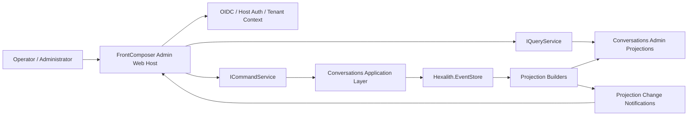

# Research Report: technical

**Date:** 2026-05-10
**Author:** Jerome
**Research Type:** technical

---

## Research Overview

This research evaluates how `Hexalith.FrontComposer` should be used to create the administration UI for `Hexalith.Conversations`. The focus is the v1 governance viewer described in the local product brief and PRD: tenant-scoped Find and Read workflows, event-sourced conversation reconstruction, attributed redactions, audit traceability, projection freshness, and fail-closed authorization. The research combines local source inspection of FrontComposer contracts, Shell, SourceTools, EventStore integration, MCP hosting, and tests with current external verification from Microsoft, Dapr, SignalR, HTTP, CloudEvents, Fluent UI Blazor, and Fluxor sources.

The key finding is that the Conversations administration UI should be contract-driven rather than hand-built as a separate portal. Conversations should expose FrontComposer-annotated commands and projections under the `Conversations` bounded context, allow SourceTools to generate the baseline shell/forms/views/manifests, and customize only the operator-specific transcript, redaction, audit, and freshness views. Tenant identity, user identity, tokens, claims, authorization, and resource visibility must stay in host/application context, never in generated command payloads.

The full Research Synthesis section at the end of this document turns the step-by-step findings into an implementation reference: recommended project layout, host wiring, projection and command contracts, integration flow, security rules, testing gates, roadmap, risks, and source verification notes.

---

<!-- Content will be appended sequentially through research workflow steps -->

## Technical Research Scope Confirmation

**Research Topic:** Hexalith.FrontComposer administration UI for Hexalith.Conversations
**Research Goals:** Determine how to use Hexalith.FrontComposer to create the administration UI for Hexalith.Conversations, including architecture, generated UI contracts, bounded-context integration, hosting, authorization, and implementation steps.

**Technical Research Scope:**

- Architecture Analysis - design patterns, frameworks, system architecture
- Implementation Approaches - development methodologies, coding patterns
- Technology Stack - languages, frameworks, tools, platforms
- Integration Patterns - APIs, protocols, interoperability
- Performance Considerations - scalability, optimization, patterns

**Research Methodology:**

- Current web data with rigorous source verification
- Multi-source validation for critical technical claims
- Confidence level framework for uncertain information
- Comprehensive technical coverage with architecture-specific insights

**Scope Confirmed:** 2026-05-10

## Technology Stack Analysis

### Programming Languages

Hexalith.FrontComposer is a .NET/C# and Razor-component stack. The local Counter sample targets `net10.0`, registers Razor components with interactive server rendering, and uses C# domain types as the source of truth for generated command/projection UI. Microsoft Learn describes Blazor as a .NET frontend framework for building rich interactive UI with C#, sharing .NET logic, and rendering HTML/CSS for browser reach; it also describes Blazor apps as component-based, with Razor components that can be reused and shared through assemblies or packages.

For Hexalith.Conversations, the administration UI should therefore start with C# contracts in a Conversations domain or contracts assembly:

- command types for governed operations such as redaction, retention policy updates, verification, and possibly archive/close operations;
- projection types for read-only administration views such as conversation search results, conversation detail, governance state, redaction attribution, audit trail, projection freshness, and verification status;
- Razor customizations only where generated rendering cannot express the needed operator workflow.

_Popular Languages: C# for domain contracts, generated UI, Fluxor actions/reducers/effects, and host wiring; Razor for component templates and overrides._
_Emerging Languages: none needed for v1; adding TypeScript/React would fight the existing FrontComposer direction._
_Language Evolution: FrontComposer is already aligned to modern .NET/Blazor, with local package pins for .NET 10-era dependencies._
_Performance Characteristics: Blazor Server/interactive SSR is appropriate for an administration UI because server-side access to tenant, authorization, and EventStore services stays near the backend; WebAssembly can be deferred unless there is a hard offline or static-hosting need._
_Sources: https://learn.microsoft.com/en-us/aspnet/core/blazor/?view=aspnetcore-10.0; https://learn.microsoft.com/en-us/aspnet/core/blazor/components/?view=aspnetcore-10.0; local `Hexalith.FrontComposer/samples/Counter/Counter.Web/Program.cs`; local `Hexalith.FrontComposer/samples/Counter/Counter.Domain/Counter.Domain.csproj`._

### Development Frameworks and Libraries

The UI framework is ASP.NET Core Blazor plus Microsoft Fluent UI Blazor. The Counter web host uses `AddRazorComponents().AddInteractiveServerComponents()`, `AddFluentUIComponents()`, `AddHexalithFrontComposerQuickstart(...)`, `AddHexalithDomain<T>()`, and generated projection template registration. Fluent UI Blazor's official repository states that `Microsoft.FluentUI.AspNetCore.*` packages provide Razor components for Blazor applications using the Fluent Design System, with `AddFluentUIComponents()` as the service-registration entry point.

FrontComposer adds its own framework layer:

- `Hexalith.FrontComposer.Contracts` supplies attributes such as `[Command]`, `[Projection]`, `[BoundedContext]`, `[ProjectionRole]`, and `[RequiresPolicy]`;
- `Hexalith.FrontComposer.SourceTools` emits generated Razor/Fluxor/manifest artifacts from annotated contracts;
- `Hexalith.FrontComposer.Shell` supplies the runtime shell, generated route/view envelope, lifecycle wrappers, authorization decorators, command palette, grid behavior, and override points;
- `Hexalith.FrontComposer.Mcp` can expose command tools and projection resources to agents, but should be hosted with tenant and resource gates.

Fluxor is the state-management layer already used by FrontComposer. The Fluxor repository describes it as a Flux/Redux-style library for Microsoft .NET and Blazor, intended to provide a single-state-store approach with low boilerplate. FrontComposer local code uses Fluxor for navigation, command palette, projection paging/navigation, density, and generated command/projection states.

_Major Frameworks: ASP.NET Core Blazor, Microsoft Fluent UI Blazor, Hexalith.FrontComposer Shell/Contracts/SourceTools, Fluxor._
_Micro-frameworks: SourceTools analyzers/generators are the key local code-generation layer; bUnit/xUnit/Verify/FsCheck support generated UI and contract testing._
_Evolution Trends: Blazor .NET 10 keeps the component model current; Fluent UI Blazor is active but explicitly best-effort open source, so version pinning and contingency testing matter._
_Ecosystem Maturity: Strong for Microsoft/.NET/Blazor; FrontComposer itself is local and should be treated as the governing API surface for Hexalith admin UI._
_Sources: https://github.com/microsoft/fluentui-blazor; https://github.com/mrpmorris/Fluxor; local `Hexalith.FrontComposer/Directory.Packages.props`; local `Hexalith.FrontComposer/docs/skills/frontcomposer/domain/commands.md`; local `Hexalith.FrontComposer/docs/skills/frontcomposer/domain/projections.md`._

### Database and Storage Technologies

FrontComposer should not be the persistence layer for Conversations. The Conversations product brief says persistence is handled by `Hexalith.EventStore`, tenant access by local projections of `Hexalith.Tenants`, and administration views by `Hexalith.FrontComposer`. The PRD requires operator/admin surfaces to expose projection freshness, degraded states, redactions, audit state, and verification output without leaking content or tenant data. That means the admin UI should consume Conversations application/query services and generated projections, not query raw event storage directly from UI code.

Recommended storage responsibilities:

- Event stream: owned by Hexalith.Conversations through Hexalith.EventStore.
- Read models/projections: Conversations-owned query surfaces shaped for FrontComposer `[Projection]` records.
- UI state: Fluxor and FrontComposer storage services for navigation, density, grid state, last-used values, and local shell preferences.
- Audit/evidence data: exposed through tenant-safe projections or commands, not through logs or raw store access.
- Cache/subscription freshness: surfaced as fields on projections such as `LastAppliedEventPosition`, `ProjectionGeneratedAt`, `IsStale`, `LagDuration`, or equivalent PRD-defined names.

_Relational Databases: not selected by FrontComposer; if Conversations read models are SQL-backed, keep that behind `IQueryService`/application services._
_NoSQL Databases: not selected by FrontComposer; document/event stores remain backend concerns._
_In-Memory Databases: only suitable for dev/demo state or tests; not governance evidence._
_Data Warehousing: out of v1 scope unless release evidence reporting later needs analytics export._
_Sources: local `_bmad-output/planning-artifacts/product-brief-Hexalith.Conversations.md`; local `_bmad-output/planning-artifacts/prd.md`; local `Hexalith.FrontComposer/src/Hexalith.FrontComposer.Contracts/Communication/IQueryService.cs`; local `Hexalith.FrontComposer/src/Hexalith.FrontComposer.Contracts/Communication/ICommandService.cs`._

### Development Tools and Platforms

The local FrontComposer pattern is generator-first. A consuming domain project references FrontComposer Contracts and Shell, adds SourceTools as an analyzer with `OutputItemType="Analyzer"` and `ReferenceOutputAssembly="false"`, and then lets generated `.g.cs` artifacts appear under `obj/` at build time. The FrontComposer sample guidance explicitly says never to edit generated files.

For Hexalith.Conversations, create a bounded-context admin/contracts project that mirrors the Counter sample:

1. Add a `Hexalith.Conversations.FrontComposer` or equivalent project for UI-facing commands/projections, unless architecture chooses to place attributes directly in the main contracts assembly.
2. Reference `Hexalith.FrontComposer.Contracts`, `Hexalith.FrontComposer.Shell`, and `Hexalith.FrontComposer.SourceTools` as analyzer.
3. Annotate partial command/projection C# types.
4. Build to generate registrations, routes, forms, Fluxor states/actions, and manifests.
5. Register generated descriptors in the admin web host.
6. Add only necessary Level 2 templates, Level 3 slot overrides, or Level 4 view overrides for the Find/Read governance workflows.

Testing should combine unit tests for Conversations command/projection contracts, generator integration/snapshot tests for FrontComposer output, bUnit tests for UI overrides, and accessibility/manual workflow checks for the PRD's operator scenarios. Existing FrontComposer packages already include xUnit v3, bUnit, Verify, FsCheck, and BenchmarkDotNet.

_IDE and Editors: Visual Studio/Rider/VS Code are all viable for .NET/Blazor; generated output should be inspected but not edited._
_Version Control: keep generated files out of source unless a local convention says otherwise; review contract annotations and custom overrides._
_Build Systems: `dotnet build` with Roslyn source generators/analyzers; central package management via `Directory.Packages.props`._
_Testing Frameworks: xUnit v3, bUnit, Verify, FsCheck; add Playwright only if end-to-end browser workflow tests are required around the admin host._
_Sources: https://learn.microsoft.com/en-us/dotnet/csharp/roslyn-sdk/#source-generators; local `Hexalith.FrontComposer/docs/skills/frontcomposer/samples/new-bounded-context.md`; local `Hexalith.FrontComposer/samples/Counter/Counter.Domain/Counter.Domain.csproj`; local `Hexalith.FrontComposer/Directory.Packages.props`._

### Cloud Infrastructure and Deployment

FrontComposer's local web sample is a standard ASP.NET Core Blazor Server app. Deployment should follow the host application's existing Hexalith deployment shape rather than introducing a separate UI platform. The admin UI can be:

- embedded in a Hexalith administration web host that references Conversations UI-facing contracts;
- hosted as a bounded-context admin module inside a larger shell;
- optionally exposed to agents through FrontComposer MCP endpoints if the host supplies tenant/resource/policy gates before `AddFrontComposerMcp`.

The PRD references Dapr/pub-sub and sidecar failure modes for Conversations operations. Dapr's official docs describe publish/subscribe as a building block and list support for brokers, dead-letter topics, resiliency, and deployment integrations such as Docker Compose, Kubernetes, and Azure Container Apps. For the administration UI, Dapr should remain a backend operations concern unless the UI host must surface pub/sub health and projection lag.

_Major Cloud Providers: no cloud-specific UI requirement; Azure Container Apps/AKS are plausible if the wider Hexalith deployment standard already uses Dapr._
_Container Technologies: standard ASP.NET Core containerization is enough for the admin host; Dapr sidecar belongs to backend services where pub/sub/service invocation are needed._
_Serverless Platforms: not recommended for the interactive admin shell unless deployment constraints demand it._
_CDN and Edge Computing: not relevant to v1 operator/governance UI._
_Sources: https://docs.dapr.io/developing-applications/building-blocks/pubsub/pubsub-overview/; local `Hexalith.FrontComposer/samples/Counter/Counter.Web/Program.cs`; local `Hexalith.FrontComposer/docs/skills/frontcomposer/setup/package-and-hosting.md`; local `_bmad-output/planning-artifacts/prd.md`._

### Technology Adoption Trends

The strongest adoption signal is internal rather than external: the Conversations product brief already names FrontComposer as the administration-view mechanism, and the PRD makes the operator read-only governance viewer a v1 release-critical surface. FrontComposer's model fits because Conversations needs auditable, tenant-scoped administration views over domain contracts, not a bespoke single-purpose UI.

The practical trend to follow is "contract-driven admin UI":

- Model Conversations admin capabilities as commands and projections first.
- Generate the baseline shell/forms/grids from FrontComposer SourceTools.
- Customize only the high-trust operator workflows where generated defaults are insufficient: Find, Read, time-travel cursor, redaction attribution, audit trail, projection freshness, and copyable citation references.
- Keep tenant identity, user identity, policy checks, and audit decisions in host/application context, not command form fields.
- Treat schema/version drift as a release concern; FrontComposer already contains schema fingerprinting, generated manifest, and MCP schema-gate concepts that should be reused.

_Migration Patterns: move from hand-built admin pages to annotated command/projection contracts plus generated shell views._
_Emerging Technologies: MCP exposure is useful for agent administration and verification, but only after tenant/resource/policy gates are implemented._
_Legacy Technology: direct EventStore browsing or log-derived governance screens should be avoided for v1 because they bypass the product contract and can leak tenant/content context._
_Community Trends: Blazor/Fluent UI/Fluxor are active enough for this stack, but Fluent UI Blazor support is repository/community based, so Hexalith should pin and regression-test UI package upgrades._
_Sources: https://github.com/microsoft/fluentui-blazor; https://github.com/mrpmorris/Fluxor; local `_bmad-output/planning-artifacts/product-brief-Hexalith.Conversations.md`; local `_bmad-output/planning-artifacts/prd.md`; local `Hexalith.FrontComposer/docs/skills/frontcomposer/security/tenant-and-policy-boundaries.md`._

## Integration Patterns Analysis

### API Design Patterns

The FrontComposer-to-Conversations boundary should be contract and service oriented, not page-to-database oriented. Locally, FrontComposer already defines `ICommandService.DispatchAsync<TCommand>` for command submission and `IQueryService.QueryAsync<T>` for projection reads. The EventStore-backed registration wires these interfaces to HTTP clients with default paths `/api/v1/commands` and `/api/v1/queries`, wraps command dispatch with authorization, and adds projection subscription services.

For Conversations administration, use this API split:

- Commands: governed changes such as `RedactMessageContentCommand`, `SetRetentionPolicyCommand`, `ArchiveConversationCommand`, and `RunGovernanceVerificationCommand`.
- Queries/projections: read-only operator surfaces such as `ConversationSearchResultProjection`, `ConversationReadProjection`, `ConversationGovernanceAuditProjection`, `ConversationRedactionProjection`, `ConversationProjectionFreshnessProjection`, and `GovernanceVerificationResultProjection`.
- Domain/application layer: Conversations owns validation, tenant checks, EventStore persistence, audit pairing, projection materialization, and typed errors.
- FrontComposer: renders forms and projections, dispatches via `ICommandService`, reads via `IQueryService`, and surfaces lifecycle/freshness states.

Microsoft's REST API Guidelines are a useful north star for external HTTP shape, but the local FrontComposer contract is more specific and should win. HTTP itself is appropriate here because the IETF specification defines a uniform request/response interface over representations; commands and queries can stay simple JSON over HTTPS with explicit status/error envelopes.

_RESTful APIs: Use REST/HTTP for the EventStore-backed command/query transport that FrontComposer already expects. Keep resource and operation names stable and versioned._
_GraphQL APIs: Not recommended for v1. Conversations needs governed commands, projection freshness, and audit-safe error semantics more than client-selected graph traversal._
_RPC and gRPC: Consider only for internal high-throughput backend services. The admin UI does not need gRPC directly._
_Webhook Patterns: Not a primary UI pattern. If downstream systems need notifications, expose domain events through backend pub/sub, not browser webhooks._
_Source: https://github.com/microsoft/api-guidelines; https://www.ietf.org/rfc/rfc9110.html; local `Hexalith.FrontComposer/src/Hexalith.FrontComposer.Contracts/Communication/ICommandService.cs`; local `Hexalith.FrontComposer/src/Hexalith.FrontComposer.Contracts/Communication/IQueryService.cs`; local `Hexalith.FrontComposer/src/Hexalith.FrontComposer.Shell/Infrastructure/EventStore/EventStoreOptions.cs`._

### Communication Protocols

Use HTTPS for command/query traffic, SignalR for projection-change notification, and backend pub/sub for Conversations event distribution. ASP.NET Core SignalR is a strong fit for UI refresh hints because Microsoft documents it as a real-time library that allows server-side code to push content to clients. FrontComposer already contains a projection-changes hub path (`/hubs/projection-changes`) and a `ProjectionSubscriptionService`.

The pattern should be:

1. Operator opens generated or customized FrontComposer projection page.
2. FrontComposer calls `IQueryService.QueryAsync<TProjection>` with tenant context, filters, pagination, ETags, and cache discriminator where allowed.
3. Operator submits a governed command through generated command form.
4. `ICommandServiceWithLifecycle` returns acknowledgement/lifecycle state; authorization runs before side effects.
5. Conversations persists/audits through EventStore and updates projections.
6. Projection-change notification nudges FrontComposer to refresh or mark stale data.
7. UI shows trust state: pending, confirmed, stale, lagged, blocked, redacted, or degraded.

_HTTP/HTTPS Protocols: Primary transport for command/query APIs. Require HTTPS and bearer/OIDC integration for production._
_WebSocket Protocols: Use indirectly through SignalR for projection-change notification, not for command persistence._
_Message Queue Protocols: Use through backend Dapr/pub-sub or equivalent; do not expose broker semantics to FrontComposer UI code._
_gRPC and Protocol Buffers: Useful for service-to-service paths only if wider Hexalith standards require them; not needed for the Blazor admin shell._
_Source: https://learn.microsoft.com/en-us/aspnet/core/signalr/introduction?view=aspnetcore-8.0; https://docs.dapr.io/developing-applications/building-blocks/pubsub/pubsub-overview/; local `Hexalith.FrontComposer/src/Hexalith.FrontComposer.Shell/Extensions/EventStoreServiceExtensions.cs`; local `Hexalith.FrontComposer/src/Hexalith.FrontComposer.Contracts/Communication/QueryRequest.cs`._

### Data Formats and Standards

JSON is the natural command/query payload format because FrontComposer and ASP.NET Core are already JSON-friendly, RFC 8259 defines JSON as a portable textual interchange format, and FrontComposer MCP uses `System.Text.Json.JsonElement` for tool arguments. Keep command and projection payloads deterministic and versioned: no raw provider payloads, no unbounded text in operational signals, and no user/tenant secrets in generated metadata.

For projection caching, FrontComposer's `QueryRequest` and `QueryResult<T>` support `ETag`, `ETags`, and `IsNotModified`. This maps well to HTTP validator semantics: RFC 9111 describes entity tags in ETag fields as validators used with conditional request headers such as `If-None-Match`.

For backend event publication, CloudEvents is worth considering if Hexalith wants cross-module event interoperability. The CloudEvents specification describes event data in common formats for interoperability across services, platforms, and systems, and includes JSON, HTTP, Kafka, AMQP, MQTT, NATS, and Protobuf bindings. This is relevant to Conversations' cross-module events, but FrontComposer should consume projections rather than raw CloudEvents.

_JSON and XML: Use JSON; avoid XML unless an external compliance/export integration later requires it._
_Protobuf and MessagePack: Defer. Use only if backend throughput data proves JSON is insufficient._
_CSV and Flat Files: Not a v1 UI integration format; evidence bundle export is v1.1 and should be designed separately._
_Custom Data Formats: Avoid custom UI payload formats. If events need interoperability, prefer a standard envelope such as CloudEvents plus Hexalith event schema version metadata._
_Source: https://www.rfc-editor.org/rfc/rfc8259; https://www.ietf.org/rfc/rfc9111.html; https://github.com/cloudevents/spec; local `Hexalith.FrontComposer/src/Hexalith.FrontComposer.Contracts/Communication/QueryResult.cs`; local `_bmad-output/planning-artifacts/prd.md`._

### System Interoperability Approaches

FrontComposer should sit at the Hexalith administration boundary and interoperate through published contracts, generated manifests, DI registrations, and host-supplied authorization/tenant services. The product brief explicitly says Conversations uses EventStore for persistence, Tenants for tenant access, Parties/Projects/Folders as upstream stable-ID owners, and FrontComposer for administration views.

Recommended interoperability map:

- FrontComposer Shell ↔ Conversations admin contracts: source-generated routes/forms/projections from attributes.
- FrontComposer Shell ↔ Conversations application API: `ICommandService`, `IQueryService`, lifecycle, projection subscriptions.
- Conversations ↔ EventStore: append/read/replay/publish; UI sees typed projection state and freshness only.
- Conversations ↔ Tenants: fail-closed tenant access decisions before aggregate or projection access.
- Conversations ↔ Parties/Projects/Folders: read-time stable-ID resolution for display and search filters.
- Conversations ↔ agents: optional FrontComposer MCP tools/resources with mandatory tenant and resource visibility gates.

_Point-to-Point Integration: Acceptable for FrontComposer-to-Conversations command/query clients because the interface is framework-owned and narrow._
_API Gateway Patterns: Useful at deployment edge if the Hexalith admin shell aggregates modules, but not a replacement for domain-level tenant/policy checks._
_Service Mesh: Infrastructure concern; do not let mesh identity replace application tenant checks._
_Enterprise Service Bus: Not needed for v1 UI. Backend pub/sub can cover decoupled event publication._
_Source: local `_bmad-output/planning-artifacts/product-brief-Hexalith.Conversations.md`; local `_bmad-output/planning-artifacts/prd.md`; local `Hexalith.FrontComposer/docs/skills/frontcomposer/setup/package-and-hosting.md`; local `Hexalith.FrontComposer/src/Hexalith.FrontComposer.Mcp/Extensions/FrontComposerMcpServiceCollectionExtensions.cs`._

### Microservices Integration Patterns

The admin UI should not know whether Conversations is one service, several services, or an EventStore-backed module. It should know the FrontComposer contracts and the admin host service registrations. This preserves replaceability and makes the generated UI testable.

Use these patterns selectively:

- API gateway: route authenticated admin traffic to the Conversations API host, but preserve per-command and per-query policy checks.
- Service discovery: rely on configuration/service discovery for `EventStoreOptions.BaseAddress`; do not hard-code module URLs in generated UI.
- Circuit breaker/timeouts: keep FrontComposer request timeouts bounded and surface degraded states as PRD-required trust signals.
- Saga: not a UI concern. For multi-module governance workflows, model saga/process manager behavior in the backend and expose status as a projection.
- Outbox: relevant for Conversations event publication. Dapr documents an outbox pattern for a single transaction across a state store and broker; whether Hexalith.EventStore already supplies this should be decided in architecture.

_API Gateway Pattern: Good for host routing and cross-cutting auth, insufficient alone for tenant isolation._
_Service Discovery: Use configuration/Aspire/service discovery for backend base addresses._
_Circuit Breaker Pattern: Required at HTTP/backend boundary; UI should show retryable/degraded state rather than hiding failures._
_Saga Pattern: Backend-only for multi-step governance or evidence workflows._
_Source: https://docs.dapr.io/developing-applications/building-blocks/pubsub/pubsub-overview/; local `Hexalith.FrontComposer/src/Hexalith.FrontComposer.Shell/Infrastructure/EventStore/EventStoreOptions.cs`; local `_bmad-output/planning-artifacts/prd.md`._

### Event-Driven Integration

Conversations is event-sourced, so the admin UI must be projection-first and freshness-aware. It should never mutate read models or infer governance truth from logs. The PRD requires projection freshness, stale/rebuilding/unavailable states, audit pairing, redaction-replay correctness, and event schema evolution. FrontComposer already has query cache, ETag, projection subscriptions, connection-state components, and lifecycle wrappers that support this pattern.

Recommended event-driven flow:

1. Commands carry a `MessageId` for idempotency and correlation.
2. Conversations aggregate validates tenant, policy, and domain invariants.
3. Governance commands write paired audit events in the same transaction boundary or fail closed.
4. EventStore persists ordered events and publishes integration/projection notifications.
5. Projectors build operator-safe projections.
6. FrontComposer queries projections, receives SignalR nudges, and displays freshness/trust state.
7. Dapr/pub-sub, if used, must be treated as at-least-once; subscribers and projections must be idempotent.

_Publish-Subscribe Patterns: Use Dapr or existing Hexalith pub/sub for backend publication, not UI coupling. Dapr explicitly provides platform-agnostic pub/sub with at-least-once delivery._
_Event Sourcing: Core to Conversations. UI reads projections and time-travel projections; raw event replay belongs in backend verification/query services._
_Message Broker Patterns: Broker choice should remain pluggable behind Dapr/EventStore/Hexalith infrastructure._
_CQRS Patterns: This is the central UI pattern: commands mutate; projections answer operator questions._
_Source: https://docs.dapr.io/developing-applications/building-blocks/pubsub/pubsub-overview/; https://github.com/cloudevents/spec; local `_bmad-output/planning-artifacts/prd.md`; local `Hexalith.FrontComposer/src/Hexalith.FrontComposer.Shell/Extensions/EventStoreServiceExtensions.cs`._

### Integration Security Patterns

Security is the load-bearing integration concern. The Conversations PRD requires fail-closed tenant isolation, content-safe errors, no cross-tenant leakage, and operator/admin surfaces that clearly distinguish hidden, stale, blocked, degraded, and redacted states. FrontComposer already reinforces this: command dispatch authorization is wrapped by `AuthorizingCommandServiceDecorator`, policy lookup is based on generated registry metadata, and MCP registration fails if the host does not register tenant and resource visibility gates.

For browser/operator access, use OpenID Connect/OAuth through the admin host. Microsoft identity documentation describes authorization code flow through `/authorize`, `client_id`, `redirect_uri`, scopes, and PKCE; FrontComposer's EventStore options already support access-token requirements. For agent/MCP access, do not treat API keys as equivalent to users unless the host maps them to tenant and user/agent identity and gates every tool/resource request.

Security rules for Conversations admin UI:

- Do not include `TenantId`, `UserId`, claims, tokens, or policy decisions as command-form fields.
- Use `[RequiresPolicy]` for protected commands and validate authorization again at dispatch.
- Fail closed when tenant context is missing, stale, ambiguous, mismatched, or unauthorized.
- Return content-safe ProblemDetails/error payloads that avoid confirming target conversation existence.
- Revalidate resource visibility before projection reads and before rendering MCP resources.
- Keep skill resources global only if they contain no tenant/domain data; all projection resources are tenant-scoped.
- Treat MCP tools as dangerous operations requiring explicit admission and lifecycle tracking.

_OAuth 2.0 and JWT: Use host-owned OIDC/OAuth access tokens for the admin shell and backend APIs._
_API Key Management: Only for controlled MCP/agent scenarios; require tenant/user mapping, rotation, and least privilege._
_Mutual TLS: Useful service-to-service hardening, but not a substitute for application authorization._
_Data Encryption: HTTPS required in transit; storage encryption and audit evidence handling are backend/platform controls._
_Source: https://learn.microsoft.com/en-us/entra/identity-platform/v2-oauth2-auth-code-flow; https://modelcontextprotocol.io/specification/2024-11-05/index; local `Hexalith.FrontComposer/src/Hexalith.FrontComposer.Shell/Services/Authorization/CommandDispatchAuthorizationGate.cs`; local `Hexalith.FrontComposer/src/Hexalith.FrontComposer.Mcp/Extensions/FrontComposerMcpServiceCollectionExtensions.cs`; local `Hexalith.FrontComposer/docs/skills/frontcomposer/security/tenant-and-policy-boundaries.md`._

## Architectural Patterns and Design

### System Architecture Patterns

The best-fit architecture for the Hexalith.Conversations administration UI is a **FrontComposer-generated CQRS adapter over an event-sourced Conversations module**.

Microsoft's CQRS guidance defines CQRS as separating read and write operations into distinct models so each can be optimized independently, and explicitly notes that CQRS can improve performance, scalability, and security. This aligns with FrontComposer's existing `ICommandService` and `IQueryService` split. Microsoft's event-sourcing guidance also matches Conversations' governance needs: the event store is the accurate record and can restore state to a point in time, while materialized views are used for efficient querying.

Architectural shape:

```text
Admin Browser
  -> Blazor + FrontComposer Shell
      -> Generated command forms and projection views
      -> Optional custom Find/Read templates
      -> ICommandService / IQueryService / projection subscriptions
          -> Conversations application API
              -> Tenant + policy gates
              -> Conversation aggregate + governance aggregate behavior
              -> Hexalith.EventStore
              -> Projectors/materialized read models
              -> SignalR projection-change notifications
```

The UI should be composed from generated FrontComposer artifacts, with custom code only at the operator workflow edge:

- Find screen: search by external identifiers, date range, business context, participant, redaction/retention status, and projection freshness.
- Read screen: reconstructed transcript, attributed redactions, governance audit trail, temporal cursor/time-travel view, citation blocks, and trust-state banners.
- Optional Verify panel: invokes a governed verification command or reads a verification projection.

_Source: https://learn.microsoft.com/en-us/azure/architecture/patterns/cqrs; https://learn.microsoft.com/en-us/azure/architecture/patterns/event-sourcing; local `Hexalith.FrontComposer/src/Hexalith.FrontComposer.Contracts/Communication/ICommandService.cs`; local `Hexalith.FrontComposer/src/Hexalith.FrontComposer.Contracts/Communication/IQueryService.cs`; local `_bmad-output/planning-artifacts/prd.md`._

### Design Principles and Best Practices

The most important design principle is **domain-contract first, UI-generation second, customization last**. FrontComposer's local docs say command types are partial C# types marked with `[Command]`, projection types are partial C# types marked with `[Projection]`, and display/field attributes should come from `Contracts` so SourceTools can emit manifests and view code. The generated files under `obj/` are framework-owned and must not be hand-edited.

Design rules for Conversations:

- Put business intent into command names: `RedactMessageContent`, not `UpdateMessage`.
- Put operator questions into projection names: `ConversationGovernanceReadModel`, not generic DTOs.
- Use `[BoundedContext("Conversations")]` consistently so generated navigation and manifest grouping are deterministic.
- Use `[RequiresPolicy]` on protected commands; policy registration and claim mapping remain host concerns.
- Keep tenant/user/claims/tokens out of command properties; derive them from host/user context.
- Prefer generated projection roles and display annotations before writing custom renderers.
- Use Level 2 templates for layout changes, Level 3 slot overrides for field-specific rendering, and Level 4 view overrides only when the whole projection body needs a specialized operator workflow.
- Treat generated code, manifests, schema fingerprints, and skill examples as compatibility artifacts.

This is a hexagonal/ports-and-adapters architecture in local terms: FrontComposer is an adapter over Conversations commands/projections; Conversations application services are the port implementation; EventStore, Tenants, Parties, Projects, and Folders remain external dependencies hidden behind application/query services.

_Source: local `Hexalith.FrontComposer/docs/skills/frontcomposer/domain/commands.md`; local `Hexalith.FrontComposer/docs/skills/frontcomposer/domain/projections.md`; local `Hexalith.FrontComposer/docs/skills/frontcomposer/samples/new-bounded-context.md`; local `Hexalith.FrontComposer/docs/skills/frontcomposer/testing/generated-code-validator.md`; local `Hexalith.FrontComposer/src/Hexalith.FrontComposer.Contracts/Attributes/RequiresPolicyAttribute.cs`._

### Scalability and Performance Patterns

The v1 admin UI has two performance obligations from the PRD: operator workflows should be usable within the 90-second investigation target, and the UI must clearly surface projection freshness/degraded states. CQRS helps because read projections can be shaped for the Find and Read screens instead of forcing the UI to assemble raw event history.

Use these performance patterns:

- Materialized views for search and read screens. Microsoft event-sourcing guidance recommends materialized views because event stores are not suited for efficient querying.
- Projection-specific pagination/filtering/sorting through `QueryRequest`.
- ETag cache validation through FrontComposer's `ETag`, `ETags`, `CacheDiscriminator`, and `QueryResult<T>.IsNotModified` support.
- SignalR projection-change notifications for refresh hints, not for durable state.
- Read-model freshness fields as first-class projection properties.
- Backend-only rebuild/replay jobs with progress projections, not browser-side replay.

Avoid a single "god projection" that tries to serve every workflow. Use small, purposeful projections:

- `ConversationSearchResultProjection`
- `ConversationReadHeaderProjection`
- `ConversationTimelineEntryProjection`
- `ConversationGovernanceAuditEntryProjection`
- `ConversationRedactionAttributionProjection`
- `ConversationProjectionFreshnessProjection`
- `GovernanceVerificationResultProjection`

_Source: https://learn.microsoft.com/en-us/azure/architecture/patterns/cqrs; https://learn.microsoft.com/en-us/azure/architecture/patterns/event-sourcing; https://learn.microsoft.com/en-us/azure/architecture/patterns/materialized-view; local `Hexalith.FrontComposer/src/Hexalith.FrontComposer.Contracts/Communication/QueryRequest.cs`; local `Hexalith.FrontComposer/src/Hexalith.FrontComposer.Contracts/Communication/QueryResult.cs`; local `_bmad-output/planning-artifacts/prd.md`._

### Integration and Communication Patterns

Architecturally, FrontComposer is a module adapter, not a service orchestrator. The integration section already identified HTTP/JSON command/query, SignalR projection nudges, and backend pub/sub. The architecture decision is to keep those roles clean:

- Browser interactivity: Blazor Server/interactive SSR through FrontComposer Shell.
- Command/query transport: HTTP/JSON through `ICommandService` and `IQueryService`.
- Projection change hints: SignalR through FrontComposer projection subscriptions.
- Backend event distribution: EventStore/Dapr/pub-sub.
- Agent access: MCP only if the host supplies tenant/resource/policy gates.

Azure's microservices pattern catalog supports several relevant boundaries: anti-corruption layers prevent incompatible domain models from leaking across services; BFF separates client-specific concerns; gateway routing/offloading centralizes routing and edge concerns; sagas manage cross-service consistency. For Conversations admin UI, use these sparingly:

- Use an anti-corruption layer between FrontComposer UI projections and upstream Parties/Projects/Folders display state.
- Treat the admin host as a lightweight BFF only when it needs operator-specific composition.
- Do not put tenant isolation solely in an API gateway.
- Do not make the browser coordinate sagas; expose saga/process status as projections.

_Source: https://learn.microsoft.com/en-gb/azure/architecture/microservices/design/patterns; https://learn.microsoft.com/en-us/azure/architecture/guide/architecture-styles/event-driven; local `Hexalith.FrontComposer/src/Hexalith.FrontComposer.Shell/Extensions/EventStoreServiceExtensions.cs`; local `Hexalith.FrontComposer/src/Hexalith.FrontComposer.Mcp/Extensions/FrontComposerMcpServiceCollectionExtensions.cs`._

### Security Architecture Patterns

The security architecture must be **fail-closed, tenant-first, and content-safe**. Azure multitenant identity guidance says identity components verify authentication and enforce permissions within tenant scope; it also warns not to build your own identity provider and recommends modern standards such as OAuth2/OpenID Connect. It further notes that tenant mapping should use immutable unique identifiers and that multi-tenant users need clear tenant switching to prevent accidental cross-tenant access.

Conversations and FrontComposer should implement that as:

- Host-owned authentication using OIDC/OAuth.
- Host-owned tenant context accessor that resolves the current tenant from immutable identifiers.
- No generated command fields for tenant/user/claims/token.
- Command metadata with `[RequiresPolicy]`; dispatch-time authorization before any side effect.
- Query/resource visibility gates before projection reads and before rendering MCP resources.
- Opaque error payloads for hidden/forbidden resources to avoid confirming existence.
- Redaction-aware rendering that never relies on color alone.
- Content-safe logs, metrics, errors, diagnostics, and conformance artifacts.

FrontComposer already has helpful structural guardrails: default null/fail-closed user context accessors, authorization decorators, tenant-scoped manifest gates, production guardrails for demo tenant context, and MCP startup checks that reject missing tenant/resource gates.

_Source: https://learn.microsoft.com/en-us/azure/architecture/guide/multitenant/considerations/identity; https://learn.microsoft.com/en-us/azure/architecture/guide/multitenant/considerations/overview; local `Hexalith.FrontComposer/src/Hexalith.FrontComposer.Shell/Extensions/ServiceCollectionExtensions.cs`; local `Hexalith.FrontComposer/src/Hexalith.FrontComposer.Shell/Services/Authorization/CommandDispatchAuthorizationGate.cs`; local `Hexalith.FrontComposer/docs/skills/frontcomposer/security/tenant-and-policy-boundaries.md`; local `_bmad-output/planning-artifacts/prd.md`._

### Data Architecture Patterns

Use **event stream as source of truth, projections as admin read models, stable IDs for upstream references**.

The Conversations product brief states that conversations attach to Projects, Folders, and Parties by stable identifiers, while those modules retain ownership. The PRD reinforces that read-time resolution should use upstream canonical state. That makes the data architecture:

- Event stream: Conversations-owned durable record, with schema/version metadata.
- Aggregate state: reconstructed from event stream for command validation.
- Audit evidence: governance events paired with governance mutations.
- Admin projections: denormalized, tenant-safe, redaction-safe views optimized for operator workflows.
- Upstream references: stable IDs plus read-time resolved labels/status.
- Projection freshness: exposed consistently through query contracts and UI.

Do not store display copies of upstream Party/Project/Folder state as authoritative data in Conversations admin projections. Cache labels where necessary for performance, but make provenance and freshness explicit.

For the read-only governance viewer, the minimum projection set should include:

- search index by external identifier, business context, participant, date, redaction count, retention state;
- transcript/timeline entries with actor attribution and redaction markers;
- governance audit timeline with same correlation/tenant evidence;
- temporal cursor projection that can reconstruct historical state;
- projection health/freshness projection.

_Source: https://learn.microsoft.com/en-us/azure/architecture/patterns/event-sourcing; https://learn.microsoft.com/en-us/azure/architecture/patterns/materialized-view; local `_bmad-output/planning-artifacts/product-brief-Hexalith.Conversations.md`; local `_bmad-output/planning-artifacts/prd.md`._

### Deployment and Operations Architecture

Deploy the admin UI as part of a Hexalith admin web host or bounded-context admin module that references Conversations UI contracts and FrontComposer Shell. Do not create a separate persistence or orchestration plane for the UI.

Recommended host composition:

```csharp
builder.Host.UseDefaultServiceProvider(o => o.ValidateScopes = true);

builder.Services.AddRazorComponents()
    .AddInteractiveServerComponents();
builder.Services.AddFluentUIComponents();

builder.Services.AddHexalithFrontComposerQuickstart(
    o => o.ScanAssemblies(typeof(Program).Assembly, typeof(ConversationsAdminMarker).Assembly));
builder.Services.AddHexalithDomain<ConversationsAdminMarker>();
builder.Services.AddHexalithEventStore(options =>
{
    options.BaseAddress = new Uri(builder.Configuration["Hexalith:EventStore:BaseAddress"]!);
});
```

Add these production-only requirements:

- real `IUserContextAccessor` / tenant context integration;
- OIDC/OAuth authentication and authorization policies matching `[RequiresPolicy]`;
- EventStore command/query endpoint configuration;
- projection subscription configuration and degraded-mode UX;
- no fake/demo tenant context outside development;
- generated-code validation and SourceTools diagnostics in CI;
- bUnit/accessibility tests for custom templates and overrides;
- operator workflow test for Find/Read in the 90-second scenario.

For MCP hosting, register tenant and resource visibility gates before `AddFrontComposerMcp`, and map endpoints only after all descriptors/options are registered. For v1, prefer browser admin UI first; MCP should be treated as a privileged agent/admin surface.

_Source: local `Hexalith.FrontComposer/samples/Counter/Counter.Web/Program.cs`; local `Hexalith.FrontComposer/src/Hexalith.FrontComposer.Shell/Extensions/ServiceCollectionExtensions.cs`; local `Hexalith.FrontComposer/src/Hexalith.FrontComposer.Shell/Extensions/EventStoreServiceExtensions.cs`; local `Hexalith.FrontComposer/docs/skills/frontcomposer/setup/package-and-hosting.md`; local `_bmad-output/planning-artifacts/prd.md`._

## Implementation Approaches and Technology Adoption

### Technology Adoption Strategies

Adopt FrontComposer for Hexalith.Conversations incrementally, starting with generated admin-safe contracts before custom UI. This fits both the local FrontComposer pattern and modern DevOps guidance: Microsoft DevOps guidance emphasizes short release cycles, automated testing, and continuous improvement; Azure Well-Architected Operational Excellence emphasizes development standards, observability, automation, and safe deployment practices.

Recommended adoption path:

1. **Contract first:** create UI-facing Conversations command/projection types annotated with FrontComposer attributes.
2. **Generated baseline:** let SourceTools generate routes, forms, Fluxor state/actions, projection views, and manifests.
3. **Read-only governance viewer:** implement the v1 Find + Read workflow as generated projections plus minimal custom templates.
4. **Operational evidence:** add projection freshness, audit state, degraded-mode banners, and citation-copy affordances.
5. **Governed mutations later:** keep full retention editor and evidence bundle generation for v1.1 unless v1 scope changes.
6. **Agent/MCP exposure last:** expose MCP tools/resources only after browser UI and tenant/resource gates are proven.

Avoid a big-bang custom admin portal. The risk is high because Conversations combines event sourcing, tenant isolation, redaction, audit evidence, and generated UI metadata. A thin-slice adoption lets the team validate generated contracts, tenant gates, and operator workflow semantics before expanding.

_Source: https://learn.microsoft.com/en-us/devops/what-is-devops; https://learn.microsoft.com/en-us/azure/well-architected/operational-excellence/; local `Hexalith.FrontComposer/docs/skills/frontcomposer/samples/new-bounded-context.md`; local `_bmad-output/planning-artifacts/prd.md`._

### Development Workflows and Tooling

Use the existing Hexalith/FrontComposer tooling style:

- `dotnet build` for generator/analyzer execution.
- `dotnet test` for unit, bUnit, property, and generator tests.
- SourceTools analyzer references with `OutputItemType="Analyzer"` and `ReferenceOutputAssembly="false"`.
- Central package management where the module establishes a `Directory.Packages.props`.
- Generated `.g.cs` files owned by SourceTools and excluded from hand edits.
- GitHub Actions or the existing CI system for build/test automation. GitHub Actions documentation describes workflows as repository-native automation for jobs including CI/CD.

Suggested project layout:

```text
src/
  Hexalith.Conversations.Contracts/
  Hexalith.Conversations.Application/
  Hexalith.Conversations.FrontComposer/
    ConversationSearchResultProjection.cs
    ConversationReadHeaderProjection.cs
    ConversationTimelineEntryProjection.cs
    ConversationGovernanceAuditEntryProjection.cs
    ConversationRedactionAttributionProjection.cs
    GovernanceVerificationResultProjection.cs
    RedactMessageContentCommand.cs
    RunGovernanceVerificationCommand.cs
    ConversationsFrontComposerRegistration.cs
  Hexalith.Conversations.Admin.Web/
    Program.cs
    Components/
      Templates/
      Slots/
      Replacements/
tests/
  Hexalith.Conversations.FrontComposer.Tests/
  Hexalith.Conversations.Admin.Web.Tests/
  e2e/
```

Development sequence:

1. Add the FrontComposer contracts/generator references.
2. Create a bounded context marker, e.g. `[BoundedContext("Conversations")] public sealed class ConversationsAdminMarker`.
3. Add initial projections for Find/Read.
4. Build and inspect generated registry/manifest output.
5. Register the domain in the admin host with `AddHexalithDomain<ConversationsAdminMarker>()`.
6. Wire `AddHexalithEventStore(...)` or the Conversations-specific command/query adapters.
7. Add custom templates only for transcript timeline, redaction attribution, and audit trail if generated rendering is insufficient.

_Source: https://docs.github.com/en/actions; local `Hexalith.FrontComposer/samples/Counter/Counter.Domain/Counter.Domain.csproj`; local `Hexalith.FrontComposer/samples/Counter/Counter.Web/Program.cs`; local `Hexalith.FrontComposer/tests/README.md`._

### Testing and Quality Assurance

Testing must cover both generated UI mechanics and Conversations' governance invariants. Microsoft Blazor testing docs identify bUnit as a convenient third-party Razor component testing library and recommend E2E testing when JS/DOM behavior or third-party UI dependencies matter. The local FrontComposer test architecture already uses xUnit, bUnit, FsCheck, Verify, and Playwright.

Minimum test layers:

- **Contract tests:** command/projection annotations, `[RequiresPolicy]`, bounded context, display metadata, no tenant/user/token fields.
- **Generator tests:** SourceTools emits registration, Fluxor, Razor, command forms, and projection manifests for Conversations contracts.
- **Application tests:** command validation, tenant fail-closed behavior, audit pairing, idempotency, redaction replay, projection freshness.
- **bUnit tests:** custom templates/slots/view replacements, redaction markers, audit timeline, freshness banners.
- **Playwright E2E:** seeded Find -> Read workflow, keyboard navigation, citation copy, no cross-tenant access, degraded projection state.
- **Accessibility tests:** WCAG 2.1 AA tags with axe-core/Playwright plus manual keyboard/screen-reader checks for redaction/audit state.
- **Property tests:** audit pairing and tenant isolation should not rely only on examples.

CI gates:

```powershell
dotnet build
dotnet test
npm --prefix tests/e2e install
npm --prefix tests/e2e test
```

Add a generated-code admission step inspired by FrontComposer's validator guidance: reject generated-file edits, tenant-spoofing fields, unapproved package references, custom MSBuild `Exec`, local path imports, and missing registrations.

_Source: https://learn.microsoft.com/en-us/aspnet/core/blazor/test?view=aspnetcore-10.0; https://learn.microsoft.com/en-us/dotnet/core/testing/unit-testing-with-dotnet-test; https://playwright.dev/dotnet/docs/intro; local `Hexalith.FrontComposer/tests/README.md`; local `Hexalith.FrontComposer/docs/skills/frontcomposer/testing/generated-code-validator.md`._

### Deployment and Operations Practices

Deploy the admin UI through the same operational discipline as other Hexalith services. Azure Well-Architected Operational Excellence highlights observability, automation, infrastructure as code, reliable workload supply chain, safe deployment practices, and incident response. Microsoft DevOps guidance similarly emphasizes CI/CD, IaC, continuous monitoring, and rich telemetry.

Operational requirements for the Conversations admin UI:

- Validate DI scopes at startup (`ValidateScopes = true`) to avoid cross-circuit/user leaks.
- Reject fake/demo tenant context outside development.
- Configure production authentication and authorization policies before enabling protected commands.
- Expose health/freshness signals for command API, query API, projection subscriptions, tenant projection state, audit sink, and EventStore connectivity.
- Treat governance command failure as fail-closed when audit sink is unavailable.
- Use safe deployments with seeded smoke checks for the Find/Read workflow.
- Ensure logs and metrics remain content-safe and avoid unbounded conversation/user text dimensions.
- Upload CI artifacts: test results, generated manifest checks, accessibility reports, and conformance evidence.

For v1 operations, the UI does not need to own Dapr, EventStore, or projection rebuild orchestration. It should surface their state through projections and operator-safe diagnostics.

_Source: https://learn.microsoft.com/en-us/azure/well-architected/operational-excellence/; https://learn.microsoft.com/en-us/devops/what-is-devops; local `Hexalith.FrontComposer/samples/Counter/Counter.Web/Program.cs`; local `_bmad-output/planning-artifacts/prd.md`._

### Team Organization and Skills

The implementation needs a small cross-functional slice rather than a pure frontend effort:

- **Domain engineer:** Conversations commands, events, audit invariants, projections, EventStore integration.
- **FrontComposer/Blazor engineer:** annotated contracts, generated UI, templates/slots/replacements, Fluxor behavior, Fluent UI details.
- **Security/tenant owner:** tenant context, `[RequiresPolicy]`, fail-closed query and command authorization, content-safe errors.
- **Test architect:** property tests, bUnit, Playwright, accessibility, conformance evidence.
- **Operator/stakeholder reviewer:** validates Find/Read workflow against Sarah's PRD journey.

Critical skills:

- Blazor/Razor and Fluent UI Blazor.
- FrontComposer SourceTools and generated artifacts.
- CQRS/event sourcing and materialized projections.
- ASP.NET Core DI/auth/authorization.
- Tenant isolation testing.
- Accessibility testing for operator workflows.
- Operational telemetry and incident-response thinking.

_Source: https://learn.microsoft.com/en-us/devops/what-is-devops; https://learn.microsoft.com/en-us/aspnet/core/blazor/test?view=aspnetcore-10.0; local `Hexalith.FrontComposer/tests/README.md`; local `_bmad-output/planning-artifacts/prd.md`._

### Cost Optimization and Resource Management

The main cost risk is not UI compute; it is expensive projection/query/replay work hidden behind an apparently simple admin screen. Keep costs controlled by shaping projections for operator workflows and avoiding raw event replay on every read.

Cost controls:

- Materialize Find and Read projections for the exact v1 workflow.
- Use pagination, sorting, filters, and ETag cache validation.
- Keep transcript payloads bounded and stream/page large timelines.
- Avoid high-cardinality telemetry dimensions such as conversation ID or raw business identifiers.
- Run heavy verification/rebuild jobs asynchronously and expose status projections.
- Limit Playwright/full E2E tests in every PR to smoke/a11y critical path; run broader suites nightly or before release.
- Track CI duration and flaky test reruns.

_Source: https://learn.microsoft.com/en-us/azure/well-architected/operational-excellence/; local `Hexalith.FrontComposer/src/Hexalith.FrontComposer.Contracts/Communication/QueryRequest.cs`; local `_bmad-output/planning-artifacts/prd.md`._

### Risk Assessment and Mitigation

| Risk | Impact | Mitigation |
|---|---|---|
| Generated UI exposes unsafe command fields | Tenant/user spoofing or policy bypass | Static admission checks; no tenant/user/token fields; host context only |
| Custom template bypasses generated lifecycle/freshness state | Operator trusts stale or incomplete data | Keep shell envelope generated; custom only projection body; bUnit and E2E tests |
| Query projection leaks cross-tenant existence | Compliance/security failure | Tenant gates before query and render; hidden/unknown error surface |
| Audit state displayed without temporal correctness | Governance claim collapses | Time-travel projection tests; audit pairing property tests |
| EventStore/projection lag hidden from operator | Bad decisions from stale data | Freshness fields and degraded-state banners in every Read view |
| MCP tool/resource exposure too early | Agent can enumerate or mutate tenant data | Browser-first rollout; mandatory gates; lifecycle tracking; explicit allowlist |
| Fluent UI/FrontComposer version drift breaks generated surfaces | UI regressions | Version pinning, generated manifest/schema checks, bUnit snapshots |
| Scope creep into full governance product | v1 slips | Keep v1 read-only viewer; defer evidence bundle and retention editor |

_Source: local `_bmad-output/planning-artifacts/prd.md`; local `Hexalith.FrontComposer/docs/skills/frontcomposer/security/tenant-and-policy-boundaries.md`; local `Hexalith.FrontComposer/docs/skills/frontcomposer/migration/versioned-corpus-rules.md`; https://learn.microsoft.com/en-us/azure/well-architected/operational-excellence/._

## Technical Research Recommendations

### Implementation Roadmap

**Phase 0 - Wiring Spike**

- Create `Hexalith.Conversations.FrontComposer` and `Hexalith.Conversations.Admin.Web`.
- Reference FrontComposer Contracts/Shell/SourceTools.
- Add marker type and one projection.
- Verify generated registration and shell navigation.

**Phase 1 - Read-Only Governance Viewer**

- Add Find projections and Read projections.
- Build generated baseline pages.
- Add custom transcript/audit/redaction templates.
- Wire EventStore-backed query service.
- Add projection freshness and degraded-state rendering.

**Phase 2 - Governance Verification**

- Add `RunGovernanceVerificationCommand` or equivalent query/action pattern.
- Show verification result projection.
- Add audit-pairing and tenant-isolation tests.

**Phase 3 - Hardened Release Gate**

- Add Playwright Find -> Read scenario.
- Add accessibility pass.
- Add generated-code admission checks.
- Publish release evidence.

**Phase 4 - v1.1 Expansion**

- Add retention editor if accepted.
- Add evidence bundle export.
- Consider MCP exposure after tenant/resource gates are proven.

### Technology Stack Recommendations

- Blazor Server / interactive SSR for the admin host.
- Microsoft Fluent UI Blazor via FrontComposer Shell.
- Hexalith.FrontComposer.Contracts, SourceTools, Shell, and optionally MCP.
- Fluxor through FrontComposer, not bespoke state management.
- Conversations application APIs behind `ICommandService` and `IQueryService`.
- EventStore as write source of truth and projection source.
- SignalR projection subscriptions for refresh hints.
- xUnit, bUnit, FsCheck, Verify, Playwright, axe-core.

### Skill Development Requirements

- FrontComposer source generation and attribute model.
- Projection design for operator workflows.
- Blazor component testing with bUnit.
- Playwright E2E and accessibility testing.
- Tenant fail-closed authorization patterns.
- Event-sourced projection freshness and replay semantics.

### Success Metrics and KPIs

- Operator can complete Find -> Read governance workflow within 90 seconds on seeded data.
- Zero cross-tenant access in positive and adversarial tests.
- 100% governance mutations paired with audit events in property/conformance tests.
- No generated command contains tenant/user/token/claims fields.
- Generated manifest/schema validation passes in CI.
- Accessibility checks pass for Find/Read workflows.
- Projection freshness is visible on every operator Read view.
- CI produces build, test, accessibility, and conformance evidence for release review.

## Research Synthesis: Contract-Driven Governance UI for Hexalith.Conversations

### Executive Summary

`Hexalith.FrontComposer` is the right administration UI mechanism for `Hexalith.Conversations` when it is used as a contract-driven Blazor shell over Conversations-owned commands and projections. The important architectural move is to avoid a bespoke admin portal that talks directly to storage. Instead, Conversations should define UI-facing C# command and projection types marked with FrontComposer attributes such as `[Command]`, `[Projection]`, `[BoundedContext("Conversations")]`, and `[RequiresPolicy]`. FrontComposer SourceTools then generates the baseline administration shell, command forms, projection views, route/manifest metadata, and Fluxor integration.

The v1 UI should stay focused on the PRD's read-only governance viewer: Find a conversation, Read a reconstructed transcript, inspect attributed redactions, inspect audit state, understand projection freshness, and avoid cross-tenant existence leaks. Mutating governance capabilities such as retention editing and full evidence bundle generation should remain v1.1 unless the product scope changes. Redaction commands or verification commands may be defined early for architectural completeness, but production UI exposure should be gated by policy, audit readiness, and tenant tests.

Current external guidance supports this architecture. Microsoft Blazor guidance confirms that server-side Blazor is appropriate when authorization enforcement and secure service access must be guaranteed. Azure architecture guidance supports CQRS, event sourcing, and materialized views for write/read separation and reconstructable history. SignalR fits projection-change notifications, Dapr fits backend pub/sub, and Azure multitenant guidance reinforces fail-closed tenant isolation. Local FrontComposer code already encodes many of these guardrails through `ICommandService`, `IQueryService`, authorization gates, tenant context services, generated manifest checks, and MCP tenant/resource gates.

**Key Technical Findings:**

- Use FrontComposer as a generated CQRS administration shell, not as the Conversations persistence layer.
- Model the UI through Conversations-owned projections and commands before writing custom Razor.
- Keep tenant, user, token, and claims context host-owned; never expose those fields in command forms.
- Use custom components only where generated UI cannot express transcript, redaction, audit, time-travel, or freshness semantics.
- Make projection freshness and degraded state visible in every operator Read view.
- Delay MCP exposure until tenant and resource visibility gates are implemented and tested.

**Top Recommendations:**

- Create `Hexalith.Conversations.FrontComposer` and `Hexalith.Conversations.Admin.Web`.
- Start with read-only projections for Find and Read, then add governed commands later.
- Register the admin host using the local Counter sample pattern: Razor components, Fluent UI, FrontComposer quickstart, domain scanning, EventStore command/query adapters, and generated projection template registration.
- Add CI checks that reject generated-file edits, tenant-spoofing fields, missing registrations, unsafe MSBuild hooks, and custom command transport bypasses.
- Validate the release through contract tests, generator tests, bUnit tests, Playwright E2E, accessibility checks, and tenant isolation tests.

### Table of Contents

1. Technical Research Introduction and Methodology
2. FrontComposer and Conversations Technical Landscape
3. Target Administration Architecture
4. Implementation Approach and Project Layout
5. Command and Projection Contract Design
6. Integration and Interoperability Patterns
7. Performance and Scalability Analysis
8. Security and Compliance Considerations
9. Testing and Quality Gates
10. Implementation Roadmap and Risk Assessment
11. Future Outlook and Innovation Opportunities
12. Source Verification and Reference Materials

### 1. Technical Research Introduction and Methodology

The research topic is significant because Conversations is not a normal CRUD administration surface. It is a tenant-isolated, event-sourced governance surface where operators need to inspect transcripts, redactions, provenance, temporal reconstruction, and audit evidence without leaking data across tenants or over-trusting stale projections. A generic hand-built grid would miss the important constraints. A generated, contract-driven shell is valuable because it lets the domain model carry UI, policy, projection, and command metadata consistently.

The methodology combined:

- Local source inspection of `Hexalith.FrontComposer`, including samples, contracts, Shell services, EventStore integration, SourceTools guidance, MCP hosting, and test documentation.
- Local product analysis of `Hexalith.Conversations` planning artifacts, including product brief and PRD.
- Current public-source verification for Blazor, Fluent UI Blazor, Fluxor, SignalR, Dapr, CQRS, event sourcing, materialized views, multitenant identity, HTTP, JSON, CloudEvents, DevOps, and testing.
- Architectural synthesis using the PRD's v1 boundary as the constraint: read-only governance viewer first, broader governance workflows later.

The strongest source for the exact implementation shape is the local FrontComposer repository. Public sources validate the surrounding platform choices but do not define FrontComposer-specific contracts.

### 2. FrontComposer and Conversations Technical Landscape

FrontComposer is a .NET, Blazor, Fluent UI, Fluxor, and source-generation stack. Its intended use is visible in the Counter sample and skill documentation:

- Domain/UI contracts are C# partial types.
- Commands use `[Command]`, often with `[BoundedContext]` and `[RequiresPolicy]`.
- Projections use `[Projection]` and display/role metadata.
- SourceTools emits generated registration, manifests, projection templates, command UI, routes, and state plumbing.
- The Shell hosts the generated UI, Fluxor state, command palette, navigation, authorization, and overrides.
- EventStore adapters provide HTTP command/query transport and SignalR projection subscriptions.
- MCP can expose tools/resources, but only when host-supplied tenant and resource visibility gates are present.

Conversations needs that stack because its v1 administration surface is primarily a safe read model over event-sourced data. The UI should not query raw event streams or logs. It should consume Conversations projections that are explicitly designed for operator workflows and then use commands only for governed operations.

Recommended bounded context name: `Conversations`.

Recommended first modules:

- `Hexalith.Conversations.FrontComposer`: annotated command/projection contracts and generated descriptors.
- `Hexalith.Conversations.Admin.Web`: Blazor Server or interactive SSR host using FrontComposer Shell.
- `Hexalith.Conversations.FrontComposer.Tests`: contract, generator, and snapshot tests.
- `Hexalith.Conversations.Admin.Web.Tests`: bUnit and host wiring tests.
- `tests/e2e`: Playwright Find -> Read, accessibility, and tenant-isolation smoke tests.

### 3. Target Administration Architecture

The target architecture is a generated FrontComposer admin shell over Conversations command/query services:



Responsibilities should stay clean:

- FrontComposer renders and orchestrates operator interaction.
- Conversations owns command validation, event persistence, projections, audit pairing, tenant filtering, redaction semantics, and temporal reconstruction.
- The host owns authentication, tenant context, authorization policies, service registration, endpoint configuration, and production guardrails.
- EventStore owns persistence mechanics.
- SignalR provides refresh hints, not authoritative write confirmation.

This gives Hexalith a predictable pattern for all administration modules: domain metadata first, generated shell second, specialized components only where the domain demands it.

### 4. Implementation Approach and Project Layout

Start with a narrow generated slice. Do not build the whole governance UI before validating SourceTools output, shell registration, and tenant-safe query flow.

Suggested layout:

```text
src/
  Hexalith.Conversations.Contracts/
  Hexalith.Conversations.Application/
  Hexalith.Conversations.FrontComposer/
    ConversationsAdminMarker.cs
    ConversationSearchResultProjection.cs
    ConversationReadHeaderProjection.cs
    ConversationTimelineEntryProjection.cs
    ConversationGovernanceAuditEntryProjection.cs
    ConversationRedactionAttributionProjection.cs
    ConversationProjectionFreshnessProjection.cs
    GovernanceVerificationResultProjection.cs
    RedactMessageContentCommand.cs
    RunGovernanceVerificationCommand.cs
  Hexalith.Conversations.Admin.Web/
    Program.cs
    Components/
      Templates/
      Slots/
      Replacements/
tests/
  Hexalith.Conversations.FrontComposer.Tests/
  Hexalith.Conversations.Admin.Web.Tests/
  e2e/
```

Host wiring should follow the FrontComposer Counter sample:

```csharp
builder.Host.UseDefaultServiceProvider(o => o.ValidateScopes = true);

builder.Services.AddRazorComponents()
    .AddInteractiveServerComponents();

builder.Services.AddFluentUIComponents();

builder.Services.AddHexalithFrontComposerQuickstart(o =>
    o.ScanAssemblies(
        typeof(Program).Assembly,
        typeof(ConversationsAdminMarker).Assembly));

builder.Services.AddHexalithDomain<ConversationsAdminMarker>();
builder.Services.AddHexalithEventStore(options =>
{
    options.BaseAddress = new Uri(
        builder.Configuration["Hexalith:EventStore:BaseAddress"]!);
});

builder.Services.AddHexalithProjectionTemplates(
    __FrontComposerProjectionTemplatesRegistration.Descriptors);
```

Production registration must also provide real authentication, tenant context, authorization policies, EventStore endpoint settings, SignalR projection subscriptions, and any required view overrides. Fake/demo tenant context belongs only in development.

### 5. Command and Projection Contract Design

The most important design rule is simple: projections carry displayable state, commands carry operator intent, and the host supplies identity and tenant context.

Initial v1 projections:

| Projection | Purpose |
|---|---|
| `ConversationSearchResultProjection` | Find by external identifier, project/folder/party reference, date, status, retention state, redaction count, and freshness |
| `ConversationReadHeaderProjection` | Header metadata for one conversation: stable id, external id, lifecycle state, tenant-safe upstream references, freshness |
| `ConversationTimelineEntryProjection` | Ordered transcript or activity line with actor, timestamp, content status, redaction state, and citation anchor |
| `ConversationGovernanceAuditEntryProjection` | Audit timeline for governance events and state transitions |
| `ConversationRedactionAttributionProjection` | Who/what redacted content, when, why, and under which policy |
| `ConversationProjectionFreshnessProjection` | Lag, generated-at, last applied event, stale/degraded flags |
| `GovernanceVerificationResultProjection` | Result of consistency or audit verification checks |

Potential v1.1 commands:

| Command | Purpose |
|---|---|
| `RedactMessageContentCommand` | Governed content redaction with reason and target message |
| `SetConversationRetentionPolicyCommand` | Retention policy change |
| `ArchiveConversationCommand` | Governance lifecycle transition |
| `RunGovernanceVerificationCommand` | Trigger verification, if modeled as a command rather than a query/action |

Avoid these fields in commands:

- `TenantId`
- `UserId`
- `AccessToken`
- `Claims`
- `PolicyName` selected by the operator
- any field that lets a form impersonate host context

Use `[RequiresPolicy]` on protected commands and ensure matching authorization policies are registered in the host. Query-side authorization should also fail closed; command authorization alone is not enough because the v1 surface is mostly read-side governance.

### 6. Integration and Interoperability Patterns

Use the local FrontComposer abstractions as the primary integration contract:

- `ICommandService.DispatchAsync<TCommand>` for command submission.
- `IQueryService.QueryAsync<TProjection>` for projection reads.
- `QueryRequest` for filters, pagination, search, sort, ETags, cache discriminator, and optional tenant value filled by host context.
- EventStore HTTP options for command and query endpoints.
- SignalR projection-change hub for refresh hints.

Protocol choices:

- HTTPS and JSON for command/query transport.
- SignalR for projection-change notifications.
- Dapr/pub-sub for backend event distribution, not browser UI mechanics.
- CloudEvents-compatible thinking for external event semantics if Conversations exposes integration events.
- MCP only after tenant tool gates and resource visibility gates are proven.

For the operator experience, the important integration is not just transport. The UI must communicate trust state:

- pending command
- accepted command
- rejected command
- projection stale
- projection lagged
- projection rebuild in progress
- audit sink unavailable
- content redacted
- resource hidden or forbidden without existence disclosure

### 7. Performance and Scalability Analysis

The admin UI itself is unlikely to be the primary cost center. The expensive operations are projection queries, transcript reconstruction, event replay, and verification. Shape the projections for the operator workflow so the UI does not force raw replay on every page load.

Performance rules:

- Materialize search results and transcript read models for the v1 Find -> Read workflow.
- Page or virtualize large timelines.
- Use ETags and cache discriminator fields where appropriate.
- Keep query filters indexed in the Conversations projection store.
- Avoid high-cardinality telemetry dimensions containing conversation ids, external identifiers, or message text.
- Surface lag rather than hiding it.
- Run heavy verification and rebuild jobs asynchronously, then expose status projections.

The PRD's 90-second operator workflow is the right first performance KPI. Optimize for successful completion of Find -> Read with trust state visible, rather than optimizing isolated component render timings first.

### 8. Security and Compliance Considerations

Security is the main architectural constraint. Microsoft Blazor security guidance emphasizes that guaranteed authorization enforcement belongs on the server. That aligns with Blazor Server or interactive SSR for this administration UI.

Security requirements:

- Production auth through OIDC/OAuth or the wider Hexalith standard.
- Server-side policy checks for commands and queries.
- Tenant context resolved by trusted host services.
- No tenant/user/token/claim fields in FrontComposer command forms.
- Query results tenant-filtered before rendering.
- Hidden/forbidden resources return opaque errors.
- Redacted content never appears in logs, diagnostics, telemetry, exceptions, screenshots, test artifacts, or browser state.
- Audit events paired with governance mutations.
- Projection freshness and degraded state shown when evidence might be incomplete.
- MCP disabled or inaccessible until tenant/resource gates exist.

Compliance is not only a checklist. For Conversations, it is a UI behavior: the operator must know whether they are seeing current evidence, historical evidence, redacted evidence, or degraded evidence. That must be visible in the Read view and testable in CI.

### 9. Testing and Quality Gates

The testing strategy should mirror the risk:

- Contract tests for `[Command]`, `[Projection]`, `[BoundedContext("Conversations")]`, `[RequiresPolicy]`, display metadata, and forbidden fields.
- Generator tests to confirm SourceTools emits registrations, manifests, routes, command forms, projection templates, and Fluxor artifacts.
- Application tests for command validation, tenant fail-closed behavior, audit pairing, idempotency, redaction replay, and projection freshness.
- bUnit tests for transcript, redaction, audit, and freshness custom components.
- Playwright E2E for seeded Find -> Read, keyboard navigation, citation copy, no cross-tenant access, stale projection display, and degraded state.
- Accessibility tests using Playwright plus axe-core or equivalent tooling.
- Admission checks based on FrontComposer validator guidance.

Suggested CI commands:

```powershell
dotnet build
dotnet test
npm --prefix tests/e2e install
npm --prefix tests/e2e test
```

Generated-code admission should reject:

- edits to generated `.g.cs` files;
- commands with tenant/user/token/claims fields;
- missing generated registrations;
- custom MSBuild `Exec` or post-build hooks;
- local path imports and package-source mutation;
- direct EventStore access from Razor components;
- MCP hosting without tenant and resource gates.

### 10. Implementation Roadmap and Risk Assessment

**Phase 0: Wiring Spike**

- Create FrontComposer and Admin.Web projects.
- Add one projection and marker type.
- Register Shell, domain scanning, and generated descriptors.
- Confirm generated navigation and projection page render.

**Phase 1: v1 Read-Only Governance Viewer**

- Add search, header, timeline, redaction, audit, and freshness projections.
- Wire EventStore-backed query service.
- Add custom transcript/audit/redaction templates.
- Add projection freshness and degraded-state UI.
- Add contract, generator, bUnit, and seeded E2E tests.

**Phase 2: Verification**

- Add verification result projection.
- Decide whether verification trigger is a command or backend job.
- Add audit pairing and temporal reconstruction tests.
- Add operator-visible verification state.

**Phase 3: Release Hardening**

- Add tenant isolation adversarial tests.
- Add accessibility evidence.
- Add generated-code admission.
- Add content-safe logging and telemetry checks.
- Seed smoke data for deployment validation.

**Phase 4: v1.1 Expansion**

- Add retention editor.
- Add evidence bundle export.
- Consider MCP exposure for privileged administrative agents.

Primary risks:

| Risk | Impact | Mitigation |
|---|---|---|
| Unsafe command fields | Tenant spoofing or policy bypass | Static checks and contract tests |
| Query leaks existence | Cross-tenant data leak | Fail-closed query gate and opaque errors |
| Stale projection hidden | Operator makes bad decision | Mandatory freshness projection and UI state |
| Audit mismatch | Governance evidence unreliable | Property tests and temporal reconstruction tests |
| Over-customized UI | Generated lifecycle bypassed | Keep generated shell envelope and customize only bodies |
| Early MCP exposure | Agent enumeration or mutation risk | Browser-first rollout and mandatory gates |
| Scope creep | v1 delivery slips | Keep Find -> Read as the first release boundary |

### 11. Future Outlook and Innovation Opportunities

The long-term opportunity is a consistent Hexalith administration model where each bounded context publishes FrontComposer-compatible command and projection contracts. Conversations can become the reference implementation because it has high-value governance constraints: tenant isolation, event sourcing, redaction, audit evidence, temporal reconstruction, and projection freshness.

Near-term innovation should stay practical:

- schema/manifest validation in CI;
- generated conformance evidence for release review;
- reusable transcript and audit timeline templates;
- resource visibility gates shared between browser UI and MCP;
- operator-safe diagnostics for projection freshness.

Medium-term opportunities:

- evidence bundle generation as a v1.1 workflow;
- retention editor with policy-based command exposure;
- agent-assisted governance verification through MCP;
- cross-module reference resolution for Projects, Folders, Parties, and Tenants with provenance and freshness markers.

Long-term opportunities:

- uniform FrontComposer admin modules across Hexalith bounded contexts;
- versioned schema negotiation for generated UI and agent resources;
- portable governance evidence packs for audits;
- shared event-sourced UI patterns for temporal read models.

### 12. Source Verification and Reference Materials

Local primary sources:

- `Hexalith.FrontComposer/README.md`
- `Hexalith.FrontComposer/samples/Counter/Counter.Web/Program.cs`
- `Hexalith.FrontComposer/samples/Counter/Counter.Domain/Counter.Domain.csproj`
- `Hexalith.FrontComposer/docs/skills/frontcomposer/domain/commands.md`
- `Hexalith.FrontComposer/docs/skills/frontcomposer/domain/projections.md`
- `Hexalith.FrontComposer/docs/skills/frontcomposer/security/tenant-and-policy-boundaries.md`
- `Hexalith.FrontComposer/docs/skills/frontcomposer/setup/package-and-hosting.md`
- `Hexalith.FrontComposer/docs/skills/frontcomposer/testing/generated-code-validator.md`
- `Hexalith.FrontComposer/src/Hexalith.FrontComposer.Contracts/Communication/ICommandService.cs`
- `Hexalith.FrontComposer/src/Hexalith.FrontComposer.Contracts/Communication/IQueryService.cs`
- `Hexalith.FrontComposer/src/Hexalith.FrontComposer.Contracts/Communication/QueryRequest.cs`
- `Hexalith.FrontComposer/src/Hexalith.FrontComposer.Contracts/Communication/QueryResult.cs`
- `Hexalith.FrontComposer/src/Hexalith.FrontComposer.Shell/Extensions/EventStoreServiceExtensions.cs`
- `Hexalith.FrontComposer/src/Hexalith.FrontComposer.Shell/Extensions/ServiceCollectionExtensions.cs`
- `_bmad-output/planning-artifacts/product-brief-Hexalith.Conversations.md`
- `_bmad-output/planning-artifacts/prd.md`

External verification sources:

- Blazor overview: https://learn.microsoft.com/en-us/aspnet/core/blazor/?view=aspnetcore-10.0
- Blazor components: https://learn.microsoft.com/en-us/aspnet/core/blazor/components/?view=aspnetcore-10.0
- Blazor security: https://learn.microsoft.com/en-us/aspnet/core/blazor/security/?view=aspnetcore-10.0
- Blazor testing: https://learn.microsoft.com/en-us/aspnet/core/blazor/test?view=aspnetcore-10.0
- Fluent UI Blazor: https://github.com/microsoft/fluentui-blazor
- Fluxor: https://github.com/mrpmorris/Fluxor
- SignalR: https://learn.microsoft.com/en-us/aspnet/core/signalr/introduction?view=aspnetcore-8.0
- Dapr pub/sub: https://docs.dapr.io/developing-applications/building-blocks/pubsub/pubsub-overview/
- Microsoft REST API Guidelines: https://github.com/microsoft/api-guidelines
- HTTP semantics RFC 9110: https://www.ietf.org/rfc/rfc9110.html
- HTTP caching RFC 9111: https://www.ietf.org/rfc/rfc9111.html
- JSON RFC 8259: https://www.rfc-editor.org/rfc/rfc8259
- CloudEvents: https://github.com/cloudevents/spec
- Azure CQRS pattern: https://learn.microsoft.com/en-us/azure/architecture/patterns/cqrs
- Azure event sourcing pattern: https://learn.microsoft.com/en-us/azure/architecture/patterns/event-sourcing
- Azure materialized view pattern: https://learn.microsoft.com/en-us/azure/architecture/patterns/materialized-view
- Azure event-driven architecture: https://learn.microsoft.com/en-us/azure/architecture/guide/architecture-styles/event-driven
- Azure multitenant considerations: https://learn.microsoft.com/en-us/azure/architecture/guide/multitenant/considerations/overview
- Azure multitenant identity: https://learn.microsoft.com/en-us/azure/architecture/guide/multitenant/considerations/identity
- Azure Well-Architected Operational Excellence: https://learn.microsoft.com/en-us/azure/well-architected/operational-excellence/
- Microsoft DevOps overview: https://learn.microsoft.com/en-us/devops/what-is-devops
- GitHub Actions: https://docs.github.com/en/actions
- Playwright for .NET: https://playwright.dev/dotnet/docs/intro
- MCP specification: https://modelcontextprotocol.io/specification/2024-11-05/index

### Technical Research Conclusion

The recommended path is to build the `Hexalith.Conversations` administration UI as a FrontComposer bounded-context module with generated command/projection surfaces and a narrowly customized governance reader. This aligns the UI with Hexalith's internal architecture and with external best practices for Blazor server-side authorization, CQRS, event sourcing, materialized views, and operational governance.

The next concrete step is a wiring spike: add `Hexalith.Conversations.FrontComposer`, define the bounded context marker and first `ConversationSearchResultProjection`, register it in an admin host, and verify generated navigation and projection rendering. Once that path works, expand into the v1 Find -> Read workflow with redaction, audit, freshness, accessibility, and tenant-isolation tests.

**Technical Research Completion Date:** 2026-05-10
**Research Period:** Current comprehensive technical analysis
**Source Verification:** Local FrontComposer and Conversations artifacts plus current external technical sources
**Technical Confidence Level:** High for FrontComposer usage pattern and v1 architecture; medium for exact project names until the Conversations source project is created
