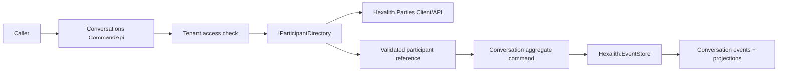
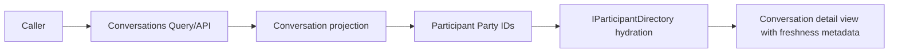

# Research Report: technical

**Date:** 2026-05-10
**Author:** Jerome
**Research Type:** technical

---

## Research Overview

This technical research evaluates how `Hexalith.Conversations` should use `Hexalith.Parties` to manage people, AI agents, and LLM participants without collapsing module boundaries. The research combines local Hexalith source and planning artifacts with current public documentation for .NET, Dapr, OpenAPI, Problem Details, Microsoft architecture patterns, and operational guidance.

The central finding is that `Hexalith.Parties` should remain the identity authority and party directory, while `Hexalith.Conversations` should own only conversation participant membership and attribution. Durable conversation events should store stable `PartyId` references plus conversation-owned role/provider metadata, then resolve current Party display/status state at read time through a Conversations-owned `IParticipantDirectory` adapter over `Hexalith.Parties.Client`.

The full research synthesis at the end of this document provides the executive summary, decision framework, implementation roadmap, test strategy, operational requirements, and risk controls.

## Technical Research Scope Confirmation

**Research Topic:** Hexalith.Parties to manage people in Conversations module
**Research Goals:** Determine how the Conversations module should integrate with Hexalith.Parties for people and participant management while preserving module boundaries.

**Technical Research Scope:**

- Architecture Analysis - design patterns, frameworks, system architecture
- Implementation Approaches - development methodologies, coding patterns
- Technology Stack - languages, frameworks, tools, platforms
- Integration Patterns - APIs, protocols, interoperability
- Performance Considerations - scalability, optimization, patterns

**Research Methodology:**

- Current web data with rigorous source verification
- Multi-source validation for critical technical claims
- Confidence level framework for uncertain information
- Comprehensive technical coverage with architecture-specific insights

**Scope Confirmed:** 2026-05-10

---

<!-- Content will be appended sequentially through research workflow steps -->

## Technology Stack Analysis

### Web Search Analysis

Public package research found two different Hexalith Parties generations:

- The older `Hexalith.Domain.Parties` NuGet package targets `net8.0`, is marked deprecated, and points to `Hexalith.Parties.Domain` as the suggested alternative. Source: https://packages.nuget.org/packages/Hexalith.Domain.Parties/0.27.6
- Current Hexalith platform packages such as `Hexalith.Extensions` target `net10.0`. Source: https://www.nuget.org/packages/Hexalith.Extensions/
- Microsoft lists .NET 10 as an active LTS release, originally released on November 11, 2025, with support ending November 14, 2028. Source: https://dotnet.microsoft.com/en-us/platform/support/policy
- Dapr's current docs describe v1.17 as latest, pub/sub as at-least-once, pub/sub envelopes as CloudEvents 1.0, and state management as key/value over pluggable state stores with optional ETag-based optimistic concurrency. Sources: https://docs.dapr.io/reference/api/pubsub_api/ and https://docs.dapr.io/developing-applications/building-blocks/state-management/state-management-overview/

Local project inspection is more authoritative than the old public NuGet package for this research because this workspace contains a newer `Hexalith.Parties` module with `net10.0`, Aspire, Dapr, EventStore, Tenants integration, REST APIs, typed clients, MCP tools, and a Party Picker.

Local sources reviewed:

- `D:\Hexalith.Conversations\Hexalith.Parties\README.md`
- `D:\Hexalith.Conversations\Hexalith.Parties\docs\getting-started.md`
- `D:\Hexalith.Conversations\Hexalith.Parties\docs\frontend\party-picker.md`
- `D:\Hexalith.Conversations\Hexalith.Parties\Directory.Build.props`
- `D:\Hexalith.Conversations\Hexalith.Parties\Directory.Packages.props`
- `D:\Hexalith.Conversations\Hexalith.Parties\src\Hexalith.Parties.Client\Abstractions\IPartiesQueryClient.cs`
- `D:\Hexalith.Conversations\Hexalith.Parties\src\Hexalith.Parties.Client\Abstractions\IPartiesCommandClient.cs`
- `D:\Hexalith.Conversations\Hexalith.Parties\src\Hexalith.Parties.Client\Extensions\PartiesClientServiceCollectionExtensions.cs`
- `D:\Hexalith.Conversations\Hexalith.Parties\src\Hexalith.Parties.Contracts\Models\PartyDetail.cs`
- `D:\Hexalith.Conversations\Hexalith.Parties\src\Hexalith.Parties.Contracts\Models\PartyIndexEntry.cs`
- `D:\Hexalith.Conversations\Hexalith.Parties\src\Hexalith.Parties.Contracts\Models\PartySearchResult.cs`
- `D:\Hexalith.Conversations\_bmad-output\planning-artifacts\prd.md`
- `D:\Hexalith.Conversations\_bmad-output\planning-artifacts\product-brief-Hexalith.Conversations-distillate.md`

Confidence: high for the recommended `Hexalith.Parties` consumption pattern because the Conversations PRD/product brief and Parties client/picker contracts agree on stable Party IDs. Confidence: medium for exact production packaging until first `Hexalith.Conversations.*` projects exist; this repository currently contains planning artifacts for Conversations but not runtime source projects.

### Programming Languages

Hexalith.Conversations should use C# on .NET 10, matching `Hexalith.Parties` and sibling Hexalith modules. `Hexalith.Parties/Directory.Build.props` targets `net10.0`, enables nullable reference types and implicit usings, and treats warnings as errors. Microsoft currently lists .NET 10 as active LTS, so using `net10.0` aligns with the local module and public support window.

The domain model should treat people, organizations, AI agents, and LLMs as upstream Party identities. Conversation state should store stable Party IDs, participant role metadata, message attribution metadata, and provider correlation IDs. It should not embed `PersonDetails`, `OrganizationDetails`, contact channels, identifiers, or display names in durable conversation state except as transient projection snapshots where explicitly needed for read performance.

Popular Languages: C# is the implementation language. TypeScript/JavaScript may be relevant only for host UI integration around the custom-element picker.

Emerging Languages: none recommended for MVP; cross-language clients can come after the .NET client path is proven.

Language Evolution: use modern C# records/required members for contract types, matching Parties contracts such as `PartyDetail`, `PartyIndexEntry`, and `CreateParty`.

Performance Characteristics: stable string IDs in conversation events are compact and avoid duplicating personal data. Read-time hydration can be cached or batched later if the typed Parties client adds bulk lookup support.

Sources: local `Hexalith.Parties/Directory.Build.props`; local `Hexalith.Parties/src/Hexalith.Parties.Contracts/Models/PartyDetail.cs`; local `Hexalith.Parties/src/Hexalith.Parties.Contracts/Commands/CreateParty.cs`; Microsoft .NET support policy at https://dotnet.microsoft.com/en-us/platform/support/policy

### Development Frameworks and Libraries

The core dependency should be `Hexalith.Parties.Client`, not the legacy `Hexalith.Domain.Parties` package. The typed client registers `IPartiesCommandClient` and `IPartiesQueryClient` via `AddPartiesClient(configuration)` and expects `Parties:BaseUrl` to be an absolute URI. For Conversations, the primary runtime use is `IPartiesQueryClient`: `GetPartyAsync`, `ListPartiesAsync`, and `SearchPartiesAsync`.

Recommended usage split:

- `Hexalith.Conversations.Contracts`: define `ParticipantReference`, `ParticipantRole`, `ParticipantAdded`, `MessageAppended`, etc.; avoid taking a dependency on Parties client infrastructure.
- `Hexalith.Conversations.Server` or `CommandApi`: depend on `Hexalith.Parties.Client` for participant validation and read-time hydration.
- `Hexalith.Conversations.Client`: expose Conversations-specific APIs and do not leak Parties HTTP details unless deliberately composing a higher-level convenience method.
- `Hexalith.Conversations.Picker/UI`: use `Hexalith.Parties.Picker` for selecting participants where a human needs search/typeahead.

Major Frameworks: ASP.NET Core for REST APIs, Dapr actors/pub-sub/state through EventStore and Parties, .NET Aspire for local orchestration, FluentValidation for contract validation, and Microsoft DI/HttpClient for service-to-service clients.

Micro-frameworks: Conversations should add a small abstraction such as `IParticipantDirectory` over `IPartiesQueryClient`. This keeps aggregate code independent of HTTP clients and makes tests simpler.

Evolution Trends: the older public `Hexalith.Domain.Parties` package is deprecated. The workspace's newer Parties module is a service/client/picker-based microservice, so Conversations should integrate by service boundary rather than by sharing old domain assemblies.

Ecosystem Maturity: Parties already provides REST, MCP, typed .NET client, search, list, get, and an embeddable picker. Conversations can consume those instead of building people management.

Sources: local `Hexalith.Parties/README.md`; local `Hexalith.Parties/docs/getting-started.md`; local `Hexalith.Parties/docs/frontend/party-picker.md`; NuGet legacy package page at https://packages.nuget.org/packages/Hexalith.Domain.Parties/0.27.6

### Database and Storage Technologies

Conversations should not choose a Parties database or duplicate Parties storage. Parties owns party records, person details, organization details, contact channels, identifiers, consent, restriction, erasure, and projection indexes. Conversations owns conversation events and projections, with Party IDs as references.

For conversation participant projections, store enough to satisfy the conversation use case:

- `PartyId`
- participant role: human user, AI agent, LLM, service, observer, or similar
- optional participant kind snapshot from Parties: `Person` or `Organization`, if needed for filtering
- optional display snapshot only if explicitly marked stale-able and non-authoritative
- attribution timestamps and command correlation IDs

Do not store contact values, names, identifiers, or person details in conversation events unless a later governance decision says an immutable snapshot is required for audit. `PartyDetail.DisplayName`, `SortName`, `PersonDetails`, contact channels, identifiers, and `NameHistory` are marked or shaped as personal data in Parties, so Conversations should keep that data out of durable conversation events.

Relational Databases: not directly selected by Conversations for Parties data. Any relational backend remains an EventStore/Dapr deployment choice.

NoSQL Databases: same. Conversations should interact through EventStore and Parties client APIs.

In-Memory Databases: acceptable only for local/dev projections. Production participant resolution should tolerate Parties API degradation through explicit degraded read behavior, not silent in-memory authority.

Data Warehousing: out of MVP scope. If analytics later needs participant dimensions, use event/projection exports with privacy review.

Sources: local `Hexalith.Parties/src/Hexalith.Parties.Contracts/Models/PartyDetail.cs`; local `Hexalith.Parties/src/Hexalith.Parties.Contracts/Models/PartyIndexEntry.cs`; Dapr state management overview at https://docs.dapr.io/developing-applications/building-blocks/state-management/state-management-overview/

### Development Tools and Platforms

Use the existing Hexalith local development shape: .NET SDK, Docker Desktop, Aspire, Dapr sidecars, REST/OpenAPI, typed .NET clients, xUnit/Shouldly/NSubstitute tests, and centralized package management.

Recommended development pattern:

1. Register Parties client in the Conversations host:

```csharp
builder.Services.AddPartiesClient(builder.Configuration);
builder.Services.AddScoped<IParticipantDirectory, PartiesParticipantDirectory>();
```

2. Configure:

```json
{
  "Parties": {
    "BaseUrl": "https://localhost:5001"
  }
}
```

3. Validate participant references at command boundaries:

```csharp
PartyDetail party = await parties.GetPartyAsync(command.PartyId, ct);
if (!party.IsActive || party.IsErased || party.IsRestricted)
{
    return ParticipantRejected(command.PartyId, "party-not-usable");
}
```

4. Store only `PartyId` and conversation-specific participant role in the conversation event.

IDE and Editors: any modern .NET IDE; no special tooling required beyond SDK and Docker for local Aspire/Dapr.

Version Control: keep references to Parties as project references inside this workspace or package references after publishing; do not copy Parties contracts into Conversations.

Build Systems: MSBuild with central package management, matching `Directory.Packages.props`.

Testing Frameworks: xUnit, Shouldly, NSubstitute, and the same architectural fitness style used by Parties. Add tests that assert Conversations events do not serialize `PersonDetails`, `ContactChannel`, or `PartyIdentifier` payloads.

Sources: local `Hexalith.Parties/Directory.Packages.props`; local `Hexalith.Parties/src/Hexalith.Parties.Client/Extensions/PartiesClientServiceCollectionExtensions.cs`; Microsoft ASP.NET Core policy authorization docs at https://learn.microsoft.com/en-us/aspnet/core/security/authorization/policies?view=aspnetcore-10.0

### Cloud Infrastructure and Deployment

Conversations should deploy alongside Parties as separate services, not merge into one bounded context. Parties README describes its CommandApi, Dapr sidecar, Tenants integration, optional Keycloak, REST API, MCP server, typed client, and Aspire local host. Conversations should use the same deployment posture: Dapr sidecar for EventStore integration, service discovery/HTTP client for Parties, and configured Tenants/EventStore dependencies.

Major Cloud Providers: cloud-neutral through Dapr and Aspire; Azure is plausible because Hexalith modules already use Microsoft stack, but the Parties integration does not require an Azure-only design.

Container Technologies: Docker for local and containerized service deployment. Dapr sidecars are central.

Serverless Platforms: not the first-choice runtime shape for this integration because Dapr sidecars, event-sourced aggregates, projection actors, and local module composition are central.

CDN and Edge Computing: not relevant to participant management.

Operational requirements:

- Parties must be reachable for participant validation and read-time hydration.
- Read projections should distinguish "conversation exists but party resolution unavailable" from "party missing."
- Participant rendering should handle deactivated/erased/restricted parties explicitly.
- At-least-once pub/sub means event handlers must be idempotent where Conversations later consumes Parties or Tenants events.

Sources: local `Hexalith.Parties/README.md`; local `Hexalith.Parties/docs/getting-started.md`; Dapr pub/sub API reference at https://docs.dapr.io/reference/api/pubsub_api/

### Technology Adoption Trends

The strongest local trend is service-boundary composition: each Hexalith module owns its aggregate and exposes contracts, clients, projections, and UI helpers. Conversations should follow that:

- Party identity is owned by `Hexalith.Parties`.
- Conversation membership is owned by `Hexalith.Conversations`.
- Tenant access is owned by `Hexalith.Tenants`.
- Persistence is owned through `Hexalith.EventStore`.
- UI composition should use `Hexalith.FrontComposer` and Parties picker where useful.

The Conversations PRD and brief are explicit: participant references are stable Party IDs; LLMs are modeled as Parties for stable attribution; read-time resolution uses upstream canonical state; cross-module lifecycle orchestration is upstream-owned in v1. Therefore, the adoption pattern is "reference, validate, hydrate" rather than "copy, own, synchronize."

Migration Patterns: when moving chatbot transcripts into Conversations, map historical human/agent/LLM actors to Party IDs first. If a historical actor cannot be resolved to a Party, create a Party before importing or record a migration exception; do not invent local actor IDs that only Conversations understands.

Emerging Technologies: Dapr's AI/conversation APIs are not a replacement for this domain module; Hexalith.Conversations is the business record, while Dapr provides runtime building blocks.

Legacy Technology: do not use deprecated `Hexalith.Domain.Parties`/`Hexalith.UI.Parties` packages for new Conversations work.

Community Trends: .NET 10 LTS plus Dapr/CloudEvents gives a stable runtime baseline for Hexalith's event-driven microservice style.

Sources: local `_bmad-output/planning-artifacts/prd.md`; local `_bmad-output/planning-artifacts/product-brief-Hexalith.Conversations-distillate.md`; Hexalith docs homepage at https://docs.hexalith.com/; Dapr pub/sub docs at https://docs.dapr.io/reference/api/pubsub_api/

### Step 2 Recommendation

Use `Hexalith.Parties` in Conversations as the party directory and identity authority:

1. Store participant references as stable `PartyId` values in conversation commands/events/state.
2. Add conversation-specific role/attribution metadata locally; do not add person/contact fields locally.
3. Validate `PartyId` with `IPartiesQueryClient.GetPartyAsync` when adding a participant.
4. Search or pick people through `IPartiesQueryClient.SearchPartiesAsync` or `Hexalith.Parties.Picker`.
5. Hydrate display data at read time from Parties, with explicit degraded behavior if Parties is unavailable.
6. Preserve attribution when a Party is deactivated, erased, merged, or restricted by keeping the original stable Party ID and reflecting current Parties status in projections.
7. Add tests that prevent personal-data duplication in Conversations events.

## Integration Patterns Analysis

### Web Search Analysis

External verification focused on standards and current platform behavior rather than generic integration advice:

- Dapr service invocation supports HTTP and gRPC service-to-service calls through sidecars, with service discovery, retries, tracing/metrics, access control, namespace scoping, and mTLS between Dapr applications on hosted platforms. Source: https://docs.dapr.io/developing-applications/building-blocks/service-invocation/service-invocation-overview/
- Dapr pub/sub uses CloudEvents envelopes and documents at-least-once processing semantics. Source: https://docs.dapr.io/reference/api/pubsub_api/
- CloudEvents is a CNCF specification for describing event data in common formats across services, platforms, and systems, with HTTP, JSON, Kafka, MQTT, AMQP, Protobuf, and other bindings. Source: https://github.com/cloudevents/spec
- OpenAPI is the formal standard for describing HTTP APIs and supports documentation, client generation, tests, and design governance. Source: https://www.openapis.org/
- RFC 9457 is the current Problem Details standard for HTTP API errors; it defines `application/problem+json` and stable members such as `type`, `title`, `status`, `detail`, and `instance`. Source: https://www.rfc-editor.org/rfc/rfc9457
- ASP.NET Core policy authorization is built on requirements and handlers, which supports reusable, testable authorization decisions at the API boundary. Source: https://learn.microsoft.com/en-us/aspnet/core/security/authorization/policies?view=aspnetcore-10.0

Local integration evidence:

- Parties exposes REST routes under `/api/v1/parties`, including list, search, get by id, temporal name lookup, name history, create, update, deactivate, reactivate, contact channel, identifier, and composite command endpoints.
- Parties command endpoints return `202 Accepted` for accepted writes and use `ProblemDetails` for `400`, `403`, `404`, `410`, and `422` style failures.
- Parties `Program.cs` wires authentication, authorization, CloudEvents, Dapr subscribe handler, Tenants event subscription, and an authorized MCP endpoint.
- Conversations PRD explicitly requires stable Party references, read-time resolution, LLM-as-Party attribution, and no v1 subscription to upstream lifecycle events.

Confidence: high for the v1 integration pattern because the local Conversations PRD and Parties API/client agree. Confidence: medium for whether Conversations should later subscribe to Parties lifecycle events; the PRD currently says v1 should not, but Parties has events that could support vNext projection optimization.

### API Design Patterns

The v1 API pattern should be "typed client over REST for synchronous integration, domain events for Conversations' own state changes." Conversations should not call Parties from inside aggregate apply methods. It should validate and hydrate Party references at command/API/application-service boundaries, then pass a clean `PartyId` and participant role into EventStore-backed conversation commands.

Recommended command flow for `AddParticipant`:

1. Authenticate and authorize tenant access through Conversations' normal tenant guard.
2. Validate the requested `PartyId` format and tenant context.
3. Resolve `PartyDetail` with `IPartiesQueryClient.GetPartyAsync(partyId, ct)`.
4. Reject missing, inactive, erased, or restricted parties according to the operation's policy.
5. Dispatch `AddParticipant` to the Conversation aggregate with only stable reference data.
6. Emit a Conversations event such as `ParticipantAdded` with `ConversationId`, `PartyId`, `ParticipantRole`, `AddedByPartyId`, timestamp, and correlation/idempotency metadata.

RESTful APIs: use Parties REST indirectly through `Hexalith.Parties.Client`. The important endpoints are `GET /api/v1/parties/{id}`, `GET /api/v1/parties/search`, and `GET /api/v1/parties`. Do not create/update Parties from Conversations except through explicit onboarding/administration workflows; regular conversation creation should assume participant Parties already exist.

GraphQL APIs: not recommended for MVP. There is no local GraphQL surface in Parties, and the typed client is simpler.

RPC and gRPC: not needed at the application contract level now. Dapr may use gRPC between sidecars internally; Conversations can stay on HTTP/typed client until performance data shows a need.

Webhook Patterns: do not introduce webhooks for v1. Use Dapr pub/sub and EventStore conventions where events are needed.

Sources: local `Hexalith.Parties/src/Hexalith.Parties.Client/Abstractions/IPartiesQueryClient.cs`; local `Hexalith.Parties/src/Hexalith.Parties.CommandApi/Controllers/PartiesController.cs`; OpenAPI Initiative at https://www.openapis.org/

### Communication Protocols

The integration should use two communication modes:

- Synchronous HTTP for command-time validation and read-time hydration from Parties.
- Asynchronous pub/sub for Conversations' own domain events and vNext optional Party lifecycle projection updates.

HTTP/HTTPS Protocols: use `HttpClient` through `IPartiesQueryClient` for `GetPartyAsync`, `ListPartiesAsync`, and `SearchPartiesAsync`. Configure `Parties:BaseUrl` in the Conversations host. In Daprized deployments, this can be backed by service discovery or Dapr service invocation, but the Conversations domain should not know the transport detail.

WebSocket Protocols: not relevant to participant management. Real-time UI can use a separate projection-notification mechanism later.

Message Queue Protocols: Dapr pub/sub is the correct abstraction. Conversations must assume at-least-once delivery for any consumed event stream and make event handlers idempotent.

gRPC and Protocol Buffers: do not expose a new gRPC contract for MVP. If later bulk participant hydration becomes a hot path, consider either a Parties bulk REST endpoint first or a formal gRPC client only after profiling.

Sources: Dapr service invocation overview at https://docs.dapr.io/developing-applications/building-blocks/service-invocation/service-invocation-overview/; Dapr pub/sub API at https://docs.dapr.io/reference/api/pubsub_api/

### Data Formats and Standards

JSON should remain the external data format for REST APIs and typed .NET client serialization. Conversations events should use EventStore's existing JSON/event envelope conventions and avoid embedding Parties personal-data objects.

Recommended `ParticipantReference` contract shape:

```csharp
public sealed record ParticipantReference
{
    public required string PartyId { get; init; }
    public required ConversationParticipantRole Role { get; init; }
    public string? Provider { get; init; }
    public string? ProviderModel { get; init; }
    public string? ProviderSessionId { get; init; }
}
```

Recommended read projection shape:

```csharp
public sealed record ConversationParticipantView
{
    public required string PartyId { get; init; }
    public required ConversationParticipantRole Role { get; init; }
    public string? DisplayName { get; init; }
    public string? PartyStatus { get; init; }
    public bool IsHydrationDegraded { get; init; }
}
```

The first type is durable and contains no Parties personal data. The second type is a projection/read model and may include a current display label from Parties when policy allows.

JSON and XML: JSON only for MVP. XML is not needed.

Protobuf and MessagePack: not needed for MVP.

CSV and Flat Files: only relevant for migration/import tooling, not runtime APIs.

Custom Data Formats: avoid custom wire formats. Use Party IDs, JSON, ProblemDetails, CloudEvents, and EventStore envelopes.

Sources: local `Hexalith.Parties/src/Hexalith.Parties.Contracts/Models/PartyDetail.cs`; RFC 9457 at https://www.rfc-editor.org/rfc/rfc9457; CloudEvents spec at https://github.com/cloudevents/spec

### System Interoperability Approaches

Use stable-ID interoperability. Conversations should reference upstream entities by stable IDs and resolve them through their owning modules. This matches the PRD's stable-ID indirection commitment and keeps module ownership clear.

Point-to-Point Integration: acceptable and recommended for v1 between Conversations and Parties through `IPartiesQueryClient`. Keep it behind a Conversations-owned `IParticipantDirectory` to avoid scattering Parties client calls.

API Gateway Patterns: useful at the platform edge, but not the core module-to-module pattern. Conversations should not require an API gateway to validate a Party ID.

Service Mesh: Dapr sidecars provide many service invocation concerns locally. A separate mesh is optional infrastructure, not a domain dependency.

Enterprise Service Bus: not recommended. Dapr pub/sub and EventStore publication are the existing platform choices.

Concrete interoperability rules:

- Conversations must never make Party display name the durable identity.
- Conversations should not duplicate `PersonDetails`, `OrganizationDetails`, contact channels, identifiers, or name history.
- Conversations should preserve old `PartyId` attribution after deactivation, erasure, restriction, or merge.
- If a Party is erased or restricted, read projections should show a governed placeholder rather than failing to open the conversation.
- If Parties is unavailable during read hydration, return the conversation with degraded participant display metadata where possible.

Sources: local `_bmad-output/planning-artifacts/prd.md`; local `_bmad-output/planning-artifacts/product-brief-Hexalith.Conversations-distillate.md`

### Microservices Integration Patterns

The best microservice pattern here is an anti-corruption layer around Parties:

```csharp
public interface IParticipantDirectory
{
    Task<ParticipantResolution> ResolveAsync(string tenantId, string partyId, CancellationToken ct);
    Task<IReadOnlyDictionary<string, ParticipantResolution>> ResolveManyAsync(
        string tenantId,
        IReadOnlyCollection<string> partyIds,
        CancellationToken ct);
}
```

`ResolveManyAsync` can initially loop with caching over `IPartiesQueryClient.GetPartyAsync`. If performance demands it, add a real bulk endpoint to Parties later instead of bypassing the service boundary.

API Gateway Pattern: keep gateway concerns out of aggregate logic.

Service Discovery: use configured `Parties:BaseUrl` for the typed client. In Aspire/Dapr deployments, this base URL can be service-discovered.

Circuit Breaker Pattern: add resilience around `IParticipantDirectory` calls. Command-time participant validation should fail closed when Parties is unavailable; read-time hydration can degrade if the conversation itself is authorized and present.

Saga Pattern: not required for `AddParticipant`; it is a reference validation plus local aggregate mutation. Use saga/process-manager only if a future workflow creates missing Party records and then creates or imports conversations.

Sources: local `Hexalith.Parties/src/Hexalith.Parties.Client/Extensions/PartiesClientServiceCollectionExtensions.cs`; Dapr service invocation overview at https://docs.dapr.io/developing-applications/building-blocks/service-invocation/service-invocation-overview/

### Event-Driven Integration

For v1, Conversations should publish its own events and should not subscribe to Parties lifecycle events unless architecture explicitly changes the PRD decision. The PRD says upstream lifecycle orchestration is owned upstream in v1 and read-time resolution uses canonical state.

VNext candidates for optional Parties event consumption:

- `PartyErased`: update participant read projections to display erased placeholder immediately.
- `ProcessingRestricted`: mark participant data as restricted in conversation views.
- `PartyMerged`: preserve historical attribution but display survivor relationship if UX needs it.
- `PartyDeactivated` and `PartyReactivated`: update participant status cache.

If Conversations consumes these later, handlers must be idempotent, tenant-scoped, and safe under at-least-once delivery. The durable conversation event stream should still keep the original `PartyId` for audit.

Publish-Subscribe Patterns: use Dapr pub/sub via EventStore publication conventions.

Event Sourcing: Conversations aggregate events should remain the authority for participant membership in a conversation.

Message Broker Patterns: broker choice should remain behind Dapr components.

CQRS Patterns: conversation detail/list projections can hydrate or cache participant display metadata separately from the aggregate.

Sources: local `Hexalith.Parties/src/Hexalith.Parties.Contracts/Events/PartyErased.cs`; local `Hexalith.Parties/src/Hexalith.Parties.Contracts/Events/ProcessingRestricted.cs`; local `Hexalith.Parties/src/Hexalith.Parties.Contracts/Events/PartyMerged.cs`; Dapr pub/sub docs at https://docs.dapr.io/reference/api/pubsub_api/; CloudEvents spec at https://github.com/cloudevents/spec

### Integration Security Patterns

Security should be layered:

- Authentication and tenant authorization happen at the Conversations API boundary.
- Parties calls must use the same tenant/user context or a service credential with explicit delegated authorization policy.
- Do not trust a Party ID from the request merely because it is syntactically valid.
- Do not return raw Parties problem details to end users if they may reveal sensitive tenant or party information; map them to Conversations problem types.
- Do not log Party display names, identifiers, contact values, or query strings from participant search unless a privacy review allows it.

OAuth 2.0 and JWT: Parties already uses JWT authentication and tenant extraction. Conversations should align with the same tenant claim and Tenants projection model.

API Key Management: not recommended for service-to-service module integration unless the platform explicitly adopts API keys for internal clients.

Mutual TLS: Dapr sidecar security can provide mTLS between Dapr applications on hosted platforms.

Data Encryption: Conversations should not store personal Party data, reducing encryption and erasure burden. For any participant display snapshot, treat it as personal data and apply the same redaction/retention posture as message content.

Sources: local `Hexalith.Parties/src/Hexalith.Parties.CommandApi/Program.cs`; local `Hexalith.Parties/src/Hexalith.Parties.CommandApi/Controllers/PartiesController.cs`; Microsoft authorization docs at https://learn.microsoft.com/en-us/aspnet/core/security/authorization/policies?view=aspnetcore-10.0; Dapr service invocation overview at https://docs.dapr.io/developing-applications/building-blocks/service-invocation/service-invocation-overview/

### Step 3 Recommendation

Use this v1 integration architecture:

1. `Hexalith.Conversations.Contracts` defines participant references by `PartyId` and role only.
2. `Hexalith.Conversations.CommandApi` validates participants through `IParticipantDirectory`, backed by `Hexalith.Parties.Client`.
3. `Hexalith.Conversations.Server` receives already-validated Party references and never calls Parties from aggregate logic.
4. `Hexalith.Conversations.Projections` stores Party IDs and may cache display metadata with clear stale/degraded flags.
5. `Hexalith.Conversations.Client` exposes a happy path that hides both EventStore and Parties mechanics from adopters.
6. UI surfaces use `Hexalith.Parties.Picker` for selection and Conversations projections for conversation rendering.
7. v1 does not consume Parties lifecycle events; vNext may add idempotent event-fed participant status projections if read-time hydration is too slow or too fragile.

## Architectural Patterns and Design

### Web Search Analysis

Current architecture sources support the local Hexalith direction:

- Microsoft's DDD microservice guidance says bounded contexts are the key design boundary, domain model logic belongs inside the domain layer, and the application layer should coordinate tasks without owning domain state. Source: https://learn.microsoft.com/en-us/dotnet/architecture/microservices/microservice-ddd-cqrs-patterns/ddd-oriented-microservice
- Azure's CQRS pattern separates commands from queries, lets read and write models scale independently, and is especially relevant with event sourcing, but adds complexity, messaging failure modes, retries, duplicates, and eventual consistency. Source: https://learn.microsoft.com/en-us/azure/architecture/patterns/cqrs
- Azure's anti-corruption layer pattern recommends a facade or adapter between subsystems with different semantics so one system's model does not leak into another. Source: https://learn.microsoft.com/en-us/azure/architecture/patterns/anti-corruption-layer
- Azure's circuit breaker guidance supports failing fast and degrading behavior around remote dependencies instead of repeatedly waiting on a failing service. Source: https://learn.microsoft.com/en-us/azure/architecture/patterns/circuit-breaker
- Azure's cache-aside guidance supports on-demand caching but warns about stale data and sensitive/security-related data. Source: https://learn.microsoft.com/en-us/azure/architecture/patterns/cache-aside
- Dapr service invocation and pub/sub remain relevant deployment building blocks for service discovery, retries, tracing, access control, mTLS, CloudEvents, and at-least-once messaging. Sources: https://docs.dapr.io/developing-applications/building-blocks/service-invocation/service-invocation-overview/ and https://docs.dapr.io/reference/api/pubsub_api/

Local Hexalith architecture sources reinforce this:

- `Hexalith.Parties` is already a DDD/CQRS/EventStore module with a Party aggregate, API/client packages, projections, Dapr pub/sub, MCP tools, tenant projection, and Party Picker.
- `Hexalith.Conversations` PRD states stable-ID indirection as a commitment: Party identity remains owned by Parties, Conversations stores stable Party references, and v1 uses read-time canonical resolution instead of upstream lifecycle subscriptions.
- `Hexalith.Parties` architecture chose Dapr actor-backed projections and a hybrid per-party/per-tenant index model. Conversations can mirror the project structure but should not mirror Parties' domain model.

Confidence: high for bounded-context and anti-corruption recommendations. Medium for exact cache strategy because it depends on Conversations' eventual latency envelope and whether a bulk Parties lookup API is added.

### System Architecture Patterns

Use a bounded-context architecture with four clear responsibilities:

| Boundary | Owns | Does not own |
| --- | --- | --- |
| `Hexalith.Parties` | Party records, person/organization details, contact channels, identifiers, consent/restriction/erasure state, Party search, Party Picker | Conversation membership, conversation message attribution rules |
| `Hexalith.Conversations` | Conversation aggregate, participant membership, message timeline, attachments references, governance state, provider correlation metadata | People data, contact data, Party lifecycle, Party search implementation |
| `Hexalith.Tenants` | Tenant lifecycle, membership, roles, configuration | Party or conversation domain state |
| `Hexalith.EventStore` | Event-sourced persistence, command routing, idempotency, event publication, snapshots | Conversation or Party domain decisions |

The Conversation aggregate should own participant membership as a conversation-specific concept, not people management. `AddParticipant` means "attach this Party identity to this conversation with this role and attribution metadata." It does not mean "create or update a person."

Recommended project structure:

```text
src/
  Hexalith.Conversations.Contracts
  Hexalith.Conversations.Client
  Hexalith.Conversations.Server
  Hexalith.Conversations.Projections
  Hexalith.Conversations.CommandApi
  Hexalith.Conversations.Aspire
  Hexalith.Conversations.AppHost
  Hexalith.Conversations.ServiceDefaults
  Hexalith.Conversations.Testing
```

Add one explicit adapter:

```text
Hexalith.Conversations.CommandApi
  Participants/
    IParticipantDirectory.cs
    PartiesParticipantDirectory.cs
    ParticipantResolution.cs
```

This keeps Parties semantics out of the aggregate while giving command handlers and query assemblers a clean way to resolve Party state.

Source: Microsoft DDD guidance at https://learn.microsoft.com/en-us/dotnet/architecture/microservices/microservice-ddd-cqrs-patterns/ddd-oriented-microservice; local `Hexalith.Parties/_bmad-output/planning-artifacts/architecture.md`

### Design Principles and Best Practices

Architectural principles for the Parties/Conversations relationship:

1. **Reference, do not replicate.** Durable conversation events store `PartyId`, not `PersonDetails`, contact channels, identifiers, or display names.
2. **Validate outside the aggregate.** Command/API/application services validate participant usability through `IParticipantDirectory`; the Conversation aggregate enforces conversation invariants.
3. **Hydrate at the edge.** Read models and clients can assemble participant display/status data from Parties, with explicit stale/degraded indicators.
4. **Preserve attribution forever.** If a Party is deactivated, erased, restricted, or merged, the historical conversation still references the original Party ID.
5. **Prevent semantic leakage.** Parties concepts such as contact channel, organization details, and identifier type should not appear in the Conversation aggregate unless a new conversation use case proves they are domain concepts there.
6. **Fail closed for writes, degrade reads deliberately.** If Parties cannot validate a new participant, reject `AddParticipant`; if Parties is unavailable during read hydration, return authorized conversation data with degraded participant labels if policy allows.

Recommended aggregate command shape:

```csharp
public sealed record AddParticipant
{
    public required string ConversationId { get; init; }
    public required string PartyId { get; init; }
    public required ConversationParticipantRole Role { get; init; }
    public required string AddedByPartyId { get; init; }
    public string? Provider { get; init; }
    public string? ProviderModel { get; init; }
    public string? ProviderSessionId { get; init; }
    public required string IdempotencyKey { get; init; }
}
```

The `PartyId` fields are stable references. The provider fields are attribution metadata; they do not replace Party identity.

Source: Azure Anti-Corruption Layer at https://learn.microsoft.com/en-us/azure/architecture/patterns/anti-corruption-layer; local `_bmad-output/planning-artifacts/prd.md`

### Scalability and Performance Patterns

The PRD sets an "open conversation" target that includes up to 20 human participants and 5 AI agents under a warm-cache scenario. That makes participant hydration a real architectural concern.

Recommended scaling plan by phase:

| Phase | Pattern | Rationale |
| --- | --- | --- |
| MVP | Read-time `GetPartyAsync` with bounded concurrency and short timeout | Simple, preserves canonical state, easiest to test |
| MVP warm path | Request-scoped de-duplication and small memory cache keyed by tenant + party id | Avoids repeated calls for the same participant in one open-conversation request |
| Post-MVP | Distributed cache-aside for non-sensitive display metadata with short TTL | Speeds common reads but must treat stale labels as possible |
| Post-MVP if needed | Parties bulk lookup endpoint | Reduces N+1 calls without breaking service boundary |
| vNext | Event-fed participant status projection | Only if read-time hydration is too slow or unavailable too often |

Guardrails:

- Do not cache contact values, identifiers, person details, or raw Parties problem details.
- Cache display labels only if privacy policy allows it and the response carries freshness metadata.
- Use bounded parallelism for participant hydration; never open unbounded HTTP calls for large conversations.
- Preserve a non-hydrated fallback display such as `Party unavailable` or `Erased party`, not stale personal data, when policy requires it.

Circuit breaker behavior:

- `AddParticipant`: fail closed with typed problem `participant_directory_unavailable`.
- `OpenConversation`: degrade participant display and surface `participantHydrationStatus = degraded` if the conversation itself is authorized and readable.
- Operator/compliance views: prefer explicit incomplete-status indicators over hiding the degradation.

Source: Azure Circuit Breaker at https://learn.microsoft.com/en-us/azure/architecture/patterns/circuit-breaker; Azure Cache-Aside at https://learn.microsoft.com/en-us/azure/architecture/patterns/cache-aside

### Integration and Communication Patterns

The primary integration pattern is an anti-corruption adapter over synchronous Parties client calls, plus event-driven Conversations persistence through EventStore.

Command write path:



Read path:



Event path:

- Conversations publishes its own tenant-scoped conversation events.
- Parties publishes its own party events.
- v1 does not require Conversations to subscribe to Parties events.
- If vNext subscribes, handlers must be idempotent and must never rewrite historical conversation attribution.

Source: Dapr service invocation at https://docs.dapr.io/developing-applications/building-blocks/service-invocation/service-invocation-overview/; Dapr pub/sub at https://docs.dapr.io/reference/api/pubsub_api/

### Security Architecture Patterns

Security architecture decisions:

- Tenant isolation happens before aggregate/projection access.
- Participant validation must include tenant context; a Party ID alone is not enough.
- Conversations should not leak inaccessible Party existence through errors, logs, or timing-heavy behavior.
- Read hydration must map Parties failures into Conversations-safe problem/status types.
- Any cached participant label is personal data unless explicitly classified otherwise.
- Observability dimensions must not include raw Party display names, contact details, identifiers, user free-text, or unbounded Party IDs.

Recommended typed errors:

| Condition | Write behavior | Read behavior |
| --- | --- | --- |
| Party not found | reject `AddParticipant` | show unresolved participant only if already in historical state |
| Party inactive | reject unless policy allows historical/observer role | show inactive status |
| Party erased | reject new participant | show erased placeholder |
| Party restricted | reject or require privileged policy | hide/redact display data |
| Parties unavailable | fail closed | degrade participant hydration |
| Tenant mismatch/unknown | fail closed | fail closed |

This follows the local PRD's requirement that typed sanitized errors include documentation/audit handles without leaking target tenant, Party, conversation existence, redacted content, or provider payload.

Source: local `_bmad-output/planning-artifacts/prd.md`; Microsoft authorization docs at https://learn.microsoft.com/en-us/aspnet/core/security/authorization/policies?view=aspnetcore-10.0

### Data Architecture Patterns

Conversation data should be split into three layers:

| Layer | Stores | Authority |
| --- | --- | --- |
| Event stream | Conversation events with Party IDs and participant role metadata | Authoritative for conversation membership and attribution |
| Conversation projections | Denormalized conversation detail/list/timeline/participant views | Rebuildable from conversation events |
| Hydration/cache | Current Party display/status labels and freshness metadata | Non-authoritative, derived from Parties |

Recommended event:

```csharp
public sealed record ParticipantAdded
{
    public required string ConversationId { get; init; }
    public required string PartyId { get; init; }
    public required ConversationParticipantRole Role { get; init; }
    public required string AddedByPartyId { get; init; }
    public DateTimeOffset AddedAt { get; init; }
    public string? Provider { get; init; }
    public string? ProviderModel { get; init; }
}
```

Recommended projection:

```csharp
public sealed record ParticipantProjection
{
    public required string PartyId { get; init; }
    public required ConversationParticipantRole Role { get; init; }
    public DateTimeOffset AddedAt { get; init; }
    public string? DisplayName { get; init; }
    public string ParticipantDataStatus { get; init; } = "not-hydrated";
    public DateTimeOffset? HydratedAt { get; init; }
}
```

The event is rebuild-stable and privacy-minimal. The projection can be regenerated and can reflect current Parties state without mutating history.

Source: Azure CQRS at https://learn.microsoft.com/en-us/azure/architecture/patterns/cqrs; local `Hexalith.Parties/src/Hexalith.Parties.Contracts/Models/PartyDetail.cs`

### Deployment and Operations Architecture

Deployment should mirror Parties and EventStore:

- `Hexalith.Conversations.AppHost` composes Conversations, EventStore, Tenants, Parties, Dapr sidecars, and any local dependencies.
- `Hexalith.Conversations.CommandApi` registers `AddPartiesClient(...)` and a Conversations `IParticipantDirectory`.
- Dapr access-control policy should allow the Conversations app id to call Parties read endpoints if using Dapr service invocation.
- Health/readiness should distinguish "Conversations writable", "tenant projection ready", "EventStore ready", and "participant directory ready."
- Runbooks should document degraded read behavior when Parties is unavailable.

Operational signals:

- Participant validation failures by reason.
- Parties client latency and error rate.
- Participant hydration degraded count.
- Open-conversation latency broken down into tenant auth, projection read, redaction filtering, and participant hydration.
- Cache hit/miss/stale rates if a participant label cache is introduced.

Release gates:

- Contract tests prove `ParticipantAdded` contains no `PersonDetails`, contact channels, identifiers, or display names.
- Integration tests cover add human, add AI agent, add LLM, deactivated Party, erased Party, Parties unavailable, tenant mismatch, and provider switch preserving LLM Party identity.
- Projection rebuild tests prove participant references survive replay and do not require live Parties to reconstruct the conversation record.

Source: local `Hexalith.Parties/docs/event-publishing.md`; local `Hexalith.Parties/docs/tenant-access-projection.md`; Dapr docs linked above.

### Step 4 Recommendation

The architecture should be:

1. **Bounded context:** Parties owns people; Conversations owns participant membership and attribution.
2. **Aggregate rule:** Conversation aggregate stores stable Party references and role metadata only.
3. **Adapter:** `IParticipantDirectory` is the anti-corruption layer over `Hexalith.Parties.Client`.
4. **Write policy:** `AddParticipant` fails closed when Party validation cannot prove the participant is usable.
5. **Read policy:** conversation views hydrate Party display/status at the edge with freshness/degraded metadata.
6. **Data minimization:** no Parties personal data in durable Conversations events.
7. **Scalability path:** start with read-time hydration and request cache; add bulk lookup or event-fed status projection only when measured.
8. **Operations:** expose participant-directory health and hydration degradation separately from conversation event/projection health.

## Implementation Approaches and Technology Adoption

### Web Search Analysis

Implementation research used current operational and engineering guidance:

- Microsoft Cloud Adoption Framework organizes adoption into Strategy, Plan, Ready, Adopt, Govern, Secure, and Manage phases; this supports a staged implementation rather than a big-bang module cutover. Source: https://learn.microsoft.com/en-us/azure/cloud-adoption-framework/overview
- Azure DevOps guidance defines CI as automated merge/build/test and CD as built, tested artifacts deployed through controlled environments with monitoring and alerts. Source: https://learn.microsoft.com/en-us/devops/what-is-devops
- Microsoft .NET testing guidance distinguishes unit tests from integration tests: unit tests should avoid infrastructure, while integration tests exercise multiple components and often include infrastructure. Source: https://learn.microsoft.com/en-us/dotnet/core/testing/?pivots=xunit
- ASP.NET Core integration test guidance recommends separate test projects and `Microsoft.AspNetCore.Mvc.Testing` / `WebApplicationFactory` for test hosts; it also recommends focused integration tests rather than every permutation. Source: https://learn.microsoft.com/en-us/aspnet/core/test/integration-tests?view=aspnetcore-10.0
- Azure Well-Architected Framework emphasizes balancing Reliability, Security, Cost Optimization, Operational Excellence, and Performance Efficiency, with implementation choices driven by workload requirements. Source: https://learn.microsoft.com/en-us/azure/well-architected/what-is-well-architected-framework

Local implementation evidence:

- Parties already has extensive unit, API, integration, projection, tenant isolation, health check, search, MCP, security, and picker tests under `Hexalith.Parties/tests`.
- Parties client exposes `IPartiesQueryClient.GetPartyAsync`, `ListPartiesAsync`, and `SearchPartiesAsync`.
- Parties client errors are represented by `PartiesClientException` with status, title, type, detail, and correlation id.
- Parties docs provide `AddPartiesClient(builder.Configuration)` and `Parties:BaseUrl` configuration.
- Parties picker docs define `PartyPicker` / custom element integration and stress that selected value is stable Party ID; labels/status are preview data only.

Confidence: high for the implementation sequence and tests because they follow existing local module patterns. Medium for exact operational SLO thresholds until Conversations runtime projects and load tests exist.

### Technology Adoption Strategies

Adopt `Hexalith.Parties` in Conversations incrementally:

1. **Contracts first:** define `ParticipantReference`, `ConversationParticipantRole`, and `ParticipantAdded` in `Hexalith.Conversations.Contracts` with only stable Party IDs and conversation-owned metadata.
2. **Adapter second:** implement `IParticipantDirectory` in `Hexalith.Conversations.CommandApi` or application layer, backed by `IPartiesQueryClient`.
3. **Command path third:** wire `AddParticipant` through tenant authorization, participant validation, and EventStore command dispatch.
4. **Read path fourth:** add participant hydration in conversation detail/list projections or query assembler.
5. **UI fifth:** use `Hexalith.Parties.Picker` where users select participants.
6. **Optimization last:** add request cache, bulk lookup, or event-fed participant status projection only after measuring.

Avoid big-bang dependency on Parties lifecycle events. The PRD says v1 uses read-time resolution and stable IDs; stay with that until measured latency or availability says otherwise.

Source: Microsoft Cloud Adoption Framework at https://learn.microsoft.com/en-us/azure/cloud-adoption-framework/overview; local `Hexalith.Parties/docs/frontend/party-picker.md`

### Development Workflows and Tooling

Recommended workflow:

- Mirror the Parties/EventStore project layout, build props, central package management, nullable settings, and warnings-as-errors posture.
- Keep `Hexalith.Parties.Client` out of `Hexalith.Conversations.Contracts` and `Hexalith.Conversations.Server` aggregate logic.
- Create a fake `IParticipantDirectory` for fast unit/API tests.
- Use `WebApplicationFactory`-style tests for CommandApi behavior.
- Use Aspire/Dapr integration tests only for critical paths because they are slower and more operationally sensitive.

Minimal implementation sketch:

```csharp
public interface IParticipantDirectory
{
    Task<ParticipantResolution> ResolveAsync(
        string tenantId,
        string partyId,
        CancellationToken cancellationToken);
}
```

```csharp
public sealed class PartiesParticipantDirectory(IPartiesQueryClient parties)
    : IParticipantDirectory
{
    public async Task<ParticipantResolution> ResolveAsync(
        string tenantId,
        string partyId,
        CancellationToken cancellationToken)
    {
        try
        {
            PartyDetail party = await parties.GetPartyAsync(partyId, cancellationToken).ConfigureAwait(false);

            if (party.IsErased)
            {
                return ParticipantResolution.Rejected(partyId, "party-erased");
            }

            if (!party.IsActive)
            {
                return ParticipantResolution.Rejected(partyId, "party-inactive");
            }

            if (party.IsRestricted)
            {
                return ParticipantResolution.Rejected(partyId, "party-restricted");
            }

            return ParticipantResolution.Accepted(party.Id, party.Type.ToString(), party.DisplayName);
        }
        catch (PartiesClientException ex) when (ex.Status == StatusCodes.Status404NotFound)
        {
            return ParticipantResolution.Rejected(partyId, "party-not-found");
        }
        catch (HttpRequestException)
        {
            return ParticipantResolution.Unavailable(partyId, "participant-directory-unavailable");
        }
        catch (TaskCanceledException)
        {
            return ParticipantResolution.Unavailable(partyId, "participant-directory-timeout");
        }
    }
}
```

Important: `ParticipantResolution.Accepted` may carry display name only as transient read/application data. Do not forward that value into durable conversation events.

Source: Azure DevOps guidance at https://learn.microsoft.com/en-us/devops/what-is-devops; local `Hexalith.Parties/src/Hexalith.Parties.Client/Abstractions/IPartiesQueryClient.cs`

### Testing and Quality Assurance

Test matrix:

| Test type | Required coverage |
| --- | --- |
| Contracts unit tests | `ParticipantAdded` and `AddParticipant` do not expose `PersonDetails`, `OrganizationDetails`, `ContactChannel`, `PartyIdentifier`, `DisplayName`, or `SortName` |
| Adapter unit tests | not found, inactive, erased, restricted, timeout, HTTP failure, ProblemDetails mapping |
| Command API tests | tenant check occurs before participant lookup; participant lookup occurs before aggregate dispatch |
| Aggregate tests | duplicate participant, invalid role transition, closed conversation behavior, idempotency |
| Projection tests | participant list rebuilds from events with Party IDs only |
| Read hydration tests | degraded Parties call returns safe status without leaking raw exception/problem details |
| Integration tests | add human, add AI agent, add LLM, provider switch preserves LLM Party identity |
| Privacy/security tests | serialized event payloads do not contain Parties personal-data types or known fixture PII |

Example architectural fitness test:

```csharp
[Fact]
public void ConversationEventsDoNotReferencePartiesPersonalDataTypes()
{
    Assembly contracts = typeof(ParticipantAdded).Assembly;
    Type[] forbidden =
    [
        typeof(PersonDetails),
        typeof(OrganizationDetails),
        typeof(ContactChannel),
        typeof(PartyIdentifier),
        typeof(PartyDetail),
    ];

    IEnumerable<Type> eventTypes = contracts.GetTypes()
        .Where(t => t.Name.EndsWith("ed", StringComparison.Ordinal));

    foreach (Type eventType in eventTypes)
    {
        Type[] propertyTypes = eventType.GetProperties()
            .Select(p => Nullable.GetUnderlyingType(p.PropertyType) ?? p.PropertyType)
            .ToArray();

        propertyTypes.ShouldNotContain(t => forbidden.Contains(t));
    }
}
```

Source: Microsoft .NET testing at https://learn.microsoft.com/en-us/dotnet/core/testing/?pivots=xunit; ASP.NET Core integration tests at https://learn.microsoft.com/en-us/aspnet/core/test/integration-tests?view=aspnetcore-10.0

### Deployment and Operations Practices

Deployment requirements:

- Configure `Parties:BaseUrl` per environment.
- If using Dapr service invocation, configure app ids, namespaces, and access control so Conversations can call Parties read APIs.
- Add health checks for participant directory reachability separately from EventStore, Tenants, and projection health.
- Expose readiness states:
  - `participant-directory-ready`
  - `participant-directory-degraded`
  - `participant-directory-unavailable`
- Add runbook entries for Parties outage:
  - new participant writes fail closed
  - open-conversation reads may degrade participant display
  - compliance/operator views must show incomplete hydration state

Recommended telemetry:

- `participant_directory.resolve.duration`
- `participant_directory.resolve.failures`
- `participant_directory.resolve.denied` by safe reason code
- `conversation.read.participant_hydration_status`
- `conversation.add_participant.rejected` by safe reason code
- `conversation.open.duration` split by authorization, projection read, redaction filtering, and participant hydration

Keep cardinality bounded. Do not put raw Party IDs, display names, contact values, prompt fragments, or arbitrary problem detail strings into metric labels.

Source: Azure Well-Architected Framework at https://learn.microsoft.com/en-us/azure/well-architected/what-is-well-architected-framework; local `Hexalith.Parties/docs/deployment-guide.md`

### Team Organization and Skills

Minimum implementation skills:

- Hexalith.EventStore command/aggregate/projection model.
- DDD aggregate boundary discipline.
- ASP.NET Core APIs, auth, and ProblemDetails mapping.
- Dapr/Aspire local topology.
- Parties client and Party Picker integration.
- Privacy-aware event design and data minimization.
- xUnit/Shouldly/NSubstitute test style already used by Parties.

Suggested ownership:

- Contracts/API engineer: conversation commands/events/errors.
- Domain engineer: Conversation aggregate and idempotency behavior.
- Integration engineer: `IParticipantDirectory`, Parties client, error mapping, resilience.
- Projection engineer: participant list/detail hydration and freshness metadata.
- QA/test architect: privacy fitness tests, tenant isolation, degraded dependency tests.
- Operations engineer: health checks, dashboards, runbooks, Dapr access control.

Source: local `Hexalith.Parties/tests`; Microsoft DevOps guidance at https://learn.microsoft.com/en-us/devops/what-is-devops

### Cost Optimization and Resource Management

Cost-sensitive choices:

- Start with read-time hydration and request-scoped caching to avoid premature durable caches.
- Avoid event-fed Parties projection in v1; it creates storage, replay, and consistency obligations.
- Add bulk lookup only after measuring N+1 latency on real open-conversation workloads.
- Keep projection payloads small by storing Party IDs and status metadata, not copied Party records.
- Bound participant hydration concurrency per request.

Cost risks:

- Per-participant HTTP calls can dominate open-conversation latency at 25 participants.
- Distributed caches can silently become privacy-sensitive stores.
- Event subscriptions to Parties introduce rebuild/replay operations and dead-letter handling.
- Metrics with unbounded Party/conversation dimensions can become costly and unsafe.

Source: Azure Well-Architected Framework at https://learn.microsoft.com/en-us/azure/well-architected/what-is-well-architected-framework

### Risk Assessment and Mitigation

| Risk | Mitigation |
| --- | --- |
| Personal data copied into conversation events | contract fitness tests; event review checklist; no Parties models in event types |
| AddParticipant succeeds for erased/restricted Party | adapter tests; command API tests; fail-closed default |
| Parties outage blocks all reads | degrade read hydration separately from conversation projection availability |
| Parties outage allows writes | fail closed on participant validation unavailable |
| N+1 participant lookup latency | request cache first; bounded parallelism; add bulk endpoint only after measurement |
| Cross-tenant Party ID probing | tenant auth before lookup; safe error mapping; no existence leaks |
| LLM provider switch changes identity | model LLM as Party; provider/session/model fields remain metadata |
| Event-fed vNext projection diverges | keep v1 read-time resolution; if added later, idempotent handlers and rebuild tests |

Source: local `_bmad-output/planning-artifacts/prd.md`; local `Hexalith.Parties/tests/Hexalith.Parties.CommandApi.Tests/Controllers/CrossTenantIsolationTests.cs`

## Technical Research Recommendations

### Implementation Roadmap

1. Define participant contracts: `ParticipantReference`, `ConversationParticipantRole`, `ParticipantAdded`.
2. Add `IParticipantDirectory` and `PartiesParticipantDirectory`.
3. Register `AddPartiesClient` and directory services in `Hexalith.Conversations.CommandApi`.
4. Implement `AddParticipant` command API path with tenant check, participant validation, and aggregate dispatch.
5. Implement Conversation aggregate membership invariants.
6. Implement participant list/detail projections with `PartyId` only.
7. Add read hydration with degraded/freshness metadata.
8. Integrate `Hexalith.Parties.Picker` into UI selection flow.
9. Add privacy, tenant, adapter, API, projection, and integration tests.
10. Add health checks, telemetry, and runbook entries.

### Technology Stack Recommendations

- C#/.NET 10.
- Hexalith.EventStore for persistence and publication.
- Hexalith.Parties.Client for participant validation/hydration.
- Hexalith.Parties.Picker for participant selection UI.
- ASP.NET Core ProblemDetails for sanitized errors.
- Dapr/Aspire for local and service deployment topology.
- xUnit, Shouldly, NSubstitute, Microsoft.AspNetCore.Mvc.Testing.

### Skill Development Requirements

- Understand the difference between Party identity and Conversation participant membership.
- Practice writing privacy-minimal events.
- Learn Parties client error behavior and safe mapping.
- Learn projection freshness/degraded semantics.
- Learn Dapr sidecar access control and health troubleshooting.

### Success Metrics and KPIs

- `AddParticipant` rejects missing/inactive/erased/restricted/unavailable Party cases.
- 0 durable Conversations event types reference Parties personal-data models.
- Open-conversation P95 meets the PRD envelope with 25 participants under warm-cache conditions.
- Participant hydration degraded state is visible and test-covered.
- Provider switch tests preserve LLM Party identity.
- Tenant isolation tests show no cross-tenant Party probing leaks.
- Projection rebuild reconstructs participant references without live Parties.

# Stable Party Identity for Conversations: Comprehensive Hexalith.Parties Technical Research

## Executive Summary

`Hexalith.Conversations` should use `Hexalith.Parties` as the authoritative directory for people, organizations, AI agents, and LLM identities, but it should not manage or duplicate people data. The correct boundary is stable-ID indirection: Conversations stores `PartyId` references and conversation-specific participant role/attribution metadata; Parties owns canonical person/organization records, contact channels, identifiers, consent, restrictions, erasure, search, and picker UI.

This pattern is strongly supported by the local Conversations PRD, the Parties client and picker contracts, and current architecture guidance. Microsoft DDD guidance emphasizes bounded contexts and domain-owned invariants; Azure CQRS guidance supports separate write and read models; Azure's anti-corruption layer pattern fits a Conversations-owned `IParticipantDirectory` over `Hexalith.Parties.Client`; Dapr and CloudEvents provide the runtime/event substrate without changing the domain boundary.

The strategic implication is simple and important: `Hexalith.Conversations` becomes the durable business record of AI-assisted exchanges, while `Hexalith.Parties` remains the identity backbone. This gives conversations stable attribution even when a person leaves, a Party is restricted or erased, or an LLM provider changes.

**Key Technical Findings:**

- Store stable `PartyId` references in durable conversation events; do not store `PersonDetails`, contact channels, identifiers, or display names.
- Validate participants at the command/API/application boundary through `IParticipantDirectory`, backed by `IPartiesQueryClient`.
- Keep Conversation aggregate logic independent from Parties HTTP clients and Parties data models.
- Use read-time hydration or projection-level display/status metadata with explicit freshness/degraded state.
- Fail closed for participant writes when Parties cannot prove a Party is usable; degrade authorized reads carefully when display hydration fails.
- Do not subscribe to Parties lifecycle events in v1; add event-fed participant status projections later only if measurement justifies it.

**Top Technical Recommendations:**

- Implement `IParticipantDirectory` as the anti-corruption layer between Conversations and Parties.
- Add contract fitness tests that prevent Parties personal-data models from entering Conversations events.
- Use `Hexalith.Parties.Picker` for UI selection, because its selected value contract is the stable Party ID.
- Add participant-directory health, telemetry, runbook, and degraded read semantics as first-class operational features.
- Treat LLMs as Parties for stable attribution; keep provider/model/session IDs as metadata, not identity.

## Table of Contents

1. Technical Research Introduction and Methodology
2. Technical Landscape and Architecture Analysis
3. Implementation Approaches and Best Practices
4. Technology Stack Evolution and Current Trends
5. Integration and Interoperability Patterns
6. Performance and Scalability Analysis
7. Security and Compliance Considerations
8. Strategic Technical Recommendations
9. Implementation Roadmap and Risk Assessment
10. Future Technical Outlook and Innovation Opportunities
11. Technical Research Methodology and Source Verification
12. Technical Appendices and Reference Materials

## 1. Technical Research Introduction and Methodology

### Technical Research Significance

AI-assisted conversations are becoming business records rather than disposable chat transcripts. For those records to be durable, auditable, tenant-safe, and portable across LLM providers, every participant must have stable attribution. That attribution cannot be a display name, email address, provider session id, or local chatbot actor string; it needs to be an upstream-owned identity reference.

In Hexalith, that identity reference is a Party. The Conversations PRD explicitly requires stable Party identity for human users, AI agents, and LLMs; it also requires that upstream references survive lifecycle changes. Current AI audit-trail discussions reinforce the same pressure: regulated AI systems need records with actor identity, timestamps, model/provider context, policy decisions, and governance evidence.

_Technical Importance:_ Stable Party references let Conversations preserve attribution while avoiding duplicated personal data.

_Business Impact:_ Buyers and operators can retrieve a conversation, prove who or what participated, and survive Party lifecycle changes without rewriting the conversation record.

Sources: local `_bmad-output/planning-artifacts/prd.md`; local `_bmad-output/planning-artifacts/product-brief-Hexalith.Conversations-distillate.md`; Microsoft domain analysis at https://learn.microsoft.com/en-us/azure/architecture/microservices/model/domain-analysis

### Technical Research Methodology

This research used a dual-source method:

- **Local source inspection:** `Hexalith.Parties` code, docs, tests, contracts, client APIs, picker docs, architecture docs, tenant projection docs, and event-publishing docs.
- **Conversations planning artifacts:** PRD, product brief, and sibling technical research outputs.
- **Current public verification:** Microsoft .NET support, Microsoft architecture patterns, ASP.NET Core authorization/testing, Dapr service invocation/pub-sub/state management, CloudEvents, OpenAPI, and RFC 9457.

The analysis focused on module boundaries, contracts, data minimization, participant validation, read hydration, operational failure behavior, and release-gate tests.

### Technical Research Goals and Objectives

**Original Technical Goal:** Determine how the Conversations module should integrate with `Hexalith.Parties` for people and participant management while preserving module boundaries.

**Achieved Objectives:**

- Identified the correct ownership split: Parties owns people; Conversations owns conversation participation.
- Defined the adapter pattern: `IParticipantDirectory` over `Hexalith.Parties.Client`.
- Defined durable event constraints: stable Party IDs only, no Parties personal-data payloads.
- Defined read hydration and degraded behavior.
- Defined implementation roadmap, tests, risks, and operational metrics.

## 2. Technical Landscape and Architecture Analysis

### Current Technical Architecture Patterns

The recommended architecture is DDD + CQRS + event sourcing with explicit bounded contexts:

| Module | Owns | Conversations consumes |
| --- | --- | --- |
| `Hexalith.Parties` | Party records, search, picker, person/org details, contact channels, identifiers, restrictions, erasure | stable `PartyId`, current display/status via client |
| `Hexalith.Conversations` | conversation aggregate, participant membership, messages, governance state, provider metadata | validated/hydrated Party references |
| `Hexalith.Tenants` | tenant lifecycle, membership, roles | local projection/fail-closed access checks |
| `Hexalith.EventStore` | aggregate persistence, idempotency, event publication, snapshots | event-sourced command/projection substrate |

The Conversation aggregate should never create, update, or interpret person details. It should only decide whether a validated Party reference can be added to a specific conversation with a specific role.

Sources: Microsoft DDD microservice guidance at https://learn.microsoft.com/en-us/dotnet/architecture/microservices/microservice-ddd-cqrs-patterns/ddd-oriented-microservice; local `Hexalith.Parties/_bmad-output/planning-artifacts/architecture.md`

### System Design Principles and Best Practices

The governing design principle is **reference, validate, hydrate**:

- **Reference:** store `PartyId` in events and projections.
- **Validate:** check Party usability before write-side participant changes.
- **Hydrate:** resolve current display/status only for query/UI surfaces.

This keeps the domain clean, minimizes personal data exposure, and preserves rebuildability. Azure's CQRS guidance supports separate write/read models and materialized views, while warning about eventual consistency, duplicates, and retries.

Source: Azure CQRS pattern at https://learn.microsoft.com/en-us/azure/architecture/patterns/cqrs

## 3. Implementation Approaches and Best Practices

### Current Implementation Methodologies

Implementation should start with the smallest useful slice:

1. Add `ParticipantReference`, `ConversationParticipantRole`, `AddParticipant`, and `ParticipantAdded`.
2. Add `IParticipantDirectory`.
3. Implement `PartiesParticipantDirectory` over `IPartiesQueryClient`.
4. Wire `AddParticipant` through tenant authorization, participant validation, and EventStore dispatch.
5. Add projection/read hydration with freshness metadata.
6. Add Party Picker integration for UI selection.
7. Add operational and privacy release gates.

`Hexalith.Parties.Client` belongs in the application/API layer, not in the Conversations contracts or aggregate layer.

Sources: local `Hexalith.Parties/src/Hexalith.Parties.Client/Abstractions/IPartiesQueryClient.cs`; Microsoft DevOps guidance at https://learn.microsoft.com/en-us/devops/what-is-devops

### Implementation Framework and Tooling

Use the existing Hexalith stack:

- C# and .NET 10.
- ASP.NET Core CommandApi.
- Hexalith.EventStore for aggregate persistence and publication.
- Hexalith.Parties.Client for participant lookup.
- Hexalith.Parties.Picker for selection UI.
- Dapr/Aspire for local/deployment topology.
- xUnit, Shouldly, NSubstitute, and `Microsoft.AspNetCore.Mvc.Testing`.

Testing should follow Parties' local style: focused unit tests for domain and adapters, API tests for authorization/order of operations, projection tests for replay/rebuild, integration tests for full topology only where necessary.

Source: Microsoft .NET testing at https://learn.microsoft.com/en-us/dotnet/core/testing/?pivots=xunit; ASP.NET Core integration testing at https://learn.microsoft.com/en-us/aspnet/core/test/integration-tests?view=aspnetcore-10.0

## 4. Technology Stack Evolution and Current Trends

### Current Technology Stack Landscape

The local `Hexalith.Parties` module targets `net10.0`, uses Dapr packages, Aspire, Microsoft.Extensions, FluentValidation, MCP packages, OpenTelemetry, xUnit, Shouldly, NSubstitute, and central package management. Public NuGet search showed that older `Hexalith.Domain.Parties` and `Hexalith.UI.Parties` packages are deprecated legacy packages, so this workspace's newer `Hexalith.Parties` service/client/picker model is the relevant source of truth.

Microsoft lists .NET 10 as an active LTS release with support through November 14, 2028, making it the appropriate runtime baseline for Conversations in this workspace.

Sources: local `Hexalith.Parties/Directory.Build.props`; local `Hexalith.Parties/Directory.Packages.props`; .NET support policy at https://dotnet.microsoft.com/en-us/platform/support/policy

### Technology Adoption Patterns

The adoption pattern should be incremental. Do not introduce a local People subsystem into Conversations. Do not reuse deprecated legacy Parties packages. Use `Hexalith.Parties.Client`, then optimize only after latency measurement.

Source: NuGet legacy package page at https://packages.nuget.org/packages/Hexalith.Domain.Parties/0.27.6

## 5. Integration and Interoperability Patterns

### Current Integration Approaches

Use an anti-corruption layer:

```csharp
public interface IParticipantDirectory
{
    Task<ParticipantResolution> ResolveAsync(
        string tenantId,
        string partyId,
        CancellationToken cancellationToken);
}
```

The adapter translates Parties client responses and errors into Conversations-safe participant decisions. The Conversation aggregate only sees validated references.

Source: Azure Anti-Corruption Layer pattern at https://learn.microsoft.com/en-us/azure/architecture/patterns/anti-corruption-layer

### Interoperability Standards and Protocols

Use:

- HTTP/JSON through the Parties typed client.
- ProblemDetails for safe typed HTTP errors.
- OpenAPI for API documentation.
- Dapr service invocation where deployment wants sidecar-based discovery/access control.
- Dapr pub/sub and CloudEvents for event publication.

Sources: Dapr service invocation at https://docs.dapr.io/developing-applications/building-blocks/service-invocation/service-invocation-overview/; Dapr pub/sub at https://docs.dapr.io/reference/api/pubsub_api/; OpenAPI at https://www.openapis.org/; RFC 9457 at https://www.rfc-editor.org/rfc/rfc9457; CloudEvents at https://github.com/cloudevents/spec

## 6. Performance and Scalability Analysis

### Performance Characteristics and Optimization

The key performance risk is N+1 participant hydration when opening a conversation with up to 20 human participants and 5 AI agents. The recommended sequence is:

1. Start with read-time hydration through `IParticipantDirectory`.
2. Add request-scoped de-duplication and bounded parallelism.
3. Add short-TTL cache-aside for non-sensitive display/status metadata if policy permits.
4. Add a Parties bulk lookup endpoint only after measurement proves the need.
5. Add event-fed participant status projection only if read-time resolution remains a bottleneck.

Writes should fail closed if Parties cannot validate a Party. Reads may degrade participant labels/status while still returning authorized conversation content.

Sources: Azure Cache-Aside at https://learn.microsoft.com/en-us/azure/architecture/patterns/cache-aside; Azure Circuit Breaker at https://learn.microsoft.com/en-us/azure/architecture/patterns/circuit-breaker

### Scalability Patterns and Approaches

Scale the read side independently from the write side. Conversation projections can store `PartyId` references and role metadata; display hydration can be separately cached and measured. This keeps projection rebuild deterministic and avoids creating a second Party database in Conversations.

Source: Azure CQRS pattern at https://learn.microsoft.com/en-us/azure/architecture/patterns/cqrs

## 7. Security and Compliance Considerations

### Security Best Practices and Frameworks

Security rules:

- Tenant authorization before participant lookup.
- No Party existence leaks across tenant boundaries.
- No raw Parties problem details in user-facing conversation errors.
- No display names/contact values/identifiers in metrics labels or logs.
- Bounded observability cardinality.
- `AddParticipant` fails closed on unavailable participant directory.

ASP.NET Core policy/resource authorization can support reusable authorization decisions, but the domain-specific tenant/participant checks should remain explicit and tested.

Sources: ASP.NET Core authorization at https://learn.microsoft.com/en-us/aspnet/core/security/authorization/policies?view=aspnetcore-10.0; local `_bmad-output/planning-artifacts/prd.md`

### Compliance and Regulatory Considerations

The privacy posture is data minimization. Parties already marks `PartyDetail.DisplayName`, `SortName`, `PersonDetails`, and name history as personal data, with contact channels and identifiers also privacy-sensitive. Conversations should not duplicate that data in durable events. If read projections cache display labels, treat them as personal data with TTL, redaction, degraded behavior, and audit awareness.

Source: local `Hexalith.Parties/src/Hexalith.Parties.Contracts/Models/PartyDetail.cs`; local `Hexalith.Parties/docs/getting-started.md`

## 8. Strategic Technical Recommendations

### Technical Strategy and Decision Framework

Adopt this decision:

> `Hexalith.Conversations` uses `Hexalith.Parties` as the identity authority and participant directory. Conversations stores stable Party references and conversation-specific metadata only.

Decision criteria:

- If the data describes the person/organization/agent identity itself, it belongs in Parties.
- If the data describes that identity's role in a specific conversation, it belongs in Conversations.
- If the data is only for display, hydrate it at read time or cache it as non-authoritative projection metadata.
- If a Party lifecycle event changes current usability, keep historical attribution intact.

### Competitive Technical Advantage

This approach gives Hexalith a strong platform advantage: AI conversation records become durable, tenant-scoped, auditable, provider-portable business artifacts with stable participant attribution. The module avoids becoming a brittle transcript table and avoids reinventing people management.

## 9. Implementation Roadmap and Risk Assessment

### Technical Implementation Framework

Recommended roadmap:

1. Contracts: participant reference and events.
2. Adapter: `IParticipantDirectory`.
3. Command: `AddParticipant` with fail-closed validation.
4. Aggregate: participant membership invariants.
5. Projection: participant list/detail with Party IDs.
6. Query: hydration/freshness/degraded metadata.
7. UI: Party Picker integration.
8. Tests: privacy, tenant, adapter, API, aggregate, projection, integration.
9. Operations: health, telemetry, dashboards, runbooks.
10. Optimization: request cache, bulk lookup, or event-fed projection only when measured.

### Technical Risk Management

| Risk | Mitigation |
| --- | --- |
| Personal data copied into events | contract fitness tests and code review gate |
| Parties outage blocks all reads | degrade read hydration separately from conversation projection |
| Parties outage allows writes | fail closed on participant validation |
| Cross-tenant Party probing | tenant access before lookup and sanitized errors |
| N+1 lookup latency | bounded concurrency, request cache, measured bulk endpoint |
| LLM provider switch changes identity | LLM-as-Party; provider IDs are metadata |
| Event-fed vNext projection diverges | keep v1 read-time; add idempotent handlers only if needed |

## 10. Future Technical Outlook and Innovation Opportunities

### Emerging Technology Trends

Near term, the best improvement is not a new protocol; it is a better Party lookup contract if measurement proves it. A bulk `GetPartiesByIds` endpoint would reduce read latency without introducing a replicated Party projection in Conversations.

Medium term, Conversations can add participant status projections fed by Parties lifecycle events, but only after v1 proves read-time resolution. Long term, stable Party attribution becomes a foundation for semantic recall, audit evidence, agent accountability, and provider portability.

### Innovation and Research Opportunities

Future work:

- Bulk participant hydration API.
- Event-fed participant status cache.
- Temporal Party display resolution for evidence views.
- Provider-family Party modeling strategy for many LLM model variants.
- Conformance pack proving stable attribution across chatbot, agent runner, and admin tools.

## 11. Technical Research Methodology and Source Verification

### Comprehensive Technical Source Documentation

Primary local sources:

- `D:\Hexalith.Conversations\_bmad-output\planning-artifacts\prd.md`
- `D:\Hexalith.Conversations\_bmad-output\planning-artifacts\product-brief-Hexalith.Conversations-distillate.md`
- `D:\Hexalith.Conversations\Hexalith.Parties\README.md`
- `D:\Hexalith.Conversations\Hexalith.Parties\docs\getting-started.md`
- `D:\Hexalith.Conversations\Hexalith.Parties\docs\frontend\party-picker.md`
- `D:\Hexalith.Conversations\Hexalith.Parties\docs\tenant-access-projection.md`
- `D:\Hexalith.Conversations\Hexalith.Parties\docs\event-publishing.md`
- `D:\Hexalith.Conversations\Hexalith.Parties\src\Hexalith.Parties.Client`
- `D:\Hexalith.Conversations\Hexalith.Parties\src\Hexalith.Parties.Contracts`
- `D:\Hexalith.Conversations\Hexalith.Parties\tests`

External verified sources:

- .NET support policy: https://dotnet.microsoft.com/en-us/platform/support/policy
- Microsoft DDD microservice guidance: https://learn.microsoft.com/en-us/dotnet/architecture/microservices/microservice-ddd-cqrs-patterns/ddd-oriented-microservice
- Azure domain analysis: https://learn.microsoft.com/en-us/azure/architecture/microservices/model/domain-analysis
- Azure CQRS: https://learn.microsoft.com/en-us/azure/architecture/patterns/cqrs
- Azure Anti-Corruption Layer: https://learn.microsoft.com/en-us/azure/architecture/patterns/anti-corruption-layer
- Azure Circuit Breaker: https://learn.microsoft.com/en-us/azure/architecture/patterns/circuit-breaker
- Azure Cache-Aside: https://learn.microsoft.com/en-us/azure/architecture/patterns/cache-aside
- Dapr service invocation: https://docs.dapr.io/developing-applications/building-blocks/service-invocation/service-invocation-overview/
- Dapr pub/sub: https://docs.dapr.io/reference/api/pubsub_api/
- Dapr state management: https://docs.dapr.io/developing-applications/building-blocks/state-management/state-management-overview/
- CloudEvents: https://github.com/cloudevents/spec
- OpenAPI: https://www.openapis.org/
- RFC 9457: https://www.rfc-editor.org/rfc/rfc9457
- ASP.NET Core authorization: https://learn.microsoft.com/en-us/aspnet/core/security/authorization/policies?view=aspnetcore-10.0
- ASP.NET Core integration testing: https://learn.microsoft.com/en-us/aspnet/core/test/integration-tests?view=aspnetcore-10.0
- .NET testing: https://learn.microsoft.com/en-us/dotnet/core/testing/?pivots=xunit
- Azure DevOps: https://learn.microsoft.com/en-us/devops/what-is-devops
- Cloud Adoption Framework: https://learn.microsoft.com/en-us/azure/cloud-adoption-framework/overview
- Azure Well-Architected Framework: https://learn.microsoft.com/en-us/azure/well-architected/what-is-well-architected-framework
- NuGet legacy Parties package: https://packages.nuget.org/packages/Hexalith.Domain.Parties/0.27.6

### Technical Research Quality Assurance

Confidence levels:

- **High:** stable Party ID boundary, Parties client/picker usage, no durable personal-data duplication, DDD/CQRS fit.
- **Medium:** exact cache and bulk lookup strategy, because it needs measured Conversations workloads.
- **Medium:** vNext Parties lifecycle event consumption, because PRD v1 explicitly avoids it but Parties events make it technically possible.

Limitations:

- `Hexalith.Conversations` runtime source projects do not yet exist in this workspace.
- Performance recommendations are architectural until validated by load tests.
- Some external AI audit-trail sources are industry commentary; core implementation recommendations rely on local artifacts and official platform docs.

## 12. Technical Appendices and Reference Materials

### Detailed Technical Data Tables

**Allowed durable participant data:**

| Field | Durable event? | Notes |
| --- | --- | --- |
| `PartyId` | Yes | Stable upstream identity |
| `ConversationParticipantRole` | Yes | Conversation-owned role |
| `Provider` | Yes, optional | Metadata only |
| `ProviderModel` | Yes, optional | Metadata only |
| `ProviderSessionId` | Yes, optional | Metadata only |
| `DisplayName` | No | Hydrate/read projection only |
| `PersonDetails` | No | Parties-owned personal data |
| `ContactChannel` | No | Parties-owned personal data |
| `PartyIdentifier` | No | Parties-owned sensitive data |

**Write/read failure behavior:**

| Failure | Write behavior | Read behavior |
| --- | --- | --- |
| Party missing | reject | unresolved historical reference if already stored |
| Party inactive | reject by default | show inactive status |
| Party erased | reject | erased placeholder |
| Party restricted | reject or privileged policy | hide/restrict display data |
| Parties unavailable | fail closed | degraded hydration |
| Tenant unknown/stale | fail closed | fail closed |

### Technical Resources and References

Recommended next artifacts:

- ADR: `Conversations uses stable Party IDs for participant attribution`.
- ADR: `ParticipantDirectory anti-corruption layer`.
- Test plan: participant privacy and tenant isolation release gates.
- Runbook: participant directory outage and read degradation.
- Integration guide: Parties client configuration, picker usage, error mapping, and hydration semantics.

---

## Technical Research Conclusion

### Summary of Key Technical Findings

`Hexalith.Conversations` should not manage people. It should manage conversation participation by referencing Parties. This keeps each bounded context clean, reduces privacy risk, preserves attribution, supports provider portability, and aligns with the Hexalith EventStore/Tenants/Parties architecture already present in the workspace.

### Strategic Technical Impact Assessment

This decision turns Parties into a shared identity substrate for AI collaboration while allowing Conversations to focus on durable, auditable conversation records. It also gives adopter modules a clean client story: select or resolve a Party, add that Party as a participant, append messages, and retrieve a hydrated conversation view.

### Next Steps Technical Recommendations

1. Create the Conversations contract types for participant references and events.
2. Implement `IParticipantDirectory`.
3. Wire `AddParticipant` with fail-closed validation.
4. Add privacy and tenant isolation fitness tests before broad feature work.
5. Add read hydration and degraded metadata.
6. Measure open-conversation latency before adding bulk lookup or event-fed caches.

---

**Technical Research Completion Date:** 2026-05-10  
**Research Period:** Current comprehensive technical analysis  
**Source Verification:** Local source inspection plus current official documentation and public package metadata  
**Technical Confidence Level:** High for architecture and boundary decisions; medium for optimization details pending runtime measurement

_This comprehensive technical research document is intended to serve as the technical reference for implementing `Hexalith.Parties` integration in `Hexalith.Conversations`._
