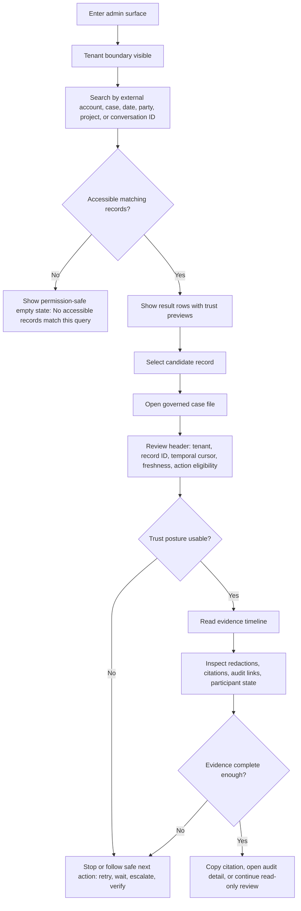
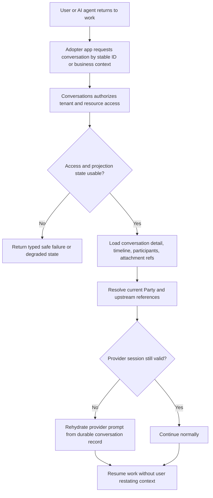
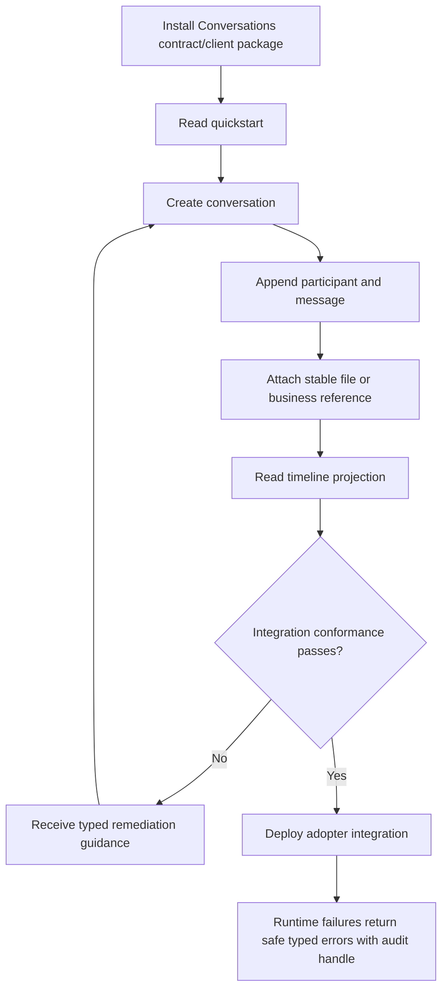
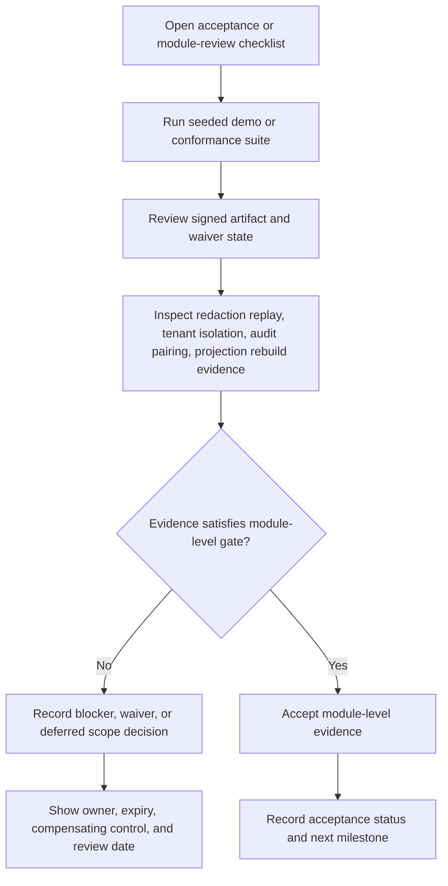

---
stepsCompleted:
  - 1
  - 2
  - 3
  - 4
  - 5
  - 6
  - 7
  - 8
  - 9
  - 10
  - 11
  - 12
  - 13
  - 14
lastStep: 14
workflowStatus: complete
completedAt: 2026-05-13
inputDocuments:
  - _bmad-output/planning-artifacts/prds/prd-Conversations-2026-06-02/prd.md
  - _bmad-output/planning-artifacts/prds/prd-Conversations-2026-06-02/addendum.md
  - _bmad-output/planning-artifacts/product-brief-Hexalith.Conversations.md
  - _bmad-output/planning-artifacts/product-brief-Hexalith.Conversations-distillate.md
  - _bmad-output/planning-artifacts/research/technical-hexalith-frontcomposer-administration-ui-for-hexalith-conversations-research-2026-05-10.md
  - _bmad-output/planning-artifacts/research/technical-hexalith-memories-rag-for-conversation-memories-research-2026-05-11.md
  - _bmad-output/planning-artifacts/research/technical-hexalith-memories-rag-implementation-handoff-2026-05-11.md
  - _bmad-output/planning-artifacts/research/technical-hexalith-parties-manage-people-conversations-module-research-2026-05-10.md
  - _bmad-output/planning-artifacts/research/technical-how-to-use-hexalithtenants-to-manage-tenant-isolation-in-hexalithconversations-research-2026-05-10.md
  - _bmad-output/planning-artifacts/research/technical-using-hexalith-eventstore-in-the-hexalith-conversations-module-research-2026-05-10.md
  - _bmad-output/project-context.md
preservationAuthorityVersion: ux-preservation-planning-2026-08-01-v1
currentDisposition: preserved-not-activated
activationAuthority: separate-approved-release-authority-required
---

# UX Design Specification Hexalith.Conversations

**Author:** Jerome
**Date:** 2026-05-12

---

> **Preservation-only UX authority.** This document preserves product UX
> decisions and acceptance obligations. It does not activate product UI
> implementation in the current corrective initiative. Activation requires
> separate approved release authority.

The historical workflow metadata and design content remain preservation
provenance. Current initiative authority comes from the canonical PRD and
addendum listed in frontmatter. The current disposition of every UX decision
and explicit acceptance-criterion identifier is maintained in
`ux-requirement-map.md`; historical story references are non-current provenance
and cannot authorize implementation.

<!-- UX design content will be appended sequentially through collaborative workflow steps -->

## Executive Summary

### Project Vision

Hexalith.Conversations provides the durable business record for AI-assisted exchanges across the Hexalith ecosystem. It makes conversations between humans, AI agents, and LLMs tenant-safe, replayable, auditable, governable, resumable, and portable across adopters without making the chatbot or any one UI own persistence.

### Target Users

The primary users are business users and AI agents who need to resume work with full context. Secondary users include chatbot and application developers who need reliable contracts, platform administrators who need tenant-scoped governance views, and operators who need evidence-rich diagnostics without exposing sensitive content.

### Key Design Challenges

The UX must make trust states visible without overwhelming users: tenant denial, stale projections, redacted content, audit state, degraded hydration, and verification status all need clear treatment. The design must also separate everyday conversation continuity from operator/admin evidence workflows, while preserving accessibility, content safety, and generated FrontComposer conventions.

### Design Opportunities

The strongest opportunity is to make governance feel inspectable rather than bureaucratic: Find -> Read -> Prove workflows can show what happened, what was redacted, who acted, when evidence was generated, and whether the view is fresh. A second opportunity is developer confidence: generated admin surfaces, typed contracts, and clear error states can make Conversations feel like a dependable platform primitive rather than another transcript store.

## Core User Experience

### Defining Experience

The defining experience for Hexalith.Conversations is Find -> Read -> Trust. A user or consuming surface locates the right conversation, reads the reconstructed timeline in business context, and immediately understands whether the record is current, complete, attributed, redacted, authorized, and audit-safe.

This loop appears differently by audience: operators use it to investigate and prove what happened; business users experience it as seamless conversation continuity inside adopter applications; developers experience it as a reliable create -> append -> read contract with safe, typed failure states.

The experience is successful when the user leaves with three things: an answer, a confidence state, and a next action. They should know what the record says, how much to trust the current view, and what to do next if the record is stale, denied, redacted, degraded, or incomplete.

For the v1 admin/governance surface, the primary job is investigation: when an authorized operator, administrator, or governance stakeholder needs to answer a question about an AI-assisted exchange, they locate the durable record, verify its trust posture, and choose the next safe action without inspecting EventStore, logs, or provider payloads.

Internally, the design should treat Find -> Read -> Trust as Investigate -> Reconstruct -> Verify -> Act. The user is not merely reading a transcript; they are viewing a governed reconstruction with an explicit trust posture and permitted actions.

### Platform Strategy

The primary v1 UX surface is a web-based administration and governance experience composed through Hexalith.FrontComposer, optimized for mouse and keyboard use by administrators, operators, and platform stakeholders. Business-user experiences are delivered through adopter applications such as the chatbot, while developer experience is delivered through typed contracts, clients, diagnostics, conformance tests, and content-safe error semantics.

The UX should use FrontComposer-generated conventions first, then customize the surfaces where trust depends on domain-specific presentation: conversation timeline, participant attribution, redaction state, audit trail, temporal cursor, projection freshness, degraded state, and citation copy.

### Effortless Interactions

Finding a conversation by business reference, project or folder context, party, timestamp, conversation id, or external identifier should feel direct and predictable. Reading the timeline should not require understanding infrastructure internals, tenant access mechanics, participant-resolution internals, provider metadata, or projection rebuild mechanics.

Trust signals should appear in context, not as a separate diagnostic chore: freshness, attribution, redaction, audit trail, participant identity availability, tenant denial, verification status, and citation anchors should be visible exactly where the user needs to make a decision.

Search results should preview trust posture before selection, so operators can distinguish current, stale, denied, redacted, partially resolved, unavailable, or degraded records before opening them. Participant search must be tenant-scoped, permission-filtered, and safe under denial.

### Critical Success Moments

The core success moment is when an operator can answer: what happened, who or what participated, what evidence backs it, whether anything was redacted, whether the view is fresh enough to trust, and what the next safe action is.

The conversation detail experience should behave like a governed case file, not a transcript. Its first screen should let an operator understand the reconstructed record, trust posture, and permitted actions without opening diagnostics. Timeline entries, redactions, citations, audit events, and degraded states should be presented as evidence in context.

A second success moment is when a business user resumes work without noticing the storage/governance substrate, because the adopter application restores the right conversation with the right context.

A third success moment is when a developer integrates create -> append -> read without learning EventStore internals, duplicating tenant checks, or guessing how to handle stale, denied, redacted, or degraded states.

### Experience Principles

- Evidence before decoration: every UX choice should make the record easier to trust.
- Context first: show conversation, participants, timeline, attachments, redactions, and evidence in business language before exposing diagnostics.
- Trust states in place: freshness, denial, degradation, redaction, and audit status should appear beside the affected content or action.
- Answer, confidence, next action: every important state should tell the user what is known, how reliable it is, and what can be done next.
- Fail closed, explain calmly: blocked or degraded states should be clear without leaking sensitive existence or content.
- Generated first, customized where trust demands it: use FrontComposer conventions for consistency, then specialize timeline, audit, redaction, freshness, and citation views.
- Adopter-safe by design: business-user and developer surfaces should inherit governance without forcing users to understand the substrate.
- No silent confidence: the UX must never present a record as complete/current when projections are stale, participant identity is unavailable, audit evidence is missing, or redaction has changed visible content.
- Trust as a contract: admin surfaces should consume Conversations-owned projections and command availability metadata, including a standard trust envelope for authorization, freshness, redaction, participant resolution, audit availability, and content safety.
- Governed case file over transcript: the timeline is an evidence timeline, with technical diagnostics one layer deeper.

## Desired Emotional Response

### Primary Emotional Goals

The primary emotional goal is calm confidence under scrutiny. Operators, administrators, and governance stakeholders should feel that the system is sober, precise, and trustworthy when they inspect an AI-assisted exchange. The UX should not feel flashy or casual; it should feel composed, evidence-aware, and ready for serious questions.

### Emotional Journey Mapping

When users first enter the admin/governance surface, they should feel oriented rather than overwhelmed. During investigation, they should feel in control: able to find the right record, understand its trust posture, and inspect evidence without decoding infrastructure details. After completing the task, they should feel relief and accountability: they know what happened, how reliable the view is, and what safe action is available.

When something goes wrong, the UX should feel firm and calm. Denied, stale, redacted, degraded, incomplete, or unavailable states should not feel broken or mysterious. They should feel intentionally governed, with clear boundaries and safe explanations.

### Micro-Emotions

The most important micro-emotions are confidence over confusion, trust over skepticism, control over anxiety, and accountability over ambiguity. For business users in adopter applications, the desired feeling is continuity: the conversation is simply there when they return. For developers, the desired feeling is reliability: the contracts make trust states explicit and reduce guesswork.

The emotion to avoid at all costs is false certainty. A clean screen that hides stale evidence, missing attribution, redaction effects, or unavailable audit state is worse than a visibly degraded screen.

### Design Implications

Calm confidence requires restrained visual hierarchy, explicit trust states, readable evidence, and no decorative treatment that competes with the record. Control requires clear filters, predictable search, visible command availability, and next actions beside uncertainty. Accountability requires citations, audit markers, redaction explanations, and trust posture summaries that are visible before users rely on the record.

Negative states should use precise, non-alarming language. The UX should explain what is known, what is hidden or unavailable, and what can be done next without leaking protected content or confirming inaccessible records.

### Emotional Design Principles

- Calm over clever: the interface should feel composed, not performative.
- Confidence with humility: show what can be trusted and what cannot.
- Relief through clarity: users should leave with an answer, a confidence state, and a next action.
- Boundaries as reassurance: denial, redaction, and unavailable states should feel governed, not broken.
- No false certainty: uncertainty must be visible wherever it affects interpretation or action.

## UX Pattern Analysis & Inspiration

### Inspiring Products Analysis

GitHub pull request and checks UI is a strong inspiration for making trust states actionable. Its useful pattern is not the code-review surface itself, but the way it collects independent signals into a clear trust posture: checks pending, checks failed, review required, merge blocked, rerun available, details available. For Hexalith.Conversations, this maps to conversation trust posture: current, stale, redacted, degraded, denied, incomplete, audit-ready, or action required.

Azure Portal is useful as an enterprise investigation reference. Its strengths are broad resource search, scoped navigation, activity history, resource health, policy state, and drill-down from summary to operational detail. For Hexalith.Conversations, the relevant lesson is not Azure's breadth, but its layered investigation model: start with resource context, summarize state, then allow deeper inspection of activity, diagnostics, and evidence.

Audit and incident review patterns add a third inspiration family. Their useful vocabulary is evidence packet, chain of custody, redaction notice, access decision, audit trail, final disposition, and exportable audit record. This keeps the experience grounded in governance rather than conversation browsing, developer review, or cloud-console management.

### Transferable UX Patterns

From GitHub, adopt compact trust gates, gated actions, inline failure reasons, rerun/retry affordances, and detail drill-downs. A conversation detail view should provide a trust posture summary similar in spirit to checks: what is safe to rely on, what is pending, what is blocked, what changed the visible record, and what action is allowed next.

From Azure Portal, adopt scoped navigation, resource-context headers, activity/audit timelines, health/status summaries, and progressive disclosure. Operators should move from search result to governed case file to evidence details without losing tenant, conversation, and trust context.

From audit and incident review patterns, adopt immutable event timelines, actor/action/source attribution, chain-of-custody markers, evidence packets, redaction notices, final disposition, and export-ready audit records.

Together, these suggest a core screen grammar: search results preview trust posture; detail pages open with a trust summary; the timeline behaves as evidence; audit and diagnostics sit one layer deeper; actions are gated and explained.

### Anti-Patterns to Avoid

Avoid making the UI feel like a chat transcript with admin badges attached. Conversations is a governed record, so a plain message list would hide the evidence model.

Avoid borrowing GitHub's developer-centric vocabulary. Operators need business-safe language such as current, stale, blocked, redacted, partially resolved, unavailable, audit-ready, or action required, not CI/check/run terminology.

Avoid borrowing Azure Portal's navigation sprawl. The Conversations admin surface should not become a general-purpose console; it should stay focused on tenant-scoped investigation of governed conversation records.

Avoid dumping infrastructure diagnostics into the primary view. Operators need business-safe trust states first; raw technical detail belongs behind drill-downs.

Avoid ambiguous green states. A record should not look complete if checks are stale, participant identity is partially resolved, audit evidence is unavailable, or redaction has changed what can be shown.

Avoid global search patterns that leak existence. Participant and conversation search must remain tenant-scoped, permission-filtered, and safe under denial.

Avoid status color as the only carrier of meaning. Labels, reasons, timestamps, and evidence links must carry the trust state.

Avoid UI-only governance. Gated actions must be backed by policy, permission, and command availability state, not merely disabled buttons.

Avoid raw diagnostic browsing as an investigation substitute. Every diagnostic layer should answer a distinct operator question: can I act, what changed, who or what caused it, what evidence supports it, and what is degraded?

### Design Inspiration Strategy

Adopt GitHub's compact status-and-gate model for trust posture, action availability, and failure explanation. Adapt Azure Portal's resource investigation model for tenant-scoped search, activity history, audit detail, and progressive drill-down.

The design should combine these into a focused trust cockpit for one governed record: a compact summary of trust posture, a reconstructed evidence timeline, gated safe actions, and deeper diagnostics only when needed.

The final UX should feel like a quiet governed case file: it borrows GitHub's compact action gating and Azure's persistent resource context, but translates both into reliance, evidence, permission, and chain-of-custody language.

Use both inspirations conservatively: the final UX should feel quieter than GitHub and more focused than Azure Portal. The goal is not a general-purpose cloud console or developer review tool; it is a governed case-file experience for AI-assisted business records.

Sources considered: [GitHub Docs on status checks](https://docs.github.com/en/pull-requests/collaborating-with-pull-requests/collaborating-on-repositories-with-code-quality-features/about-status-checks), [Azure Monitor activity log](https://learn.microsoft.com/azure/azure-monitor/essentials/activity-log).

### Pattern Fit Matrix

| Source Pattern | Adopt | Adapt | Avoid |
| --- | --- | --- | --- |
| GitHub status checks | Compact trust rollup; blocked/pending/pass/fail posture; details available on demand | Rename into business-safe trust states such as current, stale, redacted, degraded, audit-ready, or action required | Developer-centric CI/check/run vocabulary |
| GitHub gated merge/action model | Make safe actions visible only when allowed and explain why blocked actions are blocked | Use command availability metadata rather than UI-only rules | Treating the UI as the authority for governance decisions |
| Azure resource overview | Resource-context header and scoped summary before detail | Use tenant, conversation, trust posture, and evidence context instead of cloud resource metadata | Broad portal-style navigation |
| Azure activity log | Activity/audit timeline and drill-down into who/what/when/result | Present as evidence history tied to the conversation record | Raw log browsing as the primary workflow |
| Azure health/policy state | Clear operational state and recommended next action | Translate into governed record states and safe next actions | Ambiguous healthy states that hide partial or stale evidence |

### Non-Negotiable Pattern Minimum

The inspiration strategy should reduce to four required patterns:

1. **Trust posture summary** - the user can see whether the record is current, stale, redacted, degraded, denied, incomplete, audit-ready, or action required before relying on it.
2. **Evidence timeline** - the reconstructed conversation is presented as an evidence record with actor, time, content/redaction state, citation affordance, and audit linkage.
3. **Gated safe actions** - actions are visible through command availability metadata and explain why they are allowed, blocked, or unavailable.
4. **Progressive diagnostics** - technical detail is available, but the primary experience uses business-safe state language first.

These four patterns are the durable lesson from GitHub and Azure Portal. If later design work adds navigation, dashboards, filters, charts, exports, or richer investigation tools, those additions must not weaken these four patterns.

### Governance Translation Layer

The borrowed patterns must be translated into governance language before they reach the UI. GitHub contributes compact trust gates, not CI vocabulary. Azure contributes layered projection-backed diagnostics, not portal navigation. Audit and incident review patterns contribute evidence packets, chain-of-custody markers, redaction notices, access decisions, final disposition, and exportable audit records.

Every trust state should answer four questions:

- What is reliable?
- What is missing, altered, hidden, or uncertain?
- Who or what caused the state?
- What action is permitted now?

### Contract-Backed Pattern Rules

Trust posture, evidence timeline, safe actions, and diagnostics must be rendered from Conversations-owned projections and command availability metadata. The frontend should render trust state, not infer it.

Recommended contract concepts:

- `TrustPosture`: availability, policy state, data freshness, blocking conditions, confidence, last evaluated timestamp.
- `EvidenceItem`: kind, summary, timestamp, actor display state, visibility reason, citation anchor, source projection version.
- `CommandAvailability`: enabled state, reason code, required permission, risk level, preconditions, retry or audit-pairing requirements.

Neutral unavailable states must avoid distinguishing missing, forbidden, and outside-tenant records when that distinction would leak existence.

### Pattern-To-Risk Matrix

| Pattern | Risks It Must Cover |
| --- | --- |
| Trust Posture Summary | Projection freshness, degraded states, redaction impact, audit availability, ambiguous green states |
| Evidence Timeline | Audit pairing, actor attribution, redaction replay, citation integrity, metadata privacy |
| Safe Action Gates | Authorization, idempotency, retry behavior, audit event pairing, blocked-action explanation |
| Progressive Diagnostics | Tenant isolation, no raw infrastructure leakage, permission-filtered drill-down, content-safe failure states |
| Evidence Packet / Case File | Chain of custody, final disposition, export readiness, accountable decision record |

## Design System Foundation

### 1.1 Design System Choice

Hexalith.Conversations should use the existing Hexalith.FrontComposer design foundation, backed by Fluent UI Blazor, as its primary design system.

This is a themeable established-system approach: use generated FrontComposer conventions and Fluent UI components for baseline administration patterns, then introduce custom Conversations-specific presentation only where governance, evidence, and trust interpretation require it.

The decision should be treated as an architecture-aligned UX decision, not only a visual preference. FrontComposer is the platform composition path; Fluent UI Blazor is the component foundation; Conversations-specific trust patterns are the customization layer.

Generated for familiarity, custom for trust: FrontComposer and Fluent UI Blazor own the ordinary administration grammar. Custom Conversations UI is reserved for trust-bearing surfaces where governance meaning must be explicit, source-backed, and fail-closed.

### Rationale for Selection

This choice best satisfies the core UX requirement: operators must be able to find, read, and trust a governed conversation record without learning infrastructure internals or being misled by a polished but incomplete view.

Alternatives considered:

- A fully custom design system would provide maximum visual control, but it would increase delivery cost, duplicate platform patterns, and distract from the harder trust-state work.
- A separate third-party system such as Material Design or Ant Design would provide strong components, but it would create a parallel administration language inside Hexalith.
- A plain generated UI with no domain-specific customization would move quickly, but it would under-serve evidence timelines, redaction states, audit posture, projection freshness, and citation workflows.

FrontComposer plus Fluent UI Blazor is the strongest fit because it preserves platform consistency while leaving room for specialized governance components where generic generated UI is not enough.

Persona fit:

- Operators need compact, scannable trust posture and safe next actions.
- Administrators need consistent command forms and permission-aware controls.
- Auditors need evidence markers, citations, redaction explanations, and audit trails that remain readable outside developer context.
- Developers need generated conventions, reusable components, typed metadata, and minimal bespoke UI surface area.

### Implementation Approach

The implementation should be generated-first and trust-customized.

FrontComposer should generate the baseline administration shell, routes, command forms, projection views, navigation, and standard interaction patterns from annotated Conversations contracts and projections. Fluent UI Blazor should provide standard controls such as grids, forms, dialogs, menus, buttons, badges, tabs, filters, and navigation.

Custom design work should be concentrated in reusable Conversations-specific patterns:

- Trust posture summary
- Conversation evidence timeline
- Redaction and visibility markers
- Audit and governance timeline
- Projection freshness and degraded-state indicators
- Gated safe actions with blocked-action explanations
- Citation copy with stable evidence metadata
- Temporal cursor and permalink affordances
- Participant attribution with degraded identity resolution
- Safe empty, denied, stale, unavailable, and partially resolved states

Minimum viable design-system rule: use generated FrontComposer UI for standard administration, Fluent UI Blazor for standard controls, and custom components only when a user must interpret evidence, trust, governance, redaction, freshness, or action safety.

The frontend should render trust states from Conversations-owned projections and command availability metadata. It must not infer governance, authorization, freshness, redaction impact, or audit readiness on its own.

Visual trust states, warnings, action enablement, freshness indicators, citation confidence, redaction status, and audit affordances must be rendered only from Conversations-owned projections or command availability metadata. The UI may format trust data, but must never infer it.

No raw EventStore UX: operators should not browse event streams as the primary experience. The UX should expose governed records, evidence timelines, decisions, and audit trails through Conversations projections designed for that purpose.

### Customization Strategy

Customization should be conservative, reusable, and evidence-driven.

The visual language should remain quiet, dense, and operational: clear typography, predictable spacing, restrained color, strong focus states, and labels that do not rely on color alone. The UI should avoid decorative layouts, marketing-style composition, or chat-app styling. The experience should feel like a governed case file inside the Hexalith platform.

The design-system extension layer should define reusable tokens and components for:

- Current, stale, rebuilding, unavailable, denied, degraded, redacted, incomplete, audit-ready, and action-required states
- Redaction notices and visibility explanations
- Audit markers, evidence anchors, and chain-of-custody cues
- Participant identity resolution and degraded hydration states
- Command availability, required permission, precondition, and risk-level display
- Citation and temporal reconstruction affordances

Generated-first surfaces:

- Conversation search and filtering
- Conversation summary list
- Tenant-scoped admin navigation
- Standard details panels
- Standard forms and command dialogs
- Pagination, sorting, empty states, and loading states

Custom trust-critical surfaces:

- Evidence timeline
- Citation rendering
- Redaction state and redaction previews
- Audit trail
- Freshness and projection-lag indicators
- Gated action controls
- Temporal cursor navigation
- Degraded or unresolved participant identity
- Authorization and tenant-boundary warnings

Custom Conversations UI is allowed only when a generated Fluent UI surface cannot accurately communicate trust, evidence, governance, or command safety from server-owned state. Custom components must declare their projection inputs, command metadata inputs, fail-closed behavior, accessibility behavior, degraded-state behavior, and tenant-isolation test coverage.

### Design System Acceptance Criteria

- All baseline admin screens are generated through FrontComposer annotations unless explicitly listed as trust-critical.
- Trust-critical custom UI consumes Conversations-owned projections and command availability metadata only.
- No UI reads raw EventStore streams or reconstructs governance state client-side.
- All gated actions render from server-provided command availability metadata.
- If trust metadata is missing, stale, ambiguous, malformed, unauthorized, or partially loaded, the UI disables governed actions and explains the blocked or degraded state.
- Tenant identifiers, participant identities, citations, redaction state, audit state, freshness, and command eligibility are never inferred from display text.
- Evidence, audit, redaction, freshness, citation, temporal cursor, and gated-action components have automated accessibility coverage.

### Failure Prevention Guardrails

- Generated UI is acceptable for baseline CRUD-like administration, but evidence interpretation requires custom components.
- No status may rely on color alone.
- No healthy or complete state may hide stale projections, partial participant resolution, missing audit evidence, or redacted content.
- Disabled or hidden actions must be backed by command availability metadata, not UI-only logic.
- Accessibility checks must include keyboard navigation, screen-reader-readable trust states, focus order, and non-color status meaning.
- Custom patterns should become reusable FrontComposer-compatible components rather than one-off pages.

Design-system failure modes to test against:

- Baseline generated pages expose raw technical fields instead of business-safe trust states.
- Timeline rendering looks like a chat transcript rather than an evidence record.
- Redaction indicators are visually present but not understandable to screen readers.
- Search results hide stale, degraded, or partially resolved states until after selection.
- Command buttons appear available even when backend preconditions would reject the action.
- Audit and citation elements are visually decorative instead of copyable, stable, and traceable.
- Custom components diverge from FrontComposer navigation, density, accessibility, or lifecycle conventions.

Failure-mode rendering rules:

- Missing projection: show unavailable state and disable trust-dependent actions.
- Stale projection: show freshness warning and disable irreversible actions.
- Ambiguous participant: show degraded identity and do not merge identities client-side.
- Missing citation target: show broken citation and do not hide it.
- Redacted evidence: show redaction marker and never expose the original value.
- Authorization mismatch: show access denied and do not retry with broader scope.
- Tenant mismatch: hard stop with no partial render.

### Verification Expectations

Component tests should verify that gated actions disable when command availability is absent, gated actions disable when projection freshness is stale, evidence timelines render only projection-provided events, redacted content never appears in accessible names, tooltips, DOM text, or copied values, and citation components render missing or deleted evidence as degraded rather than trusted.

Integration tests should verify that a cross-tenant conversation ID cannot hydrate another tenant's details, the admin UI cannot navigate to raw stream views, projection lag produces a fail-closed trust state, and unauthorized command metadata produces no executable action.

Accessibility tests should verify that the evidence timeline is keyboard navigable, audit entries expose timestamp, actor, action, and outcome to screen readers, and disabled gated actions expose the reason without requiring hover.

The result should be a governed case-file experience: familiar through Hexalith platform conventions, precise enough for conversation evidence, and disciplined enough to support audit review.

## 2. Core User Experience

### 2.1 Defining Experience

The defining experience for Hexalith.Conversations is: recover a governed conversation record and leave with an answer, a verified trust state, and a safe next action.

For the v1 operator/admin surface, the defining flow is **Find -> Open -> Verify -> Cite, Act, or Stop**:

1. Find the right tenant-scoped conversation without leaking cross-tenant existence.
2. Open the governed record as a case file, not a chat transcript.
3. Verify freshness, attribution, redaction, auditability, citations, and command availability.
4. Cite the evidence, take the next allowed action, or stop when trust cannot be established.

For business users in adopter applications, the same experience appears as continuity: the conversation is simply there when they return, with the right context restored and governance applied invisibly.

For developers and adopters, the same experience appears as a dependable contract: create, append, attach, govern, and read without learning EventStore internals or rebuilding tenant isolation.

The core interaction is not chatting, browsing logs, or reading raw event streams. It is relying on a governed business record.

The product succeeds if the user can say: "I found the right conversation, I understand what happened, I know what evidence backs it, I can see what is redacted or degraded, and I know whether I can cite, act, or stop safely."

### 2.2 User Mental Model

Operators and administrators approach this surface with an investigation mental model. They are not trying to have a conversation; they are trying to resolve uncertainty around a past AI-assisted exchange without creating new risk.

They expect the experience to behave like a governed case file: scoped search, clear record header, evidence timeline, participant attribution, redaction notices, audit trail, freshness state, and safe action controls.

The governed case file has:

- A record identity
- A timeline of material facts
- A current trust state
- Evidence and citations
- Allowed actions
- Blocked actions with safe explanations

Business users bring a continuity mental model. They expect a prior exchange to reopen with context intact, without needing to know which service persisted it or which governance checks ran.

Developers bring an integration mental model. They expect a reliable lifecycle and typed failure states: create a conversation, append messages, attach references, read projections, and handle stale, denied, redacted, or degraded states without guessing.

Likely confusion points:

- Treating the operator timeline as a chat transcript rather than evidence.
- Assuming a clean screen means the record is complete.
- Missing stale, degraded, or partially resolved states.
- Confusing redacted content with missing content.
- Expecting disabled actions to explain themselves.
- Assuming participant names are durable truth rather than read-time hydration.
- Expecting technical EventStore details when the UI should show business-safe evidence.
- Expecting business-user continuity and operator proof workflows to use the same screen.
- Interpreting trust state as subjective reassurance rather than verified state from projections and metadata.

Operators are not browsing events or reading chat history. They are opening a governed case file whose facts, trust state, and next actions are already shaped by domain rules.

The UX should meet each user where they are: operators need proof, business users need continuity, administrators need control, and developers need contracts.

### 2.3 Success Criteria

The core experience is successful when:

- The user can locate a conversation without leaking cross-tenant existence.
- Search results preview trust posture before the user opens a record.
- The record header summarizes state, freshness, redaction, attribution, and action availability.
- The evidence timeline makes actor, time, content state, citation, and audit linkage visible.
- Redaction, degraded identity, stale projection, missing citation, and denied access states are explicit.
- Gated actions explain why they are allowed, blocked, or unavailable.
- The user can copy a stable citation for evidence without hunting through diagnostics.
- Unknown, stale, or ambiguous trust states fail closed rather than appearing safe.
- The user can tell whether the record is cite-ready, action-ready, degraded, blocked, or unavailable.
- The operator can determine whether the record is usable without interpreting raw events.
- The UI never fabricates trust from presentation-layer heuristics.
- Every permitted action maps to a backend command contract.
- Every cited answer includes enough provenance for review without leaking unauthorized tenant data.
- A denied or unavailable action still leaves the operator with a clear safe next step.
- Business-user surfaces can restore the right conversation context without exposing unnecessary governance machinery.
- Developer-facing contracts expose typed trust and failure states instead of raw EventStore mechanics.
- The user can complete the Find -> Open -> Verify -> Cite, Act, or Stop loop without understanding EventStore internals.

### 2.4 Novel UX Patterns

The UX combines established enterprise patterns in a domain-specific way.

Established patterns:

- Scoped search and filtering
- Resource/detail views
- Status summaries
- Activity and audit timelines
- Disabled action explanations
- Progressive diagnostics
- Copyable references and citations

Novel combination:

- A conversation is presented as a governed evidence record, not a chat transcript.
- Trust posture is treated as a first-class UX object.
- Redaction, freshness, auditability, participant resolution, and command availability appear together in the same decision surface.
- The UI does not infer trust; it renders trust from server-owned projections and command metadata.
- One durable record supports three experiences: operator proof, business continuity, and developer integration.
- Completion is defined by cite-readiness, action-readiness, or safe stopping, not by reaching the end of content.

Named patterns:

- **Governed Case File View:** A structured operational view that presents an AI-assisted exchange as a durable business record, combining timeline, evidence, trust state, and action eligibility.
- **Trust Banner:** Persistent record-level governance state that shows whether the record is current, stale, degraded, restricted, redacted, cite-ready, action-ready, blocked, or unavailable.
- **Evidence Timeline:** Curated business events, not raw EventStore events, with actor, timestamp, content or redaction state, citation anchor, and audit linkage.
- **Command Gate:** Actions rendered from Conversations-owned command availability metadata. Disabled states explain the governance reason without exposing sensitive internals.
- **Citation Drawer:** Copyable, scoped references to conversation evidence using stored conversation evidence and citation metadata.
- **Fail-Closed Empty States:** Permission-safe messages that avoid confirming whether inaccessible records exist.

The interaction should feel familiar in controls but specific in meaning.

### 2.5 Experience Mechanics

**1. Initiation: Find**

The operator starts from a tenant-scoped investigation entry point. They search by conversation ID, external reference, project or folder context, party reference, timestamp, or other permitted business reference.

Search uses only the current tenant and permission scope. Search results show compact trust previews so the user can identify current, stale, redacted, degraded, denied, incomplete, or audit-ready records before opening them. Search failures and empty states avoid revealing whether a record exists in another tenant or outside the user's permission scope.

**2. Interaction: Open**

The user opens a governed conversation record.

The first screen presents:

- Record identity and tenant-safe context
- Trust posture summary
- Projection freshness
- Participant attribution state
- Redaction and audit state
- Evidence timeline
- Attachments or attachment references where permitted
- Available safe actions
- Citation affordances
- Progressive diagnostics entry points

The user reads the evidence timeline as a reconstruction of the record. Timeline entries show actor, timestamp, content or redaction state, citation anchor, and audit linkage.

**3. Feedback: Verify**

The system continuously answers:

- What is reliable?
- What is missing, hidden, stale, redacted, restricted, expired, disputed, or degraded?
- Who or what caused this state?
- What can be done next?

Verification is projection-driven, never inferred by the UI. The UI never decides trust. It only presents trust states and available actions produced by Conversations-owned projections and metadata.

Blocked actions show reasons. Stale projections show freshness warnings. Missing citations show degraded evidence. Redacted content shows a redaction marker and never exposes the original value.

**4. Completion: Cite, Act, or Stop**

The user is done when they have one of three outcomes:

- **Cite:** They can rely on the record and copy or cite the evidence.
- **Act:** They know the next safe action, such as retry, escalate, verify, redact, review audit trail, or decline action.
- **Stop:** Trust cannot be established, so the UI makes doing nothing unsafe feel like a completed, safe outcome rather than a dead end.

A safe next action is one currently authorized by Conversations command availability metadata, given the conversation's projected trust state, user permissions, and tenant boundary.

Completion is not simply reaching the end of a timeline. Completion is leaving with an answer, a verified trust state, and a safe next action or a clear reason to stop.

## Visual Design Foundation

### Color System

Hexalith.Conversations should use a restrained, semantic color system aligned with FrontComposer and Fluent UI Blazor rather than a custom expressive palette.

The visual direction is **Quiet Evidence UI**: neutral structure, deliberate status color, high information clarity, and no decorative treatment that competes with the record.

The visual tone should communicate calm confidence, operational clarity, and audit readiness. The palette should avoid decorative gradients, AI-themed glow effects, chat-app styling, and saturated one-note color themes.

Recommended color strategy:

- Neutral foundation for application chrome, panels, tables, timelines, and evidence surfaces.
- One restrained primary accent for navigation focus, selected states, and primary actions.
- Semantic status colors for trust posture, projection freshness, redaction, denied access, degraded identity, audit readiness, and blocked actions.
- Distinct treatment for redacted, stale, unavailable, denied, degraded, and action-required states.
- Color always paired with label, icon, reason text, timestamp, or evidence link.

Semantic mapping:

- Primary: platform action and selection states.
- Neutral: record content, case-file structure, tables, details, and timeline surfaces.
- Success/current: current, verified, cite-ready, or action-ready states.
- Warning/stale: stale projection, delayed rebuild, partial identity hydration, or action precondition risk.
- Error/blocked: denied, unavailable, failed verification, tenant mismatch, or command-blocking state.
- Redaction: visible redaction marker distinct from warning and error.
- Degraded: partially resolved or lower-confidence state that is neither success nor failure.
- Information: audit-ready, projection-generated, citation-ready, or diagnostic detail states.

### Attention Priority

The record is the protagonist. Everything else is supporting structure.

Visual hierarchy should map to the operator flow:

- Find: search, filters, sort, record identity, freshness, and trust state.
- Open: record title, participants, timestamps, provenance, and tenant-safe scope.
- Verify: evidence, citations, redaction state, command availability, and trust status.
- Cite / Act / Stop: allowed commands, blocked commands, audit implications, and next safe action.

An operator should identify record identity, trust state, command availability, and whether evidence is complete within three seconds of opening a record.

Visual dominance ladder:

- Record content first.
- Trust and provenance second.
- Available actions third.
- Supporting metadata fourth.
- System chrome last.

Trust posture should be visible but not louder than the record identity. Redaction and blocked states should interrupt scanning enough to prevent accidental reliance. Diagnostics should be visually subordinate until opened. No decorative color should compete with status meaning. A neutral screen must not imply a safe screen unless the trust posture explicitly says so.

### Visual Trust Invariant

No visual treatment may imply verified, actionable, complete, current, or authoritative status unless that state is backed by Conversations-owned projection data or command availability metadata.

Every status must combine label, icon or shape, accessible text, deterministic state source, and optional color. Color is supplemental.

The color system must avoid ambiguous green states. A current-looking visual treatment must never hide stale projections, partial participant resolution, missing audit evidence, or redacted content.

### Visual Evidence Roles

The visual system should distinguish:

- Canonical record content
- AI-derived interpretation
- Verification state
- Command availability
- Redacted or unavailable content

These must not look equally authoritative. AI-derived interpretation, summaries, citations, and case facts should never blur into a single visual authority level.

### Typography System

Typography should prioritize readability, scanning, and evidence review over personality.

Use the existing FrontComposer/Fluent UI typography defaults unless Hexalith later defines a platform type system. The admin UI should avoid decorative or highly branded fonts. The type system should support dense operational screens, long evidence timelines, status labels, timestamps, metadata, and citation blocks.

Typography principles:

- Use clear hierarchy for record title, trust posture, section headings, timeline entries, metadata, and supporting explanations.
- Keep timeline content readable at body size with generous line height.
- Use smaller but legible metadata text for timestamps, actor references, projection positions, and citation identifiers.
- Use monospace only for identifiers, hashes, correlation IDs, immutable references, or citation blocks where alignment and exact copying matter.
- Avoid oversized hero-scale text inside admin surfaces.
- Do not rely on weight or color alone to communicate state.

Recommended hierarchy:

- Page title: governed record identity and business-safe context.
- Section headings: compact, scannable labels for case file areas.
- Body text: readable evidence content and explanations.
- Metadata: timestamps, actor state, projection freshness, citation anchors.
- Status labels: concise state plus reason, never color-only.
- Citation blocks: compact, copyable, and visually distinct.

Evidence readability rules:

- Evidence text should be optimized for sustained reading, not dashboard scanning only.
- Metadata should remain legible at dense sizes because timestamps, actor state, and citation IDs carry trust meaning.
- Long identifiers should wrap or truncate only with copy access and full-value disclosure where authorized.
- Redaction labels should remain readable at the same level as the content they replace.
- Status labels should be short and stable.

### Spacing & Layout Foundation

The layout should be dense, predictable, and case-file oriented.

Use an 8px spacing foundation, with 4px increments allowed for compact metadata relationships and 16px or 24px spacing for major section separation. The goal is not airy editorial whitespace; it is repeatable operational scanning.

Layout principles:

- Keep tenant, record identity, trust posture, and command availability visible near the top of the record.
- Present summary before timeline, and timeline before diagnostics.
- Keep evidence, redaction, citation, and audit linkage close to the timeline entry they explain.
- Use progressive disclosure for technical diagnostics.
- Avoid nested cards and decorative floating sections.
- Use tables, lists, timelines, tabs, drawers, command bars, badges, panels, callouts, and dialogs according to FrontComposer/Fluent UI conventions.
- Maintain stable dimensions for status chips, icon buttons, command gates, timeline markers, and citation controls so state changes do not shift layout.

Recommended layout model:

- Header band: record identity, tenant-safe context, trust posture, and primary command gate.
- Main body: evidence timeline with inline redaction, citation, attribution, and freshness indicators.
- Supporting panels: audit trail, participant resolution, attachments, and diagnostics.
- Drawers/dialogs: citation detail, evidence detail, command rationale, and degraded-state explanations.
- Empty/denied/unavailable states: full-width governed messages that explain the safe state without leaking existence.

Spatial priority:

- Put trust posture before diagnostics.
- Put action availability beside the decision point it affects.
- Put citation controls beside the evidence they cite.
- Put redaction and degraded-state explanations in line with affected content.
- Put raw technical detail behind explicit drill-down.

Case-file density rules:

- Density is useful only when it preserves decision safety.
- Compact tables and metadata panels are allowed, but interactive controls need stable hit targets and visible focus states.
- Layout must preserve readable line length, stable row height, visible focus, non-overlapping metadata, and no truncation of legally or operationally important state.
- Predictable column and panel regions should support Find, Open, Verify, and Cite / Act / Stop rather than card-heavy layouts.

### Implementation Mapping

- Semantic color tokens map to Fluent theme aliases.
- Status badges are shared components, not per-page styling.
- Command buttons bind to command availability metadata.
- Verification panels bind only to Conversations-owned projections.
- Redaction components never receive raw content.
- Empty, loading, stale, unauthorized, and unavailable states are visually distinct.
- Domain semantic tokens should represent trust state, verification state, citation state, command availability, redaction state, and risk severity.
- Fluent UI should own base interaction tokens, focus rings, disabled states, density, typography primitives, and component behavior.

Example domain semantic tokens:

- `--conversation-status-verified`
- `--conversation-status-unverified`
- `--conversation-status-blocked`
- `--conversation-command-unavailable`
- `--conversation-redacted`

### Accessibility Considerations

Accessibility is part of the trust model, not a polishing pass.

Every status must be communicated through text and structure, not color alone. Evidence timelines, redaction markers, trust banners, command gates, citation drawers, and degraded-state messages must support keyboard navigation, visible focus, screen-reader-readable labels, and meaningful ordering.

Accessibility requirements:

- WCAG 2.1 AA contrast for text, status labels, controls, and timeline markers.
- Keyboard access for search, timeline navigation, citation copy, command gates, filters, tabs, drawers, and dialogs.
- Screen-reader-readable trust states, including freshness, redaction, degraded identity, blocked action, denied access, and unavailable projection.
- Disabled actions expose reason text without requiring hover.
- Status icons always include text alternatives or adjacent labels.
- Motion, if any, is minimal and respects reduced-motion preferences.
- Empty, denied, stale, and unavailable states avoid revealing protected resource existence.
- All statuses pass grayscale and high-contrast review.
- Keyboard-only users can complete Find -> Open -> Verify -> Cite, Act, or Stop.
- Screen reader output must not overstate trust.

Redaction is both an accessibility and data-leak concern. Redacted content must render from a redaction-safe value or projection field, never hidden original text or CSS masking. It must be absent from DOM text, accessible names, tooltips, copied values, search indexes, browser title text, telemetry labels, and hidden responsive layouts. Redaction placeholders should preserve layout and context without exposing value length or hidden content unless that disclosure is explicitly allowed.

### Trust Failure Modes

- A screen reader announces "current" without stale or degraded context.
- Disabled actions require hover to understand.
- Redacted content leaks through hidden labels, copy buffers, DOM text, or accessibility APIs.
- Timeline order is visually clear but semantically incorrect.
- Status is communicated only by color, weight, or icon.
- Keyboard focus moves into diagnostics before core evidence.
- Loading, hover, selected, error, or empty states imply evidence exists before projection state confirms it.
- Unavailable actions look merely secondary or delayed rather than unavailable, blocked, or unsafe.

### Forbidden Visual Moves

- Chat bubbles
- Avatars as primary conversation anchors
- Decorative gradients
- AI magic visual effects
- Color-only urgency
- Blurred redaction
- Raw event stream views
- Playful typing affordances or conversational decoration in the operator evidence view

The interface should feel like a quiet case file: dense enough for expert review, restrained enough to preserve trust, and explicit enough that every status, omission, and available action can be explained without revealing protected content.

## Design Direction Decision

### Design Directions Explored

Six design directions were explored in the interactive showcase at `_bmad-output/planning-artifacts/ux-design-directions.html`:

- Case File Console
- Split Investigation Lens
- Trust Matrix Dashboard
- Evidence Reader
- Operations Desk
- Triage Rail Workbench

Each direction preserved the established Quiet Evidence UI foundation: restrained visual hierarchy, FrontComposer and Fluent UI alignment, no chat-style treatment, no decorative effects, explicit trust posture, evidence-first reading, command gates, and progressive diagnostics.

### Chosen Direction

The chosen direction is **02. Split Investigation Lens**, strengthened with two supporting influences: the clean record header from **Case File Console** and the calm timeline readability of **Evidence Reader**.

This direction keeps the investigation entry point and the governed record view visible together. A left-side Find pane shows tenant-scoped search, filters, permission-safe results, and compact trust previews. The main Read pane shows the selected governed case file with record identity, trust posture, evidence timeline, citation affordances, redaction state, audit linkage, projection freshness, and gated safe actions.

### Design Rationale

Split Investigation Lens best supports the operator workflow because it makes Find -> Read -> Trust visible as one continuous action. Operators can compare candidate records, see trust posture before opening, and verify the selected conversation without losing search context.

This direction reduces the risk of accidental reliance on the wrong record. Search results preview current, stale, redacted, degraded, denied, restricted, incomplete, or unavailable states before the user opens a record. Once opened, the record keeps trust posture and safe actions near the evidence timeline rather than hiding them in diagnostics.

The direction also supports the product's fail-closed posture. The Find pane must never become a global search that leaks existence across tenants or permissions. Result rows must be rendered from Conversations-owned projections and must use permission-safe empty, hidden, restricted, or unavailable states. Trust previews are not decorative labels; they are compact renderings of contract-backed authorization, freshness, redaction, participant-resolution, audit, citation, and command-availability state.

The selected record remains the protagonist. The split layout is not a dashboard and not a generic portal. It is an investigation lens: the left pane helps the operator choose safely, while the main pane helps them verify, cite, act, or stop.

### Implementation Approach

Use the Split Investigation Lens as the v1 design base:

- Left pane: tenant-scoped search, filters, result list, and compact trust previews.
- Result rows: record identity, business-safe context, freshness, redaction, degraded identity, denied/restricted/unavailable state, and safe next hint.
- Main pane: governed case-file reader with header, trust posture strip, evidence timeline, and command gate.
- Header treatment: borrow the Case File Console's clear record identity, tenant-safe context, temporal cursor, and primary command placement.
- Timeline treatment: borrow the Evidence Reader's calm, readable evidence entries for sustained review.
- Inline evidence treatment: actor, timestamp, content or redaction state, citation anchor, and audit linkage on each timeline entry.
- Supporting panels or drawers: citation detail, audit trail, participant resolution, projection freshness, command rationale, and diagnostics.
- Responsive behavior: collapse the Find pane into a search/results drawer on narrow screens, but preserve the selected record's trust posture before timeline content.
- Safety invariant: both result previews and opened-record trust states must be rendered from Conversations-owned projections and command availability metadata, never inferred by the UI.
- FrontComposer alignment: generate baseline command/projection surfaces first, then customize only the search/result preview, evidence timeline, trust posture, citation, redaction, and command-gate components.

### Party Mode Refinements

The Split Investigation Lens must make tenant scope visually persistent in both panes. The active tenant boundary, permission mode, and data scope should be visible in the Find pane and repeated in the selected record header so operators never mistake scoped search for global search.

Trust previews must be specific, source-attributed, and projection-backed. A result row should not simply say "verified" or "trusted"; it should expose compact facts such as projection freshness, redaction state, audit coverage, citation status, participant-resolution state, policy status, command availability, source projection, timestamp, and policy or schema version where applicable.

The Find pane must avoid existence leakage through result rows, empty states, counts, facets, autocomplete, pagination, ordering, or timing. User-facing copy should prefer permission-safe language such as "No accessible records match this query" rather than implying whether inaccessible records exist.

The opened record needs an evidence completeness indicator. The Read pane should clearly show whether the timeline is complete, partially redacted, permission-filtered, reconstructed from stale projections, missing citation links, or otherwise degraded.

Command gates must expose reason codes and user-readable explanations. Unavailable actions should distinguish missing permission, stale projection, tenant mismatch, legal hold, retention state, redaction state, incomplete reconstruction, audit dependency unavailable, or command metadata unavailable.

The timeline should support two review modes: a calm human-readable chronology by default, and a forensic exact view for auditors or operators who need event IDs, actor IDs, causation/correlation IDs, projection positions, and freshness details.

Redaction must be a first-class reading state, not a missing-text illusion. The UI should distinguish content that was redacted by policy, unavailable by permission, never collected, deleted or hidden by retention, sealed by legal hold, or pending projection.

The design should include "Why this result?" and "Why am I seeing this?" affordances. These should explain matching fields, permission scope, tenant relationship, policy path, trust preview source, and audit consequence without exposing protected content.

The main risk to guard against is turning the split view into two competing dashboards. The left pane remains for safe discovery; the main pane owns deep reading, verification, citation, and action.

## User Journey Flows

### Sarah: Operator Find -> Read -> Verify -> Cite, Act, or Stop

Sarah's journey is the defining v1 UX flow. The Split Investigation Lens supports it by keeping safe discovery and governed reading visible together.

Key interaction requirements:

- Find pane stays tenant-scoped and permission-safe.
- Result rows preview freshness, redaction, audit, citation, participant resolution, and command availability.
- Read pane shows evidence completeness before timeline reliance.
- Command gates explain unavailable actions with reason codes.
- Time-travel and redaction states remain visible without exposing protected content.

### Maya and Atlas: Resume With Full Context

Maya and Atlas share the same product promise: durable continuity through adopter surfaces. The UX is mostly invisible to them; success means they do not need to rebuild context.

Key interaction requirements:

- Business continuity appears in adopter UI, not the operator console.
- Degraded participant or attachment hydration must be explicit but not alarming.
- Provider IDs remain metadata; the durable conversation is the source of truth.
- Resume failures use typed, content-safe error states.

### Diego: Developer Create -> Append -> Read

Diego's journey validates the developer-facing UX: the contract package should feel like Conversations, not raw EventStore.

Key interaction requirements:

- Quickstart hides EventStore envelopes, snapshots, raw streams, and projection internals.
- Error states distinguish tenant binding, stale projection, unsupported contract, and denied access.
- Consumer-side conformance tests become part of the developer journey.
- Documentation and diagnostics must preserve tenant and content secrecy.

### Julian and Helen: Evidence-Based Acceptance Review

Julian and Helen need proof that the module's trust claims are demonstrable, not decorative.

Key interaction requirements:

- Acceptance surfaces summarize pass/fail, waiver, signer, timestamp, and scope.
- Module-level evidence is separated from platform-level compliance evidence.
- Synthetic reference samples must be labeled honestly.
- Partial acceptance must show explicit owner, risk, and review date.

### Journey Patterns

The journey flows standardize these reusable patterns:

- **Scoped Entry:** every journey starts by establishing tenant, resource, contract, or release scope.
- **Trust Before Reliance:** users see freshness, authorization, redaction, audit, and citation state before acting.
- **Evidence Near Action:** citations, audit links, and command reasons appear beside the affected evidence or decision.
- **Fail-Closed Completion:** stopping is a valid successful outcome when trust cannot be established.
- **Source-Owned State:** UI renders projection and command metadata; it does not infer trust.
- **Safe Explanation:** errors explain class, retryability, and next action without leaking protected content.

### Flow Optimization Principles

- Keep Sarah's operator path within the PRD's 90-second investigation target.
- Keep the selected record, tenant boundary, trust posture, and action eligibility visible before deep diagnostics.
- Minimize user interpretation of infrastructure terms; use governed record language first.
- Preserve keyboard and screen-reader access for search, timeline, citation copy, command gates, filters, and drawers.
- Treat unhappy paths as primary UX: stale projection, unavailable audit state, denied access, missing citation, degraded participant identity, and redaction replay all need designed states.
- Keep v1 read-only where the PRD requires it; evidence bundle export and richer retention editing remain v1.1 unless explicitly promoted.

## Component Strategy

### Design System Components

Hexalith.Conversations should use FrontComposer and Fluent UI Blazor for the ordinary administration grammar: shell, navigation, routes, generated projection views, command forms, inputs, validation, buttons, menus, tabs, dialogs, drawers, badges, lists, grids, filters, loading states, empty states, focus behavior, theme tokens, typography, density, and accessibility foundations.

The gap is not basic controls. The gap is governance meaning: operators must understand freshness, authorization, redaction, audit readiness, citation confidence, participant resolution, and command safety without the UI inferring those states.

Available foundation components:

- Application shell, navigation, routes, generated projection views, and generated command surfaces from FrontComposer.
- Forms, inputs, validation summaries, buttons, icon buttons, menus, tabs, dialogs, drawers, badges, lists, grids, tables, pagination, filters, loading states, empty states, and focus behavior from Fluent UI Blazor.
- Theme tokens, typography primitives, density controls, disabled states, keyboard behavior, and accessibility foundations from Fluent UI.
- Generated command and projection metadata from Conversations contracts as the source for field labels, availability, validation, and safe action state.

Custom components are mandatory only when the UI must encode domain semantics that Fluent UI cannot express safely. A component becomes custom only when it changes user interpretation of evidence, permission, governance, provenance, redaction, freshness, citation, participant identity, or action safety. Everything else should remain FrontComposer and Fluent UI composition.

### Component Architecture Principle

The custom component layer should be split into reusable trust primitives and composed investigation components.

Trust primitives are the smallest reusable units that render source-owned governance state. They should be shared across result rows, headers, timeline entries, drawers, diagnostics, and acceptance surfaces. Trust primitives are data-bound renderers, not policy engines. They render normalized trust metadata; they do not decide permission, freshness, eligibility, redaction, or command safety.

Composite components such as Trust Preview Result Row, Trust Posture Strip, Evidence Timeline Entry, and Command Gate must use these primitives rather than duplicating trust logic.

Use a shared `EvidenceTrustModel` or equivalent contract for trust-bearing components. It should cover tenant scope, permission state, redaction state, freshness state, citation state, participant resolution state, command eligibility, audit reference, confidence, and completeness.

Component categories:

- Display components present source-owned state without initiating changes.
- Policy-sensitive controls expose command availability and must bind to server-provided permission, precondition, and reason metadata.
- Diagnostic and detail surfaces explain state, source, and evidence depth only when the user is authorized to inspect that detail.

Trust signal hierarchy:

- Persistent: tenant scope, record governance, freshness, and action eligibility.
- Contextual: citation, participant identity, redaction reason, and completeness.
- On-demand: why-this-result, audit linkage, waiver details, and blocker details.

Components should also be grouped by narrative role:

- Orientation: tenant scope, governed header, and trust posture.
- Discovery: Find pane, result row, and why-this-result.
- Evidence Reading: timeline entry, citation control, participant identity, and redaction.
- Decision Support: completeness, acceptance summary, waivers, and blockers.
- Action Safety: command gate, freshness detail, and audit linkage.

This structure keeps the split investigation lens from becoming a page with many badges. Trust signals should be legible, not loud, with progressive disclosure and visual restraint to prevent trust fatigue.

### Custom Components

Core trust primitives:

| Primitive | Required Inputs | Forbidden Inputs | Fail-Closed Behavior | Test Expectation |
| --- | --- | --- | --- | --- |
| Trust Fact | source, timestamp, scope, confidence or status, and citation or audit reference where applicable | inferred UI state without source metadata | no source means no trust claim | source mapping, stale source, and missing source tests |
| SafeReasonInline | safe reason code and short user-facing explanation | protected metadata, hidden entity names, denied participant hints | show generic safe reason or unavailable state | non-leak copy, screen reader, and hidden DOM tests |
| SafeReasonDetail | authorized reason detail, permission state, and audit reference | detail inherited only from parent authorization | require independent authorization before rendering | authorization matrix and drawer audit tests |
| Redaction Placeholder | authorized category, policy reason class, and request path | raw protected content, entity names, snippets, counts, timing, hidden text, aria leaks, tooltip leaks, copy leaks, telemetry content | render protected/unavailable placeholder only | DOM, accessibility tree, tooltip, clipboard, telemetry, and responsive duplicate leakage tests |
| Freshness Marker | freshness state, projection source, timestamp, and version or cursor | inferred freshness from local cache age alone | missing metadata renders unknown and suppresses confidence | current, possibly-stale, stale, unknown, and conflicting state tests |
| Command Availability Marker | command availability, reason code, required permission, preconditions, and last evaluated timestamp | client-inferred permission or action eligibility | missing metadata renders metadata-unavailable and blocks unsafe action | blocked command, stale projection, and pre-execution recheck tests |
| Citation Control | authorized citation metadata, evidence reference, copy policy, and audit linkage | protected content in copied citation or unauthorized evidence detail | missing citation prevents evidence acceptance | copy safety, broken citation, drawer authorization, and responsive persistence tests |
| Participant Identity Marker | authorized participant attribution, resolution state, and hydration source | Parties personal data beyond authorized hydrated display | unresolved state and blocked identity-dependent commands | unresolved, permission-filtered, stale hydration, and downgrade tests |

Custom composite components:

| Component | Purpose | Key States | Accessibility and Interaction |
| --- | --- | --- | --- |
| Tenant-scoped Find Pane | Provides the permission-safe discovery entry point for governed conversation records. | empty, loading, no accessible matches, restricted results, stale results, denied scope | keyboard search and filters; first impression answers tenant, count/facet permission, result freshness, why shown, and what is missing or withheld |
| Trust Preview Result Row | Helps operators choose a candidate record safely before opening it. | current, stale, rebuilding, unavailable, denied, restricted, redacted, degraded, incomplete, selected | row is keyboard selectable; trust facts are text labels; why-this-result is available without leaking protected content |
| Governed Record Header | Establishes record identity, tenant boundary, temporal cursor, and action eligibility. | current, stale, denied, unavailable, degraded, legal hold, retention affected, read-only | heading hierarchy identifies the record; trust and scope are announced before timeline content |
| Trust Posture Strip | Summarizes whether the record is safe to rely on. | usable, action required, stale, incomplete, redacted, degraded, blocked, unavailable | every state has visible text and screen-reader text; color is never the only signal |
| Evidence Completeness Indicator | Prevents false confidence before timeline reliance. | complete within permissions, complete within indexed data, incomplete due to withheld data, unknown due to missing metadata | announced before timeline navigation; "complete" requires defensible scope |
| Evidence Timeline Entry | Presents each conversation event as evidence, not as a chat bubble. | normal, redacted, permission-filtered, degraded participant, stale, missing citation, audit-linked, audit-unavailable, selected, focused | semantic chronological order; keyboard users can reach citation, audit, and redaction actions |
| Safe State Message | Explains denied, unavailable, stale, redacted, degraded, or empty states without leaking protected existence or content. | denied, unavailable, stale, rebuilding, redacted, degraded, no accessible matches | text carries meaning without relying on color or hover |
| Evidence Detail Drawer | Shared shell for citation, audit linkage, participant resolution, projection freshness, and why-this-result details. | authorized, blocked, stale, unavailable, audit-unavailable | independent authorization check on open; audit affordance; closes on permission downgrade |
| Command Gate | Shows allowed and blocked actions from command availability metadata. | available, disabled-with-safe-reason, requires-elevation, blocked-by-policy, blocked-by-stale-projection, blocked-by-missing-evidence, pending-confirmation, metadata-unavailable | blocked reasons visible without hover; action availability re-evaluates before execution |
| Permission-gated Forensic Timeline Mode | Provides exact event-level evidence only for authorized review. | unavailable, authorized, partially hidden, stale, audit-required | explicit mode indicator, separate permission, audit logging, and safe degraded state |
| Evidence Acceptance Summary | Summarizes acceptance status and evidence sufficiency for module review. | accepted, blocked, waived, incomplete, stale, synthetic sample | distinguishes module-level evidence from platform-level compliance evidence |
| Waiver and Blocker Summary | Shows explicit owner, risk, expiry, compensating control, and review date for partial acceptance. | active waiver, expired waiver, blocker, deferred scope | labels must be readable outside developer context |

Merged component decisions:

- Projection Freshness Indicator becomes the Freshness Marker primitive plus Projection Freshness Detail panel in the shared Evidence Detail Drawer.
- Participant Resolution Marker becomes the Participant Identity Marker primitive plus Participant Resolution Detail panel in the shared Evidence Detail Drawer.
- Citation Anchor becomes the Citation Control primitive plus Citation Detail panel in the shared Evidence Detail Drawer.
- Redaction and Visibility Marker becomes the Redaction Placeholder primitive plus Redaction Detail treatment inside Evidence Timeline Entry and the shared Evidence Detail Drawer.

### Component Implementation Strategy

Use FrontComposer and Fluent UI Blazor as the foundation, then add a small Conversations component layer for trust-bearing patterns.

Implementation guardrails:

- Render trust states only from Conversations-owned projections and command availability metadata.
- Display components may format trust data, but must not decide trust, permission, freshness, redaction, or action eligibility.
- Policy-sensitive controls must fail closed when metadata is missing, stale, inconsistent, contradictory, or unauthorized.
- Diagnostic and detail drawers must be permission-gated separately from the parent component.
- Opening citation, audit linkage, participant resolution, projection freshness, why-this-result, and forensic details must trigger an independent authorization check and must not rely only on parent row or header authorization.
- Search result counts, facets, autocomplete, pagination, ordering, empty states, and response timing must be permission-safe.
- Unauthorized records must not affect visible result counts, facet values, autocomplete suggestions, result ordering, pagination, empty states, or material response timing.
- Components must not cache or re-display stale trust labels after projection refresh; each trust-bearing component needs an explicit projection version, timestamp, or freshness source.
- Redaction components must never receive raw protected content, including through hidden text, aria labels, tooltip text, copy buffers, telemetry labels, browser title text, or responsive duplicate layouts.
- Forensic timeline mode must be permission-gated because event IDs, actor IDs, correlation IDs, causation IDs, and projection positions may carry sensitive operational meaning.
- Missing command availability metadata is not equivalent to an optional disabled action; it is a governed metadata-unavailable state.
- FrontComposer-generated metadata and custom component contracts need drift checks so generated field names, command availability, validation, and projection state remain aligned.
- Responsive layouts must preserve tenant scope, trust posture, evidence completeness, and command eligibility before timeline content at every breakpoint.
- Trust metadata should be fetchable in bounded, batched calls to avoid slow row-by-row permission, citation, freshness, and participant checks that create latency or timing leaks.
- Tenant switches invalidate visible evidence.
- Permission downgrades close gated drawers.
- Stale projection updates must not imply record truth.
- Command availability must be re-evaluated before execution, not only at render time.

Failure semantics:

- Missing tenant scope blocks render entirely.
- Missing permission metadata hides or blocks detail.
- Missing freshness metadata renders unknown or stale and suppresses confidence.
- Missing citation metadata prevents evidence acceptance.
- Missing participant resolution shows unresolved identity and blocks identity-dependent commands.
- Contradictory trust metadata renders degraded or conflicting, never confident.

Freshness taxonomy:

- current
- possibly-stale
- stale
- unknown
- conflicting

Observability requirements:

- Telemetry should record command blocked, citation opened, redaction displayed, waiver viewed, freshness warning shown, evidence accepted, forensic mode entered, and authorization denied.
- Telemetry must not include protected content, redacted values, hidden entity names, denied participant data, protected snippets, or raw evidence content.

Component acceptance criteria:

- A keyboard-only operator can complete Find -> Open -> Verify -> Cite, Act, or Stop.
- A screen reader user hears tenant scope, trust posture, evidence completeness, and blocked-action reasons before relying on timeline content.
- No redacted or unauthorized content appears in rendered text, hidden DOM, accessible names, tooltips, copy buffers, telemetry labels, browser titles, or responsive duplicates.
- Every trust-bearing visual state maps to an explicit projection field, command availability field, or authorized detail source.
- Missing trust or command metadata produces a governed unavailable, unknown, or degraded state, never a silent default.
- Result counts, filters, facets, ordering, autocomplete, pagination, empty states, and response timing remain permission-safe.
- Empty states are indistinguishable between none exist and none permitted unless policy explicitly allows distinction.
- Why-this-result and why-am-I-seeing-this explanations explain scope, source, and matching rationale without exposing inaccessible records, hidden fields, denied participants, ranking factors, or redacted content.
- Complete means defensible within explicit scope; complete within permissions, complete within indexed data, incomplete due to withheld data, and unknown due to missing metadata must be distinct states.

### Preserved Historical/Future Activation Sequence

The Phase 0-3 sequence below is retained as design provenance for a separately
approved future activation. It is not the active Epic 6 execution plan, does
not assign current story ownership, and does not authorize product UI work.

**Phase 0 - Trust Primitives and Contracts**

- Trust Fact
- SafeReasonInline
- SafeReasonDetail
- Redaction Placeholder
- Freshness Marker
- Command Availability Marker
- Citation Control
- Participant Identity Marker
- Shared `EvidenceTrustModel` or equivalent contract
- Primitive snapshot and interaction tests
- Permission matrix tests
- Redaction leakage tests
- Stale projection command-blocking tests
- Responsive priority tests
- Audit and telemetry event tests for drawers, citations, forensic mode, and gated commands

**Phase 1 - Core Investigation Components**

- Tenant-scoped Find Pane
- Trust Preview Result Row
- Governed Record Header
- Trust Posture Strip
- Evidence Completeness Indicator
- Evidence Timeline Entry
- Safe State Message
- Basic Command Gate

**Phase 2 - Evidence and Governance Components**

- Shared Evidence Detail Drawer
- Citation Detail panel
- Audit Linkage panel
- Participant Resolution panel
- Projection Freshness panel
- Why this result panel
- Why am I seeing this panel
- Full Command Gate rationale

**Phase 3 - Review and Enhancement Components**

- Permission-gated Forensic Timeline Mode
- Evidence Acceptance Summary
- Waiver and Blocker Summary
- Responsive Find Drawer for narrow screens
- Evidence acceptance and waiver review flows

Canonical trust-state fixtures:

- fully trusted record
- redacted record
- stale projection
- missing citation
- unresolved participant
- blocked command
- waived blocker
- cross-tenant attempt
- permission downgrade during active session
- partial evidence timeline

## UX Consistency Patterns

### Trust And Safety Invariants

A UI element is trust-bearing when it affects reliance, action, or interpretation. Trust-bearing elements include status labels, result counts, empty states, filters, command buttons, disabled reasons, citations, redaction placeholders, participant labels, freshness markers, completeness claims, drawer titles, and copied text.

Every trust-bearing element must be source-owned, permission-safe, accessible, and testable.

Acceptance expectations:

- Missing or contradictory metadata downgrades to unknown, stale, blocked, unavailable, incomplete, or degraded.
- Current and complete states require explicit source metadata.
- Search counts, facets, autocomplete, ordering, pagination, and timing do not reveal inaccessible records.
- Redacted or unauthorized content is absent from visible text, hidden DOM, accessible names, tooltips, clipboard content, telemetry labels, browser titles, and responsive duplicates.
- Gated drawers authorize independently and close on permission downgrade.
- Commands re-check availability before execution.
- Keyboard and screen-reader flows expose tenant scope, trust posture, evidence completeness, and blocked-action reasons before reliance.

### Trust Primitive Matrix

Every recurring trust primitive should have a defined source field, visible label, fallback state, allowed action, and test expectation. This applies to freshness markers, citation controls, participant identity, command availability, evidence completeness, and redaction placeholders.

Visible UI is never evidence; source-owned metadata is evidence.

| Primitive | Source Field | Fallback State | Allowed Action | Test Expectation |
| --- | --- | --- | --- | --- |
| Freshness marker | projection freshness metadata | unknown or stale | retry freshness check or inspect freshness detail | stale, unknown, conflicting, and missing-source fixtures |
| Citation control | authorized citation metadata | citation unavailable | copy only safe citation text | clipboard, DOM, and authorization recheck tests |
| Participant identity | authorized participant resolution state | unresolved or permission-filtered | inspect authorized participant detail | no Parties personal data leakage tests |
| Command availability | server command availability metadata | metadata unavailable or blocked | execute only after pre-execution recheck | permission-revoked-after-render tests |
| Evidence completeness | source-owned completeness state | incomplete or unknown | inspect completeness reason | complete requires explicit scope tests |
| Redaction placeholder | authorized redaction category and policy reason class | protected or unavailable | inspect redaction detail only when authorized | hidden DOM, aria, tooltip, clipboard, and telemetry leak tests |

### Trust State Precedence

Trust states follow a conservative precedence order. If metadata is missing, stale, contradictory, unauthorized, or unavailable, the component must downgrade the visible state instead of presenting confidence.

A component may show current or complete only when the relevant projection source, freshness metadata, permission state, citation state, participant resolution state, audit reference, and command availability are all sufficient for that claim. When states conflict, the safer state wins: blocked over available, stale over current, incomplete over complete, redacted over visible, unknown over assumed.

Every trust-bearing pattern must preserve the same user outcome: answer, confidence state, and next safe action.

### Leakage Prevention

Permission safety applies to direct content and derived signals. The UI must not leak inaccessible records through counts, facets, autocomplete, ordering, pagination, recent items, result timing, disabled action labels, drawer titles, tooltip text, hidden DOM, copied citation text, telemetry labels, browser titles, or responsive duplicate content.

When the system cannot reveal whether records exist, use safe empty and denial language such as "No accessible matches" or "This detail is unavailable for the current scope."

No inaccessible record should have a UX shadow. The interface must not leave placeholder rows, layout gaps, recent-item traces, disabled controls, browser titles, route labels, or telemetry names that imply a protected record exists.

### Button Hierarchy And Command Safety

Primary actions are reserved for the next safe step in the governed workflow: open record, copy citation, retry freshness check, run verification, or submit an allowed governance command. Secondary actions support inspection, filtering, drawer opening, export preview, or navigation without changing state. Destructive or governance-changing actions must never appear as casual primary actions.

All governance actions require command availability metadata from the server and a pre-execution recheck. A visible button is never proof that an action is allowed. Missing command metadata is a governed unavailable state, not a disabled optional action.

Blocked actions should show a safe reason near the control. Sensitive reasons require an independently authorized detail drawer.

### Feedback Patterns

Feedback states must answer three questions: what is known, whether it can be trusted, and what the user can do next. Success states should be quiet and evidence-specific. Warning states cover stale, possibly stale, incomplete, partially resolved, and degraded evidence. Error states cover unavailable, failed, denied, blocked, or conflicting evidence.

Redaction, denial, and unavailable states must use safe language that does not leak protected existence, hidden participant data, inaccessible records, raw policy internals, or redacted content. Color may reinforce state, but visible text, labels, timestamps, and safe reasons carry the meaning.

Feedback appears where the decision happens: search result rows preview trust posture; record headers show overall reliance state; timeline entries show local redaction, citation, audit, participant, and freshness state; command gates show why an action is allowed or blocked.

### Search And Filtering Patterns

Search is tenant-scoped, permission-filtered, and trust-previewed. Result rows should show record identity, business context, freshness, redaction state, participant resolution state, citation availability, and why the result is visible when authorized.

Filters should use business-safe concepts: date range, project or folder reference, participant reference, lifecycle state, redaction state, freshness state, audit readiness, and verification state. Filters, facets, result counts, pagination, ordering, and autocomplete must not leak inaccessible records.

Search result selection should never be based on transcript-like snippets alone. Every candidate should carry enough trust posture for the user to choose safely before opening the record.

### Find Read Trust Visual Rhythm

Find rows should show enough trust posture to choose safely without becoming dense diagnostic panels. Read views should privilege evidence order, provenance, redaction state, citation state, and source confidence. Trust areas should summarize what is safe now, what is blocked, and what is unknown.

A standard trust summary band appears before the timeline at every breakpoint: tenant scope, record identity, freshness, completeness, citation status, participant resolution, and command eligibility.

### Evidence Drawer And Overlay Patterns

Evidence detail drawers are the standard overlay for citation, audit linkage, participant resolution, projection freshness, why-this-result, and command reasoning. Drawers require independent authorization on open and must close if permission is downgraded. Parent row access does not automatically authorize detail access.

Drawer titles should use authorized generic framing until detail authorization succeeds. If authorization fails, the drawer should show only a safe unavailable state and must not briefly focus, announce, or render protected content during transition.

Dialogs are reserved for confirmation of governance-changing commands, especially actions with audit, retention, redaction, waiver, or acceptance implications. Confirmation copy should state the operation, the scope, the rationale requirement, and the audit outcome without exposing protected content.

Overlays must never contain raw redacted content in hidden DOM, tooltip text, accessible names, clipboard buffers, telemetry labels, or responsive duplicate layouts.

### Form Patterns

Governance forms must be sparse, explicit, and rationale-driven. Forms should collect only operator intent, such as redaction rationale or retention policy selection. Tenant identity, user identity, claims, tokens, and host authorization context must never be user-editable fields.

Validation should run in layers: local required-field validation for immediate clarity, server validation for policy and command eligibility, and pre-execution recheck before any governance mutation. Failed submission must preserve safe user-entered intent while removing or hiding anything the user is no longer authorized to see.

Form summaries should distinguish validation failure, permission denial, stale projection, audit unavailable, command metadata unavailable, and upstream dependency unavailable. Submission controls fail closed when trust metadata is missing.

### Navigation Patterns

The primary navigation grammar is Find -> Read -> Trust. Users enter through tenant-scoped search, open a governed record, inspect the evidence timeline, and leave with an answer, a confidence state, and a next action.

Tenant scope, record identity, temporal cursor, trust posture, and command eligibility should remain visible before the timeline at every breakpoint. Deep diagnostics should open from the record context rather than sending users to unrelated console pages.

Navigation must not expose inaccessible records through counts, facets, result ordering, autocomplete suggestions, recent items, breadcrumbs, or timing. Tenant switches invalidate visible evidence and close gated drawers.

### Empty And Loading States

Empty states must be permission-safe. "No accessible matches" is preferred when the system cannot reveal whether records exist. Empty states may explain scope, filters, and next safe action, but must not imply that hidden records do or do not exist.

Loading states should preserve the last known tenant scope, selected record, and trust posture where safe. Projection rebuilding, stale evidence, unavailable audit state, and degraded participant hydration are not generic spinners; each needs a distinct state with timestamp, source, and safe next action.

When trust metadata cannot be loaded, the UI renders unknown, stale, unavailable, or blocked. It must not silently default to confident, complete, current, or action-ready.

### Copy And Export Safety

Copying citations, summaries, rows, timeline entries, or evidence details requires authorization recheck and must omit unsafe derived text. Export, disclosure, replay, restore, escalation, and governance commands follow the same command availability and pre-execution recheck rules as other governed actions.

Copy output should be constructed from a permission-safe citation or export DTO, not from rendered text selection or the full component model.

### Trust Transition Pattern

When permissions downgrade, metadata expires, command availability changes, or projection freshness changes, the UI must show a safe transition state, close gated details, clear protected content, and preserve only safe operator-entered intent.

Trust transitions should be visible enough that the operator understands why the page changed, but safe enough that the explanation does not disclose protected content or inaccessible record existence.

### FrontComposer Contract

FrontComposer and Fluent UI Blazor render the interaction; they do not calculate trust. Inputs to trust-bearing components must already be tenant-filtered and permission-safe. Components must not derive sensitive state from absent or inaccessible data.

Trust precedence should be deterministic and shared through a contract or generated model rather than reimplemented separately in Blazor components.

Design-system components render the interaction, but Conversations projection and command metadata own the trust claim. Developers must be able to trace every visible trust label, blocked action, freshness marker, redaction placeholder, citation affordance, and completeness claim back to a named projection field, command availability field, or authorized detail source.

Use FrontComposer and Fluent UI Blazor for ordinary interaction grammar, then add Conversations-specific trust primitives only where the UI changes user interpretation of evidence, permission, governance, provenance, redaction, freshness, citation, participant identity, or action safety.

### Safety Acceptance Criteria

- **AC-SAFE-001:** Unauthorized conversation IDs return a fail-closed UI state with no title, preview, participant names, snippets, timestamps, tags, or inferred existence.
- **AC-SAFE-002:** Redacted fields are absent from rendered DOM, tooltip text, aria labels, clipboard payloads, telemetry payloads, browser title, route metadata, and responsive duplicate layouts.
- **AC-SAFE-003:** Evidence drawer authorization is checked independently from the parent timeline view.
- **AC-SAFE-004:** Every command rechecks tenant, role, trust state, and source-owned command metadata immediately before execution.
- **AC-SAFE-005:** Trust posture is displayed only from projection or command metadata, never inferred client-side.
- **AC-SAFE-006:** Trust precedence is deterministic and tested.
- **AC-SAFE-007:** Search results never reveal inaccessible records through counts, pagination totals, empty-state wording, filter chips, recent searches, or sort gaps.
- **AC-SAFE-008:** Loading, empty, error, denied, redacted, and stale-projection states each have distinct components and test snapshots.

### Quality Gates

The admin UX requires four quality gates: leakage, tenant isolation, trust provenance, and command safety.

Leakage gate: every restricted conversation fixture is exercised across visible text, hidden DOM, ARIA labels, tooltips, copied text, URLs, browser title, telemetry payloads, error messages, responsive duplicate layouts, and loading skeletons.

Tenant isolation gate: search results, filters, counts, pagination totals, empty states, and not-found states remain indistinguishable between nonexistent and inaccessible records unless the user is explicitly authorized to know the distinction.

Trust provenance gate: every trust badge, warning, disabled command, and safety explanation has a source-owned reason code from projection or command metadata.

Command safety gate: destructive, export, disclosure, replay, restore, escalation, and governance commands require pre-execution authorization recheck fixtures, including permission changes between render and click.

A Leak Sentinel test helper should scan forbidden strings and structured forbidden values across rendered DOM text, attributes, ARIA properties, page title, clipboard output, telemetry envelopes, screenshots, and accessibility snapshots where available.

Canonical safety fixtures:

- Authorized conversation with full evidence.
- Authorized conversation with redacted evidence.
- Unauthorized conversation that exists.
- Nonexistent conversation.
- Cross-tenant conversation with same or similar identifiers.
- Conversation with mixed-access timeline events.
- Conversation whose trust posture changes while open.
- Conversation with command permissions revoked after render.
- Long content with responsive layout duplication.
- Malicious content containing HTML, script-like text, private-looking tokens, and misleading labels.

## Responsive Design & Accessibility

### Responsive Strategy

Hexalith.Conversations should use a desktop-first strategy for the administration and governance experience. The primary v1 surface is an operator workspace for Find -> Read -> Trust workflows, where users need search, evidence timelines, trust posture, command gates, citations, audit detail, and projection freshness visible with minimal context loss.

Desktop layouts should use the extra space for split investigation: scoped search or result list, governed record header, evidence timeline, trust summary band, and optional evidence detail drawer. The interface should remain dense but calm, using FrontComposer and Fluent UI Blazor conventions for shell, navigation, grids, drawers, forms, tabs, dialogs, and focus behavior.

Tablet layouts should preserve the trust summary band and evidence timeline as first-class elements, while moving filters, secondary navigation, and detail panels into drawers or collapsible regions. Touch targets must be usable without converting the product into a simplified consumer chat view.

Mobile layouts should prioritize safe read-only triage unless a later release explicitly promotes mobile governance actions. Mobile should support locating a record, reading trust posture, reviewing evidence at a high level, copying authorized citations where allowed, and identifying the next safe action. Governance-changing actions should be hidden or blocked unless the command metadata and confirmation flow are explicitly designed and tested for narrow screens.

Responsive layouts are separate leak surfaces. A mobile card, condensed row, sticky header, drawer title, duplicated timeline summary, or hidden desktop-only panel must pass the same authorization, redaction, clipboard, telemetry, and accessibility rules as the desktop layout.

### Responsive Disclosure Boundary

Responsive design defines different governance surfaces, not smaller versions of the same page. Desktop supports full investigation and approval workflows. Tablet supports constrained review. Mobile supports read-only triage and safe handoff unless a specific mobile action has been designed, authorized, and tested.

Every viewport must preserve the same authorization boundary, trust ordering, and assistive technology disclosure behavior, even when the layout changes completely.

| Surface | Primary Use | Allowed Trust Content | Governance Actions | Required Safety Checks |
| --- | --- | --- | --- | --- |
| Desktop | Investigation and approval | Full authorized view | Full, role-gated | Leak Sentinel, keyboard, screen reader, resize |
| Tablet | Review and comparison | Authorized summary plus selected detail | Limited and explicit | Same data contract as desktop, constrained layout checks |
| Mobile | Triage and handoff | Minimal authorized summary | Read-only by default | No hidden detail DOM, safe handoff link, assistive technology announcement check |

Responsive adaptation must not change authorization semantics. Desktop tables, tablet split views, mobile cards, sticky headers, condensed summaries, drawers, skeletons, and duplicated markup are all separate disclosure surfaces.

Trust-bearing data must be generated from permission-safe DTOs before it reaches the component tree. CSS hiding, viewport-only hiding, and visually hidden text are not acceptable controls for unauthorized or redacted content.

### Viewport Capability Rules

Each governance action should have a viewport capability state: visible, enabled, disabled with safe reason, or absent. Approve, export, restore, share, copy link, change retention, replay, and escalation default to blocked on mobile until deliberately designed and tested.

Breakpoints may change layout density, navigation, and action availability. They must not change DTO shape, redaction rules, metadata ordering, trust precedence, or disclosure boundaries.

Mobile layouts default to read-only triage for governance workflows. Any mobile governance-changing action requires explicit command metadata, confirmation design, pre-execution recheck, and responsive leak tests before release.

### Breakpoint Strategy

Use standard Fluent UI and application-shell breakpoints unless implementation evidence shows a Conversations-specific need:

- Mobile: 320px - 767px
- Tablet: 768px - 1023px
- Desktop: 1024px+
- Wide desktop: 1440px+

The product should be designed desktop-first for workflow capability, then adapted down with strict information-priority rules. At every breakpoint, the user must encounter tenant scope, record identity, trust posture, evidence completeness, and command eligibility before relying on timeline content.

Responsive priority order:

1. Tenant scope and governed record identity.
2. Trust summary band.
3. Evidence completeness and freshness.
4. Timeline content.
5. Citation and audit affordances.
6. Command gates.
7. Filters, diagnostics, and secondary metadata.

On narrow screens, filters, audit detail, why-this-result, participant resolution, and projection freshness details should move into independently authorized drawers. The timeline must not duplicate protected content into separate mobile summaries unless the duplicate content is generated from a permission-safe DTO.

### Accessibility Strategy

The target accessibility baseline is WCAG 2.1 AA for operator/admin web surfaces. Accessibility is part of trust, not polish: a screen reader user and keyboard-only user must receive the same tenant scope, trust posture, redaction state, evidence completeness, blocked-action reasons, and safe next actions as a mouse user.

Key requirements:

- Color is never the only carrier of trust, warning, redaction, denial, degraded, or blocked states.
- Focus order follows the investigation workflow: scope, trust posture, evidence completeness, timeline, citation/audit controls, command gates, then diagnostics.
- Evidence drawers trap focus only after successful authorization and return focus safely when closed.
- Unauthorized drawers must not briefly announce or focus protected content during loading or denial transitions.
- Redaction placeholders must be semantic, not cosmetic. Redacted or unauthorized content must not appear in accessible names, descriptions, live regions, tooltips, hidden DOM, or copied text.
- Disabled or blocked commands need accessible safe reasons, but those reasons must not disclose restricted facts.
- Trust state changes, projection freshness changes, command availability changes, and permission downgrades should be announced through appropriate live-region behavior without exposing protected content.
- Touch targets should meet at least 44x44px where touch operation is supported.
- Text must remain readable under browser zoom and high-contrast modes.

### Assistive Technology Safety

Assistive technology output is user-visible product output. Anything exposed through accessible names, descriptions, live regions, headings, table summaries, copied text, browser titles, or focus order must obey the same tenant, permission, and redaction rules as visible content.

Accessible names, descriptions, live regions, focus announcements, shortcut labels, landmark labels, table summaries, drawer titles, error summaries, and hidden helper text must be permission-safe.

State changes should announce class and next action, not protected detail. For example, announce "Evidence detail unavailable for the current scope" rather than naming the protected participant, message, or policy object.

Screen reader order must match trust order. If trust metadata must visually precede trust-bearing content, it must also precede that content in the accessibility tree.

### Accessibility Microcopy Rules

Use state words consistently:

- Use "Redacted" only when the user is allowed to know content exists but not see it.
- Use "Unavailable" when the system cannot confirm whether content exists.
- Use "Restricted" when access is denied by policy.
- Use "Still loading" when trust metadata or timeline content is pending.
- Use "Some events unavailable" when evidence is incomplete within an authorized scope.

Never include sensitive values in tooltip text, ARIA labels, empty-state explanations, validation errors, live regions, or toast text.

### Partial Load And Performance Safety

Trust metadata must load before or with trust-bearing content. A timeline entry, participant label, citation control, command gate, or evidence detail must not render in an apparently confident state while freshness, permission, redaction, citation, or command metadata is still pending.

Skeletons and loading placeholders must be generic and size-stable. They must not reveal protected content length, participant count, message count, evidence density, attachment count, or command availability through shape, count, width, timing, or ordering.

Virtualized timelines must preserve chronological order, keyboard navigation, focus restoration, screen-reader position context, and redaction semantics. Offscreen virtualization must not leave protected content in hidden DOM.

Deferred drawer loading should show a safe pending state, authorize before content fetch, and render protected detail only after authorization succeeds.

### Mobile Triage And Handoff

Mobile supports safe triage, not full governance by default. The mobile user should be able to identify the record, inspect trust posture, read authorized high-priority evidence, copy an authorized citation where allowed, and hand off to desktop or an authorized workflow for deeper governance actions.

Mobile handoff links or references must include only permission-safe identifiers and temporal cursors. They must not embed protected titles, participant names, snippets, or redacted content.

The mobile handoff should preserve query state, selected record identity, and permission scope without embedding sensitive payloads in URLs. "Continue review" should open the exact filtered desktop or tablet context when authorization allows it.

### Testing Strategy

Responsive and accessibility testing should be risk-based and evidence-driven.

Responsive testing must cover desktop, tablet, mobile, and wide desktop layouts for these states:

- fully trusted record
- redacted record
- stale projection
- missing citation
- unresolved participant
- blocked command
- cross-tenant attempt
- permission downgrade during active session
- partial evidence timeline
- no accessible matches
- unauthorized record that exists
- nonexistent record

Accessibility testing should include:

- automated checks for WCAG 2.1 AA issues
- keyboard-only walkthrough of Find -> Read -> Trust
- screen reader pass for trust summary, timeline, redaction, citation, drawer, and command gate flows
- focus management tests for drawers, dialogs, permission downgrade, and tenant switch
- high-contrast and reduced-motion checks
- aria-label and accessible-name leakage checks
- clipboard safety checks for citation and row copy
- responsive duplicate leakage checks on mobile and tablet layouts

The Leak Sentinel helper should run across desktop and mobile layouts. It should scan forbidden strings and structured forbidden values in rendered DOM text, attributes, ARIA properties, page title, clipboard output, telemetry envelopes, screenshots, and accessibility snapshots where available.

### Responsive Acceptance Criteria

- **AC-RESP-001:** Tenant scope, record identity, trust posture, evidence completeness, and command eligibility appear before timeline reliance at every breakpoint.
- **AC-RESP-002:** Mobile and tablet layouts do not introduce protected content through duplicated cards, summaries, sticky headers, drawer titles, skeletons, or browser titles.
- **AC-RESP-003:** Mobile governance-changing actions are blocked unless explicitly designed, authorized, confirmed, and tested for narrow screens.
- **AC-RESP-004:** Screen reader output contains no redacted or unauthorized content in accessible names, descriptions, live regions, landmarks, table summaries, or focus announcements.
- **AC-RESP-005:** Keyboard-only users can complete Find -> Read -> Trust, including citation copy and safe stop, without pointer-only interactions.
- **AC-RESP-006:** Permission downgrade closes authorized drawers, clears protected content, announces a safe state change, and preserves only safe operator-entered intent.
- **AC-RESP-007:** Browser zoom, high contrast, reduced motion, and narrow viewport behavior preserve trust ordering and do not hide blocked-action reasons.
- **AC-RESP-008:** Leak Sentinel checks run against desktop, tablet, and mobile states before release.
- **AC-RESP-009:** Each breakpoint renders from the same permission-safe view model contract; forbidden fields are absent from serialized payloads and rendered DOM before layout adaptation.
- **AC-RESP-010:** Responsive duplicate markup for trust-bearing content is forbidden unless both copies are generated from the same authorized/redacted component and covered by Leak Sentinel.
- **AC-RESP-011:** Mobile blocked actions return explicit unavailable state, not hidden optimistic affordances.
- **AC-RESP-012:** Screen reader disclosure order is tested; trust metadata is announced before message content, attachments, citations, exports, approvals, and provenance-sensitive labels.
- **AC-RESP-013:** Focus after navigation, filtering, modal close, timeline virtualization, and handoff-link generation lands on a safe summary region, not directly on sensitive content.
- **AC-RESP-014:** Skeletons, empty states, error states, and partial-load placeholders use generic copy only unless details are explicitly authorized.
- **AC-RESP-015:** Viewport-specific telemetry must not include redacted content, unauthorized identifiers, hidden column names, filter terms, or assistive-technology-only labels.
- **AC-A11Y-001:** Redacted or unauthorized content has safe accessible names and descriptions verified by accessibility-tree inspection.
- **AC-A11Y-002:** Keyboard and screen-reader flows preserve Find -> Read -> Trust order.
- **AC-LEAK-001:** Leak Sentinel scans DOM, accessibility tree, URL/query state, clipboard actions, and viewport-specific menus across desktop, tablet, and mobile.
- **AC-MOB-001:** Mobile governance actions are disabled or absent by default unless covered by explicit tests and product acceptance.
- **AC-PERF-001:** Skeleton, lazy-load, virtualized, and error states use generic placeholders and never expose restricted metadata during loading transitions.

### Responsive Test Fixtures

Use canonical fixtures for responsive and accessibility release gates:

- `TenantA_Admin_FullTrust`
- `TenantA_Reviewer_RedactedParticipants`
- `TenantA_MobileTriage_ReadOnly`
- `TenantB_NoAccess_CrossTenantPoison`
- `MixedTimeline_PartialLoad_RedactedEvents`
- `VirtualizedTimeline_RestrictedRowsAdjacentToVisibleRows`
- `AssistiveTech_RedactionAnnouncement`

The cross-tenant poison fixture should contain unique sentinel values in forbidden data and assert they never appear anywhere client-observable.

### Implementation Guidelines

Use FrontComposer and Fluent UI Blazor as the foundation for responsive shell behavior, grids, drawers, dialogs, forms, buttons, tabs, focus behavior, and design tokens. Add Conversations-specific responsive behavior only where trust interpretation, evidence hierarchy, redaction, citation, participant identity, projection freshness, or command safety requires it.

Implementation rules:

- Use permission-safe DTOs per responsive surface; do not pass full records into components and hide fields with CSS.
- Avoid `display:none`, hidden regions, collapsed panels, inactive tabs, and offscreen responsive regions for unauthorized content. If it should not be disclosed, it must not be in the render tree.
- Treat `AuthorizeView` as UI gating only; DTO projection and query handlers still carry the security boundary.
- Avoid duplicated desktop/mobile markup for trust-bearing content unless each duplicate is generated from the same permission-safe projection model and covered by leakage tests.
- Keep trust summary visible before timeline content at every breakpoint.
- Treat drawer titles, sticky headers, route labels, page titles, skeletons, empty states, validation messages, toasts, and telemetry names as trust-bearing surfaces.
- Use semantic HTML and Fluent UI accessibility primitives before adding ARIA manually.
- Use ARIA only to clarify state and relationships; never use ARIA to carry content that is not visually or permission-safe available.
- Ensure keyboard access for search, filters, result selection, timeline navigation, citation copy, drawer open/close, command gates, and confirmation dialogs.
- Preserve safe operator-entered form intent across validation failures, but clear protected content on permission downgrade.
- Use stable layout dimensions for timeline rows, trust bands, icon buttons, command gates, and status markers so loading or state changes do not create confusing layout shifts.
- Treat Fluent table or grid column hiding as presentation only. Sensitive columns require server-side omission.
- Map error boundaries to generic, content-safe UX. Do not expose event stream IDs, aggregate IDs, tenant IDs, policy names, stack traces, or raw exception details.
- Verify browser zoom, high contrast, reduced motion, and narrow viewport behavior before release.
